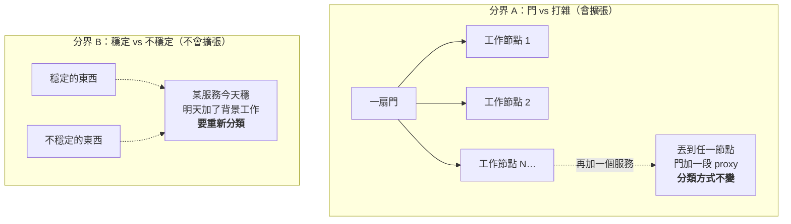
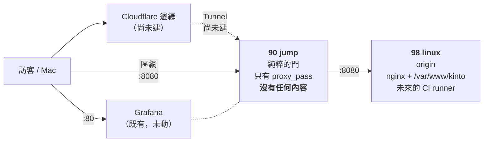
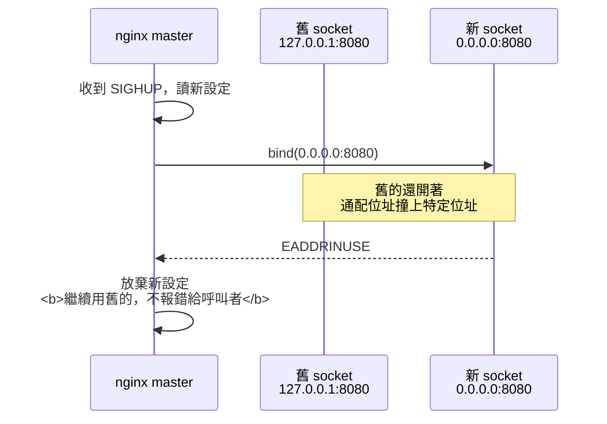
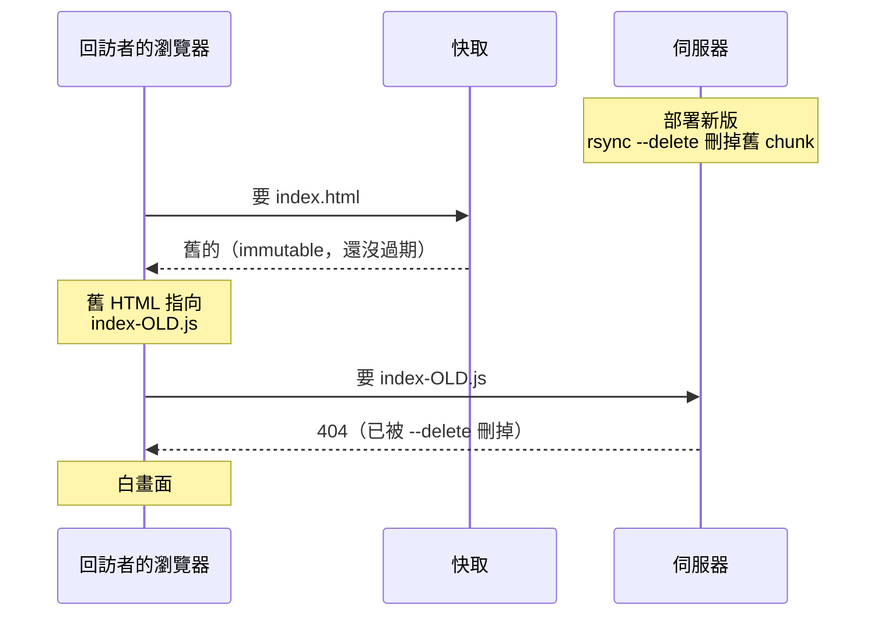

# [實戰 04] 一個靜態網站、兩台機器，以及三個「綠燈但壞掉」的坑

> **本篇目標**：把一個靜態網站部署到自家兩台 Linux 上，過程中**兩次把職責分配想錯**，以及三個「所有檢查都是綠的、東西卻是壞的」的陷阱。
> **發生時間**：2026-08-28　**機器**：`90` (`liyi-jump`)、`98`
> **成果**：內網已跑起來，`http://192.168.10.90:8080/` 可瀏覽，18 項自動驗證通過
> **⚠️ 尚未完成**：Cloudflare Tunnel 還沒建，**對外還連不到**。這篇停在「內網通了」。

## 你會學到

- 兩台機器的職責怎麼分——以及**我為什麼連錯兩次**，錯的前提如何污染後續每一個判斷
- 挑分界（abstraction boundary）比推導本身重要：**會擴張的抽象 vs 不會擴張的抽象**
- 兩層 nginx 的責任劃分：為什麼 proxy 那層**一個 `add_header` 都不能加**
- 三個「綠燈但壞掉」的坑：`set -e` 吃掉 reload、`reload` 換不掉 listen 位址、proxy 讓 gzip 靜默失效
- 為什麼驗收腳本**只驗 HTTP 200 完全不夠**

---

## 背景：要部署什麼

一個 Astro 靜態網站，`dist/` 約 10 MB，其中 9.3 MB 是兩個瀏覽器遊戲的建置產物（PixiJS，放在 `/play/<slug>/`）。網站本身只有不到 1 MB。

手上有兩台機器，就是這份實戰誌一直在記的那兩台：

| 機器 | 現況 |
|---|---|
| `90` `liyi-jump` | nginx 1.28 + fail2ban，`:80` 反代 Grafana。**設計上唯一的對外入口** |
| `98` | Docker（Grafana / Prometheus / node-exporter） |

需求很單純：**更新遊戲的時候不要重新部署整個網站**。遊戲會頻繁改，網站文案不會。

---

## 第一部分：職責分配，我連錯兩次

這是全篇最有價值的部分，因為**結論最後回到使用者一開始就講的那句話**，而我繞了兩圈才到。

### 起點：一句已經過期的理由

專案文件裡本來就寫著「網站放 `90`」，理由是：

> 對外服務與內網監控不共用同一台，`98` 被打穿的成本高得多。

我照著做了。**問題是這個前提已經死了**——後來才問出來，`98` 上的 Grafana 對使用者「無關緊要，甚至可以拿掉」。

> 💡 **教訓一：文件裡的「理由」也會過期，而且比「結論」更容易過期。**
> 結論（網站放 90）看起來還對，但撐著它的理由已經垮了。
> 這種文件最危險——**它看起來是可信的，於是你會拿它去推導新的東西**。

而我真的這樣做了。當使用者問「要不要把 GitHub self-hosted runner 裝在 `90`」時，我照著這句話推：既然 `98` 這麼寶貴，那 runner 也不該放 `98`……**這個判斷完全是錯前提的產物**。使用者當場糾正：`98` 就是打雜的，Grafana 拿掉也無所謂。

### 第一次自己想：改用「穩定性要求」當分界

被糾正之後我重想，換了一個分界：不是「門 vs 幹活的」，而是**穩定性要求**。

| | `90` | `98` |
|---|---|---|
| 角色 | 對外服務：唯一入口 **＋ 要提供給外面的東西** | 內部作業：build / CI / 監控 |
| 要求 | 穩、小、可預測 | 允許髒、允許壞、允許吃滿資源 |

照這個分界，靜態網站**應該留在 `90`**，理由聽起來相當漂亮：

1. 靜態檔是全機器最穩定的東西——躺在磁碟上，沒有 runtime、不會 OOM
2. **不要讓對外的網站相依於跑 CI 的那台**。CI 是全屋子最不可預測的負載，一次失控的 build 吃滿磁碟，網站就跟著消失

我當時對第 2 點很有信心。它甚至是真的——**只是不重要**。

### 第二次糾正：使用者補了四條前提

使用者接著說了四件我不知道的事：

| 新資訊 | 打掉了什麼 |
|---|---|
| **這只是 demo 站，不是正式站** | 我在拿**正式站的可用性標準**算一個掛掉五分鐘沒人在意的站 |
| **打雜機會越來越多，要做集群** | ⭐ 決定性 |
| 未來固定 IP 也會導向 `90` | `90` 會 front 很多服務，更不該同時是其中一個的 origin |
| 會用 Cloudflare 免費 CDN | 部分吸收 origin 抖動（但沒有我想的多，見下） |

**決定性的是「集群」那條**，而它殺死我的理由的方式很值得記：

> 「不要讓網站相依於跑 CI 的那台」——在**單機**打雜機上，這是真的。
> 但集群裡「跑 CI 的節點」跟「服務網站的節點」**本來就會是不同台**。
> 所以我是為了躲一個**暫時的**問題，換一個**永久的**架構特例。

### 真正的教訓：挑對分界，比推導正確更重要

兩個分界都能自圓其說。差別在**會不會隨系統成長而失效**：



這張圖在說：**A 的分類規則不隨系統長大而改變，B 的會**。「這個服務算穩定嗎」是個會隨時間改變答案的問題，用它當架構分界，等於每加一個東西就要重新吵一次。

> 💡 **教訓二：分界要選「不會隨系統成長而失效」的那個。**
> 兩個分界都能推出自洽的結論，但只有一個在第二台、第三台打雜機出現時還站得住。
> **我推導的過程沒有錯，錯在一開始選錯了要推什麼。**

### 最終架構



這張圖是目前的流量走向。虛線是還沒做的部分——Tunnel 沒建之前，這套只在區網內成立。

**額外拿到的好處**：build 與 origin 同側之後，部署變成該節點的**本機複製**，原本規劃中那把 `98 → 90` 的 SSH key（還要用 `command="rrsync …",restrict` 限制死）**整個不需要了**。少一把 key 就是少一條攻擊路徑。

**誠實記下代價**：多一跳，而且網站現在相依於兩台都活著。至於 CDN 能吸收多少——

> ⚠️ Cloudflare 免費方案**預設不快取 HTML**（只快取靜態副檔名），而我們還刻意給
> `/play/*/index.html` 設了 `no-cache`。所以 **HTML 每次都會打到 origin**。
> origin 掛掉，頁面就是進不去，只有 assets 有 CDN 護著。
> 想連 HTML 都快取，得自己加 Cache Rule 開 Cache Everything。

---

## 第二部分：兩層 nginx 的責任劃分

拆成兩層之後立刻要回答一個問題：**安全標頭、快取標頭該由誰送？**

答案是 **origin 全包，proxy 一個都不加**。

### origin（`98`）：所有標頭的唯一來源

```nginx
server {
    listen 192.168.10.98:8080;   # 只綁區網介面，ufw 只放行 90
    root /var/www/kinto;
    autoindex off;
    server_tokens off;

    add_header X-Content-Type-Options nosniff always;
    add_header Referrer-Policy strict-origin-when-cross-origin always;
    ...
}
```

### proxy（`90`）：只有轉發

```nginx
location / {
    proxy_pass http://kinto_origin;
    include    snippets/proxy-headers.conf;

    # ⚠️ 不要在這裡 add_header。標頭是 origin 的責任。
}
```

### 為什麼不兩邊都加（看起來比較保險）

因為「保險」的寫法會製造一個**不會報錯的失敗模式**：改了 origin 忘了改 proxy，或反過來。兩份設定各自都是合法的、`nginx -t` 都會過，但**送出去的標頭是哪一份取決於誰後執行**——這種 bug 只會在某天有人看 response header 時才被發現。

> 💡 **教訓三：同一件事只在一個地方做。**
> 「為了保險兩邊都設」在設定檔的世界裡不是保險，是**多開一條會靜默漂移的路**。

### 順帶一提 nginx 的 `add_header` 繼承陷阱

```nginx
server {
    add_header X-Content-Type-Options nosniff always;   # ← 父層

    location /play/ {
        add_header Cache-Control "public, max-age=31536000, immutable" always;
        # ⚠️ 一旦這個 location 有自己的 add_header，
        #    父層那行就【完全不繼承】——nosniff 會消失
        add_header X-Content-Type-Options nosniff always;              # ← 必須重寫
        add_header Referrer-Policy strict-origin-when-cross-origin always;
    }
}
```

nginx 的 `add_header` 不是累加，是**子區塊有就整組覆蓋**。這是老坑但每次都會中，因為它同樣**不報錯**。

> 想從頭學 nginx 的設定檔結構與反向代理 → [infra-4-3：Nginx 入門](../../../lessons/infra/part-4/infra-4-3-nginx-intro.md)
> 想學多後端的流量分配 → [infra-9-1：反向代理與負載平衡](../../../lessons/infra/part-9/infra-9-1-load-balancing.md)

---

## 第三部分：三個「綠燈但壞掉」的坑

這三個放在一起講，因為它們的共通結構完全一樣：

```
你檢查的東西  → 綠燈 ✅
實際的行為    → 壞的 ❌
```

**每一個都是「檢查的對象」跟「要驗證的事實」之間有落差。**

### 坑一：`set -e` 把腳本停在 reload 之前

**症狀**：跑完設定腳本，`nginx -t` 顯示 syntax is ok，磁碟上的設定檔內容也對——但 nginx **實際跑的還是舊設定**。

**當時的困惑**：檔案改了、語法過了、腳本也「跑完了」，為什麼沒生效？

**診斷**：先確認「磁碟上的設定」跟「實際在跑的設定」是兩件事，分別查：

```bash
# 磁碟上：對的
grep -n "listen" /etc/nginx/sites-available/kinto-proxy   # → listen 8080;
ls /etc/nginx/sites-enabled/                              # → gateway, kinto-proxy

# 實際在跑：不對
ss -tln | grep 8080                                       # → 127.0.0.1:8080（舊的！）
```

**根因**：腳本長這樣——

```bash
set -euo pipefail
...
ufw allow from 192.168.10.0/24 to any port 8080 proto tcp comment '...'   # ← 回傳非零
nginx -t                 # ← 根本沒跑到
systemctl reload nginx   # ← 根本沒跑到
```

`ufw` 那行失敗，`set -e` 直接讓腳本退出。而它的輸出被 `>/dev/null` 吃掉，看起來就像「順利跑完」。

**修法**：把「不影響主要目的」的步驟從致命錯誤降級：

```bash
ufw allow ... >/dev/null \
  || echo "  ⚠️ ufw 規則沒加成功，繼續。之後用 'sudo ufw status' 自己確認。"
```

> 💡 **教訓四：`set -e` 很好，但它會把「順帶做的事」升級成「致命錯誤」。**
> 寫腳本時要分清楚哪些步驟失敗就該停、哪些只是加值。
> 特別危險的是**失敗發生在真正重要的那一步之前**——症狀會偽裝成完全不相干的問題。

### 坑二：`reload` 換不掉 listen 的位址

修好坑一、reload 真的跑了之後，**症狀一模一樣**：設定寫 `listen 8080`，實際還是綁在 `127.0.0.1:8080`。

**診斷**：這次去看 nginx 自己的日誌（不是 `nginx -t` 的輸出）：

```
$ sudo tail -5 /var/log/nginx/error.log
[emerg] bind() to 0.0.0.0:8080 failed (98: Address already in use)
[emerg] bind() to 0.0.0.0:8080 failed (98: Address already in use)
[emerg] still could not bind()
```

**根因**：nginx reload 的順序是「**先開新 socket、再關舊 socket**」（這是為了零停機——新舊 worker 要能同時服務）。從 `127.0.0.1:8080` 換成 `0.0.0.0:8080` 時，新 socket 要 bind 通配位址，卻撞上還沒關掉的特定位址 socket，於是 `EADDRINUSE`。

而 nginx 對這種情況的處理是：**放棄新設定，安靜地繼續用舊的**。



這張圖說明為什麼「零停機 reload」的設計本身，正是它換不掉 listen 位址的原因。

**修法**：這種情況只能 `restart`（先全關再全開）。而且——

```bash
bound_wide() { ss -tln | grep -qE '(0\.0\.0\.0|\*):8080'; }

nginx -t
systemctl reload nginx

if ! bound_wide; then          # reload 沒達成目的
  systemctl restart nginx      # 才升級成 restart
  sleep 1
fi

if ! bound_wide; then          # restart 也沒成功 → 真的失敗
  ss -tln | grep 8080 >&2
  exit 1
fi
```

> 💡 **教訓五：`nginx -t` 只驗語法，不驗「套用後會變成什麼」。**
> 要判斷成敗，**檢查你真正想要的那個結果**——這裡是「socket 有沒有綁在該綁的位址上」，
> 不是「設定檔語法對不對」。這兩件事的距離比直覺上大得多。

### 坑三：加了一層 proxy，gzip 就靜默失效

網站部署完、18 項驗證跑下去，17 項綠、**gzip 那項紅**。

**症狀**：

```bash
# 直接打 origin（在 98 上）
$ curl -sI -H 'Accept-Encoding: gzip' http://192.168.10.98:8080/play/blindfold/assets/index-CzkQWOCK.js
HTTP/1.1 200 OK
Content-Encoding: gzip          ← 有壓 ✅

# 經過 proxy（從 Mac 打 90）
$ curl -sI -H 'Accept-Encoding: gzip' http://192.168.10.90:8080/play/blindfold/assets/index-CzkQWOCK.js
HTTP/1.1 200 OK
Content-Length: 309036          ← 沒壓，原封送出 ❌
```

87 KB 的東西變成 309 KB。而且 origin 的 `gzip on` / `gzip_types` 設定完全正確，proxy 也沒有做任何跟壓縮有關的事。**兩邊的設定分開看都是對的。**

**根因**：兩個 nginx 預設值對不上——

| 設定 | 預設值 | 效果 |
|---|---|---|
| `proxy_http_version` | **1.0** | proxy 用 HTTP/1.0 去問 origin |
| `gzip_http_version` | **1.1** | origin 對 HTTP/1.0 的請求**拒絕壓縮** |

origin 沒有壞，它是**照著自己的設定正確地拒絕壓縮**。

**修法**：

```nginx
upstream kinto_origin {
    server 192.168.10.98:8080;
    keepalive 16;              # 連線重用，要搭配下面兩行才有效
}

location / {
    proxy_pass http://kinto_origin;
    proxy_http_version 1.1;    # ← 沒有這行，origin 就不壓縮
    proxy_set_header   Connection "";
}
```

> 💡 **教訓六：兩個元件各自的預設值都合理，湊在一起可以是壞的。**
> 這類 bug 不會出現在任何一邊的設定檔裡——它存在於**兩者的介面上**。
> 所以整合測試要打**完整路徑**，不能只測各元件自己。

---

## 第四部分：快取設計，以及為什麼 `index.html` 是特例

遊戲的建置產物有兩類，防「拿到舊版」的機制不一樣：

| 類別 | 例子 | 防陳舊機制 | 能長快取嗎 |
|---|---|---|---|
| Vite 產出的 JS | `index-CzkQWOCK.js` | **檔名帶內容雜湊** | ✅ |
| `public/` 原樣複製的素材 | `spine/heroine.webp` | 檔名沒雜湊，但程式碼用 `?v=<git short hash>` 去要 | ✅ URL 不同就是不同快取鍵 |
| **`index.html`** | — | **兩者都沒有** | ❌ |

`index.html` 是進入點，裡面**寫死了帶雜湊的 chunk 檔名**：

```html
<script type="module" src="./assets/index-CzkQWOCK.js"></script>
```

而部署用的是 `rsync --delete`——新版上去，舊的 chunk 就被刪掉了。



這張圖說明為什麼 `index.html` 被長快取住 = 網站壞掉。**症狀只發生在回訪者身上**，開發者自己（開 DevTools、停用快取）永遠看不到。

### 兩套寫法，同一個效果

這個專案同時保留了 Cloudflare Pages / Netlify 的 `_headers` 與自架 nginx 的設定，兩邊要達成一致的效果。**但寫法刻意不同**：

**nginx**——用「一條前綴 + 一條正則」，因為 nginx 的 location 優先序有明確規範（正則優先於前綴）：

```nginx
location /play/ {
    add_header Cache-Control "public, max-age=31536000, immutable" always;
}
location ~ ^/play/[^/]+/index\.html$ {
    add_header Cache-Control "no-cache" always;      # 蓋過上面那條
}
```

**`_headers`**——用「**縮小涵蓋範圍**」，而不是加一條例外規則：

```
/play/*/assets/*
  Cache-Control: public, max-age=31536000, immutable
```

`/play/<slug>/` 底下除了 `assets/**` 就只有 `index.html`，所以只涵蓋 `assets/` 等於自動排除 `index.html`。

**為什麼不用「加一條例外」的寫法**：多條規則同時命中時誰覆蓋誰，Cloudflare / Netlify 的行為我沒把握。**猜錯就等於沒修，而且不會有任何錯誤訊息。** 縮小涵蓋範圍不依賴優先序，是不用查文件也能確定正確的寫法。

> 💡 **教訓七：不確定平台行為時，選一個「不依賴那個行為」的寫法。**
> 比起賭一個你沒驗證過的優先序規則，換一個結構讓問題根本不存在。

> 這個坑的完整理論與通解 → [cache-3-5：前端更新後使用者還拿到舊版](../../../lessons/cache/part-3/cache-3-5-frontend-deploy-pitfall.md)
> 瀏覽器 + CDN 雙層快取下的部署問題 → [cache-4-4：雙層快取的前端部署](../../../lessons/cache/part-4/cache-4-4-dual-layer-deploy.md)
> `Cache-Control` 各個指令的差別 → [課外讀物 E-11-2：瀏覽器快取](../../../課外讀物/E-11-performance/E-11-2-browser-cache.md)

---

## 第五部分：驗收腳本要驗什麼

三個坑全都是「綠燈但壞掉」，所以驗收腳本的設計原則只有一條：**驗你真正要的那個結果，不要驗代理指標。**

腳本從 Mac 直接打 `90:8080`——**刻意打 gateway 而不是 origin**，因為那才是使用者真正走的路徑。proxy 那層有沒有把標頭與壓縮正確帶過來，只有這樣才驗得到。

18 項分五類：

| 類別 | 項數 | 在驗什麼 |
|---|---|---|
| 頁面 | 8 | 中英文首頁、作品列表、內頁、隱私權、`robots.txt` 都回 200 |
| Demo | 4 | 兩款遊戲的 `index.html` 回 200 + **它引用的 chunk 真的存在** |
| 快取標頭 | 2 | assets 有 `immutable`、`index.html` 是 `no-cache`——**兩類必須不同** |
| 安全標頭 | 3 | `nosniff`、`Referrer-Policy`、目錄列表關掉（`/games` → 301） |
| 壓縮 | 1 | 遊戲 JS 有 `Content-Encoding: gzip` |

其中兩項是**刻意加的**，值得單獨說：

### 「chunk 真的存在」

```bash
js=$(curl -s "$BASE/play/$slug/index.html" | grep -oE './assets/index-[A-Za-z0-9_-]+\.js' | head -1)
check "chunk ${js#./assets/}" "$(code "$BASE/play/$slug/${js#./}")" 200
```

從 HTML 裡把它實際引用的檔名挖出來，再去要一次。**光看 `index.html` 回 200 完全看不出 chunk 已經被 `--delete` 刪掉了**——那正是快取設計那節講的失敗模式，這一項就是它的哨兵。

### gzip

如果沒有這一項，坑三會**永遠不會被發現**。所有頁面都 200、內容都正確，只是每個人下載的量是 3.5 倍。使用者只會覺得「網站有點慢」。

> 💡 **教訓八：驗收要驗「使用者實際體驗到的東西」，不是「元件有沒有回應」。**
> HTTP 200 只證明「有東西回來了」。它不證明回來的東西是對的、是完整的、是壓縮過的。

---

## 附註：兩個小坑

### bash 的 `$var` 後面接全形標點

```bash
set -euo pipefail
die "不認得的 slug：$slug（可用的：...）"
# → line 44: slug�: unbound variable
```

`$slug（` 裡的全形括號是多位元組字元，bash 在解析變數名時會把它吃進去，變成一個不存在的變數名，配上 `set -u` 就炸。

**修法**：訊息裡有中文一律寫 `${var}`。

### `ssh -t` 與 heredoc 互斥

```bash
ssh -t "$HOST" "sudo bash -s" <<'REMOTE'
...
REMOTE
# → Pseudo-terminal will not be allocated because stdin is not a terminal.
# → sudo: A terminal is required to authenticate
```

`sudo` 要 TTY（所以要 `-t`），但 heredoc 佔住了 stdin，ssh 就不配 TTY。兩者互斥。

**修法**：遠端腳本拆成獨立檔案 `scp` 上去再執行，別走 stdin。

---

## 指令速查

| 指令 | 用途 |
|---|---|
| `ss -tln \| grep 8080` | **實際**綁在哪個位址（不是設定檔說綁哪） |
| `nginx -t` | ⚠️ 只驗語法，**不代表套用後會是你要的樣子** |
| `sudo tail -20 /var/log/nginx/error.log` | reload 失敗的真正原因在這，不在 `nginx -t` 的輸出 |
| `curl -sI -H 'Accept-Encoding: gzip' <url>` | 驗壓縮有沒有真的生效 |
| `curl -sI <url> \| grep -i cache-control` | 驗快取標頭 |
| `sudo ufw status` | 確認防火牆規則真的加上去了（腳本裡它可能是被降級的警告） |
| `ps -o lstart= -p $(cat /run/nginx.pid)` | nginx master 啟動時間——reload 不會改變它，restart 會 |

---

## 目前狀態與待辦

> ⚠️ **本文寫成時網站還只在內網跑。2026-08-29 已經上線**：<https://kinto.liyibass.com>
> 前面的推導與三個坑都不受影響，只有這一節要更新。

**已完成**：

- 兩台的 nginx / 目錄 / 防火牆（腳本化、冪等）、部署腳本、18 項驗證腳本
- **Cloudflare Tunnel** — 網域 `kinto.liyibass.com`，路由器零入向 port。
  DNS 從 Route 53 搬到 Cloudflare 的完整過程另外寫成 [E-3-9](../../../課外讀物/E-3-network/E-3-9-dns-delegation-migration.md)
- **CI** — 兩個 repo 各一個 self-hosted runner 在 `98`，push 到 `main` 就自動 build ＋ 部署 ＋ 驗證

⭐ **先手動再自動化，這個順序真的救到人**：三個坑全部是手動階段撞到的。
如果一開始就把（還沒驗證過的）步驟寫成 YAML，症狀會變成「CI 綠燈但網站是舊的」，
在 runner 的日誌裡查會難上一個數量級。

⭐ **裝 runner 要在 push 之前**。GitHub 會把等不到 self-hosted runner 的 job
排隊保留（最長 24 小時）——runner 一上線，先前排隊的 push 立刻被撿走自動跑掉。
順序反了則是卡在佇列裡等到過期。

**未完成**：

- [ ] `90` 上舊架構留下的 `/var/www/kinto`（9.7 MB）還沒刪（已經沒人服務，但刪目錄不可逆，留給人工確認）
- [ ] Route 53 那個變成孤兒的 hosted zone 還在扣月費
- [ ] 「零入向洞」的最終證據要用**手機 4G** 驗（家裡 WiFi 會因為 hairpin NAT 得到假結果）

### 上線後才驗得到的一件事

**Grafana 有沒有從隧道漏出去**——這是本文第一部分「門 vs 打雜」的最終驗收：

```bash
# 三個名字都沒有 DNS 記錄
dig +short liyibass.com www.liyibass.com grafana.liyibass.com   # 全空

# 拿不存在的主機名去打隧道
curl -s -o /dev/null -w '%{http_code}\n' -H 'Host: bogus.liyibass.com' https://kinto.liyibass.com/
# → 530（Cloudflare 找不到對應的路由，根本到不了 cloudflared）
```

⭐ **擋住它的是 Tunnel ingress 的 catch-all（`http_status:404`），不是 nginx。**
`90` 的 `:80` 仍然是 Grafana 的 `default_server`、仍然通吃所有 Host——
但外面的流量根本到不了那裡。**控制點在隧道的設定檔，不在 nginx**，
這也是為什麼原本安全清單裡「把 Grafana 綁到內網 IP」那條被降級：
它想解的問題已經被別的層解掉了，而它自己會帶來「WiFi 沒起來就 bind 失敗」的新風險。

---

## 課外讀物與課程對照

> 想從頭學 nginx 反向代理與設定檔結構 → [infra-4-3：Nginx 入門](../../../lessons/infra/part-4/infra-4-3-nginx-intro.md)

> 想學完整的「部署一個對外網站」流程 → [infra-4-5：動手做——Nginx + systemd + HTTPS](../../../lessons/infra/part-4/infra-4-5-deploy-a-full-website.md)

> 這篇的快取坑，完整理論版 → [cache-3-5：前端更新後使用者還拿到舊版](../../../lessons/cache/part-3/cache-3-5-frontend-deploy-pitfall.md)

> 自架 vs 雲端的取捨 → [infra-9-3：自架 vs 雲端](../../../lessons/infra/part-9/infra-9-3-self-hosted-vs-cloud.md)

> CDN 到底幫你擋掉什麼 → [課外讀物 E-11-5：CDN](../../../課外讀物/E-11-performance/E-11-5-cdn.md)

---

## 小練習

1. 在你的機器上開一個 nginx，先設 `listen 127.0.0.1:9999`，reload 之後改成 `listen 9999`，再 reload 一次。用 `ss -tln` 確認它**沒有**換過去，然後去 `error.log` 找那行 `bind() failed`。
2. 架一個兩層 nginx（proxy → origin），origin 開 gzip。用 `curl -sI -H 'Accept-Encoding: gzip'` 分別打兩層，重現「origin 有壓、proxy 沒壓」。再加上 `proxy_http_version 1.1` 看它恢復。
3. 寫一個 `set -euo pipefail` 的腳本，故意讓中間某個「順帶做的事」失敗，觀察後面真正重要的步驟被跳過時**畫面上看起來有多正常**。
4. **進階**：拿你手上任何一個有 CI/CD 的專案，檢查它的部署驗證步驟——它驗的是「HTTP 200」還是「使用者實際體驗到的東西」？如果只驗 200，想三個它抓不到的失敗模式。
