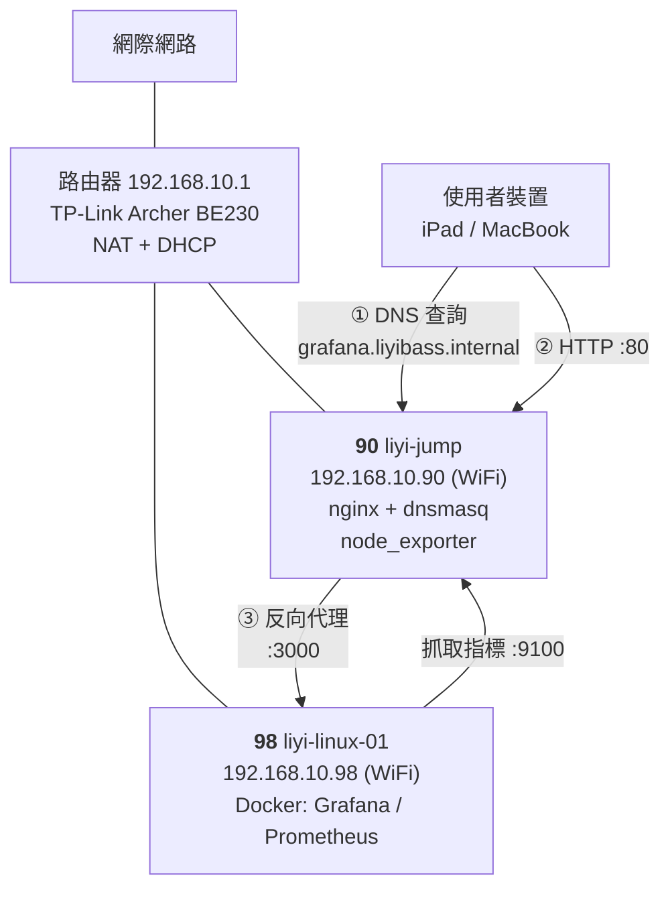

# 架構現況

> **這是一份活文件**：每次動這些機器之後就更新它。
> **最後更新**：2026-08-01（網域改為 `.liyibass.internal`）
> **這份文件的用途**：讓「現在到底長怎樣」有唯一答案。ADR 記錄的是「當初為什麼」，這裡記錄的是「現在是什麼」。

---

## 網路拓撲



使用者的一次存取會經過三步：先向 90 的 dnsmasq 問名字，拿到 90 的 IP 後連 90 的 nginx，nginx 再依 `server_name` 轉發到 98。

---

## 機器：90（liyi-jump）

### 網路

| 介面 | 型態 | IP | 狀態 | 備註 |
|---|---|---|---|---|
| `wlp2s0b1` | WiFi | `192.168.10.90/24` | ✅ 使用中 | metric 600 |
| `enp1s0f0` | 有線 | *（未設定）* | ❌ `no-carrier` | 尚未購入 switch |

- 預設閘道：`192.168.10.1`
- 機器自己的 DNS：`192.168.10.1`、`8.8.8.8`（**仍走 systemd-resolved，未改用本機 dnsmasq**）
- 設定方式：netplan + systemd-networkd（靜態 IP）

### 服務

| 服務 | 監聽 | 開機自啟 | 用途 |
|---|---|---|---|
| `nginx` | `:80` | ✅ | 反向代理，依 `server_name` 分流 |
| `dnsmasq` | `192.168.10.90:53` | ✅ | 區網 DNS，`.liyibass.internal` 權威 + 上游轉發 |
| `systemd-resolved` | `127.0.0.53:53` | ✅ | **本機**程式的解析器（與 dnsmasq 共存） |
| `node_exporter` | `:9100` | ✅ | 給 98 的 Prometheus 抓 |
| `chrome-remote-desktop@liyi` | — | ✅ | XFCE on `:20` |
| `sshd` | `:22` | ✅ | ⚠️ 仍允許密碼登入 |

> 💡 dnsmasq 與 systemd-resolved 能共存，是因為它們綁**不同的 IP**。
> 「埠被佔用」判斷的是「IP + 埠」的組合，不是單看埠號。

### 防火牆（ufw）

預設政策：`deny (incoming)` / `allow (outgoing)`

| 埠 | 來源 | 用途 |
|---|---|---|
| 22/tcp | `192.168.10.0/24` | SSH |
| 53 | `192.168.10.0/24` | dnsmasq |
| 80/tcp | `192.168.10.0/24` | nginx |
| 9100/tcp | `192.168.10.98` | node_exporter |

### 關鍵設定檔

| 路徑 | 內容 |
|---|---|
| `/etc/nginx/sites-available/gateway` | 依 `server_name` 分流 |
| `/etc/nginx/snippets/proxy-headers.conf` | 共用代理標頭 |
| `/etc/nginx/conf.d/websocket-upgrade.conf` | WebSocket 升級的 `map` |
| `/etc/dnsmasq.d/local.conf` | 區網 DNS 名冊 |
| `/etc/netplan/00-installer-config.yaml` | 有線網卡（已移除 `.97`） |
| `/etc/netplan/90-wifi.yaml` | WiFi 🔴 **含明文密碼** |
| `/etc/netplan/99-wait-online-fix.yaml` | 開機不等有線網卡 |

---

## 機器：98（liyi-linux-01）

| 項目 | 內容 |
|---|---|
| IP | `192.168.10.98`（WiFi，`wlp2s0b1`） |
| 有線 | `enp1s0f0`，`no-carrier`，未使用 |
| 服務形式 | **Docker Compose**，設定在 `~/monitoring/` |

### 容器

| 容器 | Image | 對外綁定 |
|---|---|---|
| `grafana` | `grafana/grafana:12.1.0` | `192.168.10.98:3000` |
| `prometheus` | `prom/prometheus:v3.5.0` | `127.0.0.1:9090`（僅本機 👍） |
| `node-exporter` | `prom/node-exporter:v1.9.1` | `:9100` |

Docker 網路：`br-ea7db3c6f33c`（`172.18.0.0/16`），容器之間用**服務名**互相呼叫。

### 機密處理

`~/monitoring/.env`（600）存 Grafana admin 密碼，另有 `.env.example` 進版控。

---

## 名稱解析：三套 DNS 各管各的

這套系統裡同時有三套 DNS 在運作，常被混為一談：

| | 誰在用 | 解析什麼 | 由誰回答 |
|---|---|---|---|
| **①** | 使用者的瀏覽器 | `*.liyibass.internal` | 90 的 dnsmasq |
| **②** | 98 上的容器之間 | `prometheus`、`grafana` | Docker 內建 DNS `127.0.0.11` |
| **③** | 兩台機器本身 | 公網域名（`apt`、`docker pull`） | 各自的 systemd-resolved |

### 目前的名冊（dnsmasq）

```
jump.liyibass.internal      → 192.168.10.90      機器本身
services.liyibass.internal  → 192.168.10.98      機器本身
grafana.liyibass.internal   → 192.168.10.90      服務（指向反向代理）
```

> ⚠️ **服務名稱一律指向 90，不是後端機器。**
> 流量必須先進 nginx 才輪得到它分流。指向 98 會讓瀏覽器繞過代理，且需自帶 `:3000`。

### 哪些地方**沒有**用 DNS（寫死 IP）

```
nginx upstream        192.168.10.98:3000
prometheus targets    192.168.10.90:9100 / 192.168.10.98:9100
```

這是刻意的取捨——見下方「IP 遷移 checklist」。

---

## 流量路由規則（目前：子網域）

```
http://grafana.liyibass.internal/            → 192.168.10.98:3000
http://grafana.liyibass.internal/api/live/   → 同上，帶 WebSocket 升級標頭
http://192.168.10.90/grafana/        → 301 導向 grafana.liyibass.internal（舊網址相容）
http://192.168.10.90/                → 靜態導覽頁（default_server）
```

**備援存取**：DNS 出問題時，`http://192.168.10.98:3000/` 可直連 Grafana。

---

## 📋 IP 遷移 checklist（買到 switch 之後照這份跑）

> **背景**：目前 90 / 98 都走 WiFi。接上 switch 後的規劃是把 `.90` / `.98`
> 改配給**有線**介面，WiFi 另配其他位址。
>
> **為什麼需要 checklist**：系統裡有 5 個地方寫死了 IP。少改一個就是一次故障，
> 而且症狀通常是「某個圖表沒資料」這種不明顯的樣子，可能好幾天才發現。
>
> 💡 也可以改成到處都用名字，只改 dnsmasq 一個地方。但那會引入新的失敗模式
> （dnsmasq 掛掉就全家死），且 nginx 的 upstream 預設**只在啟動時解析一次**，
> IP 變了不會自動跟上。2 台機器的規模，用 checklist 管更划算。
> 等機器與服務變多，再導入 Prometheus 的服務發現（service discovery）。

### 執行前

- [ ] 確認實體鍵盤螢幕可用，**或**保留 WiFi 設定當退路
      （⚠️ 遠端改網路最經典的翻車方式就是把自己鎖在門外）
- [ ] 決定 WiFi 要改配哪組 IP
- [ ] `cd ~/infra && ./sync.sh && git commit` 先存好現狀

### 要改的 5 個地方

| # | 位置 | 檔案 | 改什麼 |
|---|---|---|---|
| 1 | 90 | `/etc/netplan/00-installer-config.yaml` | `enp1s0f0` 加上 `192.168.10.90/24` + 預設路由 |
| 2 | 90 | `/etc/netplan/90-wifi.yaml` | WiFi 改配新 IP，調整 route metric |
| 3 | 90 | `/etc/dnsmasq.d/local.conf` | 3 筆 `host-record`（若對外 IP 不變則免改） |
| 4 | 90 | `/etc/nginx/sites-available/gateway` | `upstream` 的後端 IP |
| 5 | 98 | `~/monitoring/prometheus/prometheus.yml` | 2 個 `targets` |

還要順帶檢查的：

- [ ] 90 的 ufw：`9100` 來源限制、各條規則的 `192.168.10.0/24` 是否仍正確
- [ ] 98 的 `docker-compose.yml`：Grafana 的 `ports` 綁定位址
- [ ] 98 的 `02-firewall.sh`
- [ ] `~/.ssh/config` 的 `linux` / `windows` 主機
- [ ] `99-wait-online-fix.yaml`：改走有線後，該標 `optional` 的變成 **WiFi** 那張

### 驗證

- [ ] `dig +short @192.168.10.90 grafana.liyibass.internal` 回傳正確
- [ ] `curl -I http://grafana.liyibass.internal/` → 302
- [ ] Grafana 的 Prometheus 資料來源正常
- [ ] Prometheus targets 頁面兩台 node_exporter 都是 UP
- [ ] 從 iPad / MacBook 實際開一次 Grafana
- [ ] **重開機一次**，確認全部自動恢復

---

## 已知問題清單

| 嚴重度 | 問題 | 追蹤 |
|---|---|---|
| 🔴 | `90-wifi.yaml` 含明文 WiFi 密碼（已排除於版控外，但檔案本身仍是明文） | 待辦 |

| 🔴 | SSH 仍允許密碼登入（兩台）。90 的 `authorized_keys` 有一把來源不明的金鑰（註解是未修改的樣板 `"your.name@gemmis.io"`），需先驗證才能關閉密碼登入 | 待驗證 |
| 🟡 | 路由器 DHCP 尚未下發 `192.168.10.90` 當 DNS，客戶端還無法解析 `.liyibass.internal` | 待操作 |
| 🟡 | 無 TLS，Grafana 帳密區網明文傳輸 | 待辦 |
| 🟡 | 90 / 98 的靜態 IP 落在 DHCP 池（`.2`–`.253`）內，理論上有重複配發風險 | 低優先 |
| 🟢 | dnsmasq 是新的單點故障：掛掉則名稱解析與公網 DNS 都斷 | 備援為 IP 直連 |
| 🟢 | 兩台都走 WiFi，可靠度受限 | [ADR-003](決策紀錄/ADR-003-網路介面與IP規劃.md) |
| 🟢 | `192.168.10.99`（Windows）目前 ping 不通，未盤點 | 待確認 |

---

## 變更歷程

| 日期 | 變更 | 記錄 |
|---|---|---|
| 2026-08-01 | 90 新增 `99-wait-online-fix.yaml`，開機 2min6s → 預期約 10s | [實戰筆記 01](實戰筆記/01-開機慢兩分鐘的追查.md) |
| 2026-08-01 | 安裝 `ssh-askpass-gnome`，建立 askpass 提權流程 | [ADR-002](決策紀錄/ADR-002-sudo權限策略.md) |
| 2026-08-01 | CRD 解析度清單擴充、DPI → 192、視窗主題 → `Default-xhdpi` | 待補筆記 |
| 2026-08-01 | 建立 `~/infra` git repo，機密隔離 + 現狀基準線 | commit `a9676ea` |
| 2026-08-01 | 移除 `enp1s0f0` 的 `.97`，解除 IP 撞號地雷 | commit `63cb9e6` |
| 2026-08-01 | ufw 的 SSH 來源限制為區網 | commit `a3092fa` |
| 2026-08-01 | 架設 dnsmasq，路徑式路由遷移為子網域路由 | commit `e2679d3` |
| 2026-08-01 | **重開機實測**：90 的開機時間 2min 11.336s → **10.358s**（userspace 快 22 倍），所有服務自動恢復 | [實戰筆記 01](實戰筆記/01-開機慢兩分鐘的追查.md) |
| 2026-08-01 | 區網網域 `.home.arpa` → `.liyibass.internal`，新舊並存零停機 | commit `f3dee9b` |
| 2026-08-01 | 移除 `.home.arpa` 過渡期設定，改名三段式流程完成 | commit `679b771` |
| 2026-08-01 | **98 修 `wait-online` + 移除 `kdump-tools`**：2min 8.245s → **10.859s**，並拿回 512MB 記憶體 | [實戰筆記 01](實戰筆記/01-開機慢兩分鐘的追查.md) |

### 90 的開機時間基準（2026-08-01 03:41 實測）

```
kernel     720ms
initrd     3.942s
userspace  5.696s
────────────────
總計       10.358s
```

最慢的服務是 `node_exporter`（5.254s），但那是「等 `network-online.target`」的排隊時間，程式本身 0.16 秒就起來了——**不是瓶頸**。

### 98 的開機時間基準（2026-08-01 20:28 實測）

```
kernel      654ms
initrd     3.628s
userspace  6.576s
────────────────
總計       10.859s
```

最慢的項目是 `dev-rfkill.device`（4.756s，硬體裝置探測）——**已無任何服務在拖慢開機**。

> 之後若開機時間明顯變長，拿這兩組數字當比較基準。
> 原始紀錄在 90 的 `~/boot-times.log` 與 `~/boot-times-98.log`。
