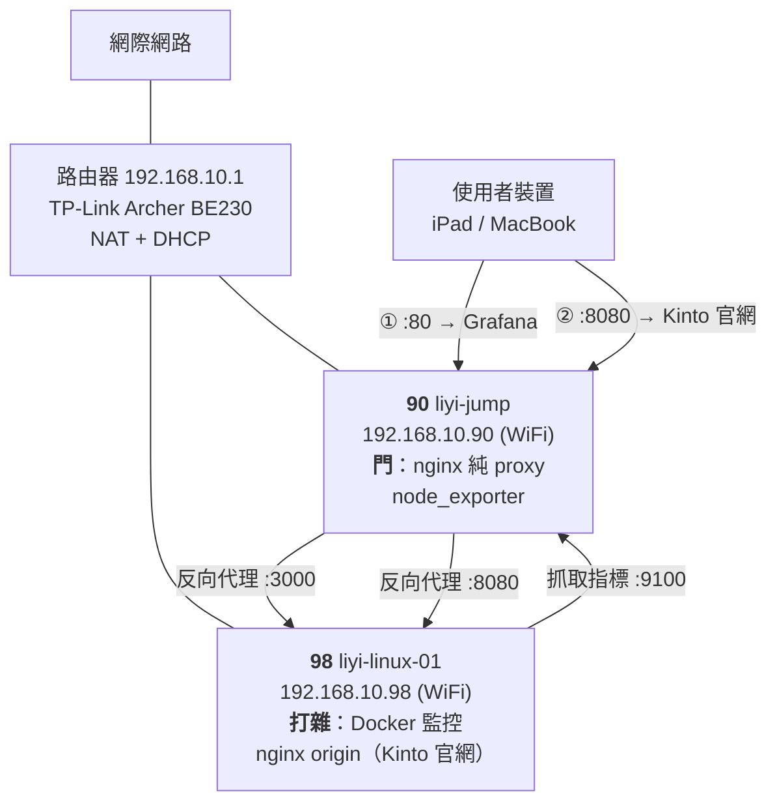

# 架構現況

> **這是一份活文件**：每次動這些機器之後就更新它。
> **最後更新**：2026-08-12（區網 DNS 移除作業收尾：dnsmasq 停用並 purge）
> **這份文件的用途**：讓「現在到底長怎樣」有唯一答案。ADR 記錄的是「當初為什麼」，這裡記錄的是「現在是什麼」。

---

## 網路拓撲



90 上有**兩個入口、兩種角色的服務**：

| 網址 | 到哪 |
|---|---|
| `http://192.168.10.90/` | Grafana（`default_server` 接住，轉發到 98:3000） |
| `http://192.168.10.90:8080/` | Kinto 官網（轉發到 98:8080 的 nginx origin） |

> 📌 **職責分界是「門 vs 打雜」**（2026-08-28 定案）：90 是唯一對外入口，**只有 proxy、沒有內容**；
> 98 負責實際跑服務、build、CI。打雜機未來會長成一組節點，這個分法照樣成立。
> 完整推導（含**推錯兩次的過程**）見 [實戰筆記 04](實戰筆記/04-兩台機器的部署分工與三個綠燈陷阱.md)。

> 2026-08-11 之前中間還有一步「先向 90 的 dnsmasq 問名字」。移除區網 DNS 後那一步消失了，
> 代價是網址從 `grafana.liyibass.internal` 變回 IP。見 [ADR-004](決策紀錄/ADR-004-移除區網DNS改回IP直連.md)。
>
> （存取路徑 08-11 就改了，但 dnsmasq 這個 daemon 一直到 08-12 才真的停掉——
> 詳見 ADR-004 的後記。）

---

## 機器：90（liyi-jump）

### 網路

| 介面 | 型態 | IP | 狀態 | 備註 |
|---|---|---|---|---|
| `wlp2s0b1` | WiFi | `192.168.10.90/24` | ✅ 使用中 | metric 600 |
| `enp1s0f0` | 有線 | *（未設定）* | ❌ `no-carrier` | 尚未購入 switch |

- 預設閘道：`192.168.10.1`
- 機器自己的 DNS：`192.168.10.1`、`8.8.8.8`（路由器 DHCP 下發，走 systemd-resolved）
- 設定方式：netplan + systemd-networkd（靜態 IP）

### 服務

| 服務 | 監聽 | 開機自啟 | 用途 |
|---|---|---|---|
| `nginx` | `:80` | ✅ | 反向代理到 Grafana，`default_server` 接住所有請求 |
| `nginx` | `:8080` | ✅ | 反向代理到 98 的 Kinto 官網 origin（`kinto-proxy` site） |
| `systemd-resolved` | `127.0.0.53:53` | ✅ | **本機**程式的解析器 |
| `node_exporter` | `:9100` | ✅ | 給 98 的 Prometheus 抓 |
| `chrome-remote-desktop@liyi` | — | ✅ | XFCE on `:20` |
| `sshd` | `:22` | ✅ | ⚠️ 仍允許密碼登入 |

> 💡 2026-08-12 之前這台還跑著 dnsmasq，與 systemd-resolved 共存在 53 埠上
> （靠綁**不同的 IP**——「埠被佔用」判斷的是「IP + 埠」的組合）。
> 那段經驗留在 [實戰筆記 02](實戰筆記/02-三套DNS與自架區網解析.md)。

### 防火牆（ufw）

預設政策：`deny (incoming)` / `allow (outgoing)`

| 埠 | 來源 | 用途 |
|---|---|---|
| 22/tcp | `192.168.10.0/24` | SSH |
| 80/tcp | `192.168.10.0/24` | nginx（Grafana） |
| 8080/tcp | `192.168.10.0/24` | nginx（Kinto 官網 proxy） |
| 9100/tcp | `192.168.10.98` | node_exporter |

### 關鍵設定檔

| 路徑 | 內容 |
|---|---|
| `/etc/nginx/sites-available/gateway` | `default_server` 單一入口，代理到 98 的 Grafana |
| `/etc/nginx/sites-available/kinto-proxy` | `:8080` → 98:8080。⚠️ 刻意**不加任何 `add_header`**，標頭全由 origin 負責 |
| `/etc/nginx/snippets/proxy-headers.conf` | 共用代理標頭 |
| `/etc/nginx/conf.d/websocket-upgrade.conf` | WebSocket 升級的 `map` |
| `/etc/netplan/00-installer-config.yaml` | 有線網卡（已移除 `.97`） |
| `/etc/netplan/90-wifi.yaml` | WiFi 🔴 **含明文密碼** |
| `/etc/netplan/99-wait-online-fix.yaml` | 開機不等有線網卡 |

---

## 機器：98（liyi-linux-01）

| 項目 | 內容 |
|---|---|
| IP | `192.168.10.98`（WiFi，`wlp2s0b1`） |
| 有線 | `enp1s0f0`，`no-carrier`，未使用 |
| 服務形式 | **Docker Compose**，設定在 `~/monitoring/` |

### 容器

| 容器 | Image | 對外綁定 |
|---|---|---|
| `grafana` | `grafana/grafana:12.1.0` | `192.168.10.98:3000` |
| `prometheus` | `prom/prometheus:v3.5.0` | `127.0.0.1:9090`（僅本機 👍） |
| `node-exporter` | `prom/node-exporter:v1.9.1` | `:9100` |

Docker 網路：`br-ea7db3c6f33c`（`172.18.0.0/16`），容器之間用**服務名**互相呼叫。

### 非容器服務（2026-08-28 新增）

| 服務 | 監聽 | 用途 |
|---|---|---|
| `nginx` | `192.168.10.98:8080` | **Kinto 官網的 origin**。root `/var/www/kinto`，ufw 只放行 90 |

⚠️ 這台的 nginx **預設站台已停用**（`sites-enabled/default`），否則會用 `default_server`
佔住 `:80`、在區網上多開一個「Welcome to nginx」。

| 設定檔 | 作用 |
|---|---|
| `/etc/nginx/sites-available/kinto-origin` | 靜態站台。**所有安全與快取標頭都在這裡**——90 那層一個都不加 |
| `/var/www/kinto/` | 官網（擁有者 `liyi`，所以部署不需要 sudo） |
| `/var/www/kinto/play/<slug>/` | 遊戲 demo，各自獨立更新 |

⚠️ **`/play/*/index.html` 刻意排除長快取**。它沒有內容雜湊也沒有 `?v=`，卻寫死了帶雜湊的
chunk 檔名；被 `immutable` 快取住的話，回訪者會拿舊 HTML 去要已被 `rsync --delete` 刪掉的
chunk ⇒ 白畫面。見 [實戰筆記 04](實戰筆記/04-兩台機器的部署分工與三個綠燈陷阱.md)。

### 機密處理

`~/monitoring/.env`（600）存 Grafana admin 密碼，另有 `.env.example` 進版控。

---

## 名稱解析：現在只剩兩套

2026-08-12 移除區網 DNS 後，這套系統裡的 DNS 剩下兩套：

| | 誰在用 | 解析什麼 | 由誰回答 |
|---|---|---|---|
| **①** | 98 上的容器之間 | `prometheus`、`grafana` | Docker 內建 DNS `127.0.0.11` |
| **②** | 兩台機器本身 | 公網域名（`apt`、`docker pull`） | 各自的 systemd-resolved（上游 `192.168.10.1`） |

原本的第①套——90 的 dnsmasq 解析 `*.liyibass.internal`——已移除。使用者裝置改用 IP 直接
存取，區網裡不再有任何自架的名稱解析。決策見
[ADR-004](決策紀錄/ADR-004-移除區網DNS改回IP直連.md)。

### 哪些地方寫死 IP（現在是全部）

```
使用者 → 90            192.168.10.90       瀏覽器直接打
nginx upstream        192.168.10.98:3000
prometheus targets    192.168.10.90:9100 / 192.168.10.98:9100
Grafana root_url      http://192.168.10.90/
```

> ⚠️ **`GF_SERVER_ROOT_URL` 最容易漏。** Grafana 用它產生**絕對**連結——告警通知裡的
> 連結、Share URL、快照連結。一般瀏覽用的是相對路徑，所以它設錯時**平常完全看不出來**，
> 等到收到告警、點下去發現是死連結才知道。改 IP 時務必一起改。

這是刻意的取捨——見下方「IP 遷移 checklist」。

---

## 流量路由規則（目前：IP 直連）

```
http://192.168.10.90/            → 192.168.10.98:3000（Grafana，default_server）
http://192.168.10.90/api/live/   → 同上，額外帶 WebSocket 升級標頭
http://192.168.10.90/grafana/    → 301 導回 /（舊路徑書籤相容）
http://192.168.10.90:8080/       → 192.168.10.98:8080（Kinto 官網）
```

⚠️ `:8080` 那條的 `location /` 一定要有 **`proxy_http_version 1.1;` ＋ `proxy_set_header Connection "";`**，
否則 origin 的 gzip 會整個失效——nginx 的 `proxy_http_version` 預設 1.0，
而 `gzip_http_version` 預設 1.1，origin 收到 1.0 的請求就拒絕壓縮（實測 309 KB 而非 87 KB）。
兩邊設定看起來都對，只會發現網站變慢。

nginx 只剩一個 `server` 區塊且是 `default_server`，所以**不管 Host 是什麼**都會落到
Grafana——IP、殘留的 `.internal` 書籤、還沒過期的 DNS 快取，全部通吃。

> ⚠️ 根路徑被 Grafana 佔走，原本的靜態導覽頁已移除。要再加服務時，既沒有名稱
> 可分流、也沒有空的根路徑可用——只能走不同的 port，或重新引入區網 DNS。
> **Kinto 官網就是走「不同的 port」這條路**（`:8080`）。

**備援存取**：nginx 出問題時，`http://192.168.10.98:3000/` 可直連 Grafana。

---

## 📋 IP 遷移 checklist（買到 switch 之後照這份跑）

> **背景**：目前 90 / 98 都走 WiFi。接上 switch 後的規劃是把 `.90` / `.98`
> 改配給**有線**介面，WiFi 另配其他位址。
>
> **為什麼需要 checklist**：系統裡有 5 個地方寫死了 IP。少改一個就是一次故障，
> 而且症狀通常是「某個圖表沒資料」這種不明顯的樣子，可能好幾天才發現。
>
> 💡 也可以改成到處都用名字，只改 DNS 一個地方——2026-08-01 到 08-11 之間確實這樣
> 做過（dnsmasq）。但它引入了新的失敗模式（DNS 掛掉就全家死），且 nginx 的 upstream
> 預設**只在啟動時解析一次**，IP 變了不會自動跟上——名字並沒有真的省下這份 checklist。
> 最後回到 IP + checklist，見 [ADR-004](決策紀錄/ADR-004-移除區網DNS改回IP直連.md)。
> 等機器與服務變多，再導入 Prometheus 的服務發現（service discovery）。

### 執行前

- [ ] 確認實體鍵盤螢幕可用，**或**保留 WiFi 設定當退路
      （⚠️ 遠端改網路最經典的翻車方式就是把自己鎖在門外）
- [ ] 決定 WiFi 要改配哪組 IP
- [ ] `cd ~/infra && ./sync.sh && git commit` 先存好現狀

### 要改的 5 個地方

| # | 位置 | 檔案 | 改什麼 |
|---|---|---|---|
| 1 | 90 | `/etc/netplan/00-installer-config.yaml` | `enp1s0f0` 加上 `192.168.10.90/24` + 預設路由 |
| 2 | 90 | `/etc/netplan/90-wifi.yaml` | WiFi 改配新 IP，調整 route metric |
| 3 | 98 | `~/monitoring/docker-compose.yml` | `GF_SERVER_ROOT_URL` 裡的 90 位址 ⚠️ 最容易漏 |
| 4 | 90 | `/etc/nginx/sites-available/gateway` | `upstream` 的後端 IP |
| 5 | 98 | `~/monitoring/prometheus/prometheus.yml` | 2 個 `targets` |

還要順帶檢查的：

- [ ] 90 的 ufw：`9100` 來源限制、各條規則的 `192.168.10.0/24` 是否仍正確
- [ ] 98 的 `docker-compose.yml`：Grafana 的 `ports` 綁定位址
- [ ] 98 的 `02-firewall.sh`
- [ ] `~/.ssh/config` 的 `linux` / `windows` 主機
- [ ] `99-wait-online-fix.yaml`：改走有線後，該標 `optional` 的變成 **WiFi** 那張

### 驗證

- [ ] `curl -I http://192.168.10.90/` → 302 導向 `/login`
- [ ] `docker inspect grafana | grep ROOT_URL` 已是新位址
- [ ] Grafana 的 Prometheus 資料來源正常
- [ ] Prometheus targets 頁面兩台 node_exporter 都是 UP
- [ ] 從 iPad / MacBook 實際開一次 Grafana
- [ ] **重開機一次**，確認全部自動恢復

---

## 已知問題清單

| 嚴重度 | 問題 | 追蹤 |
|---|---|---|
| 🔴 | `90-wifi.yaml` 含明文 WiFi 密碼（已排除於版控外，但檔案本身仍是明文） | 待辦 |

| 🔴 | SSH 仍允許密碼登入（兩台）。90 的 `authorized_keys` 有一把來源不明的金鑰（註解是未修改的樣板 `"your.name@gemmis.io"`），需先驗證才能關閉密碼登入 | 待驗證 |
| 🔴 | **98 的 Grafana / Prometheus 資料無任何備份**（`monitoring_grafana-data` 53MB、`monitoring_prometheus-data` 36MB）。98 硬碟故障 = 儀表板與歷史指標永久消失。這是目前唯一會造成**不可逆損失**的缺口 | 已知，暫緩處理 |
| 🟡 | 無 TLS，Grafana 帳密區網明文傳輸 | 待辦 |
| 🟡 | 90 / 98 的靜態 IP 落在 DHCP 池（`.2`–`.253`）內，理論上有重複配發風險 | 低優先 |
| 🟢 | 90 的根路徑被 Grafana 佔用，加第三個服務時沒有分流空間 | [ADR-004](決策紀錄/ADR-004-移除區網DNS改回IP直連.md) |
| 🟢 | 兩台都走 WiFi，可靠度受限 | [ADR-003](決策紀錄/ADR-003-網路介面與IP規劃.md) |
| 🟢 | `192.168.10.99`（Windows）目前 ping 不通，未盤點 | 待確認 |

---

## 變更歷程

| 日期 | 變更 | 記錄 |
|---|---|---|
| 2026-08-28 | Kinto 官網上線（內網）。90 加 `:8080` proxy、98 加 nginx origin，職責分界定為「門 vs 打雜」 | [實戰筆記 04](實戰筆記/04-兩台機器的部署分工與三個綠燈陷阱.md) |
| 2026-08-01 | 90 新增 `99-wait-online-fix.yaml`，開機 2min6s → 預期約 10s | [實戰筆記 01](實戰筆記/01-開機慢兩分鐘的追查.md) |
| 2026-08-01 | 安裝 `ssh-askpass-gnome`，建立 askpass 提權流程 | [ADR-002](決策紀錄/ADR-002-sudo權限策略.md) |
| 2026-08-01 | CRD 解析度清單擴充、DPI → 192、視窗主題 → `Default-xhdpi` | 待補筆記 |
| 2026-08-01 | 建立 `~/infra` git repo，機密隔離 + 現狀基準線 | commit `a9676ea` |
| 2026-08-01 | 移除 `enp1s0f0` 的 `.97`，解除 IP 撞號地雷 | commit `63cb9e6` |
| 2026-08-01 | ufw 的 SSH 來源限制為區網 | commit `a3092fa` |
| 2026-08-01 | 架設 dnsmasq，路徑式路由遷移為子網域路由 | commit `e2679d3` |
| 2026-08-01 | **重開機實測**：90 的開機時間 2min 11.336s → **10.358s**（userspace 快 22 倍），所有服務自動恢復 | [實戰筆記 01](實戰筆記/01-開機慢兩分鐘的追查.md) |
| 2026-08-01 | 區網網域 `.home.arpa` → `.liyibass.internal`，新舊並存零停機 | commit `f3dee9b` |
| 2026-08-01 | 移除 `.home.arpa` 過渡期設定，改名三段式流程完成 | commit `679b771` |
| 2026-08-01 | **98 修 `wait-online` + 移除 `kdump-tools`**：2min 8.245s → **10.859s**，並拿回 512MB 記憶體 | [實戰筆記 01](實戰筆記/01-開機慢兩分鐘的追查.md) |
| 2026-08-01 | 路由器 DHCP 下發 `192.168.10.90` 當 DNS（次要留空），**手機實測可解析 `.liyibass.internal`** | [實戰筆記 02](實戰筆記/02-三套DNS與自架區網解析.md) |
| 2026-08-01 | `~/infra` 推上 GitHub private repo，設定檔取得異地副本 | `git@github.com:liyibass/infra.git` |
| 2026-08-11 | 路由器 DHCP 的 DNS 改回 `192.168.10.1`，不再下發 90 | — |
| 2026-08-11 | 90 的 nginx 改 `default_server` IP 直連，移除子網域 `server_name` 與靜態導覽頁 | [ADR-004](決策紀錄/ADR-004-移除區網DNS改回IP直連.md) |
| 2026-08-11 | 98 的 Grafana `GF_SERVER_ROOT_URL` → `http://192.168.10.90/`，容器重建 | 同上 |
| 2026-08-11 | `~/infra` 移除 dnsmasq 鏡像與 `sync.sh` 的拉取行 | 同上 |
| 2026-08-12 | 移除 `/etc/systemd/resolved.conf.d/liyibass.conf`（90 自己的 global DNS 不再指向 dnsmasq） | [ADR-004 後記](決策紀錄/ADR-004-移除區網DNS改回IP直連.md#後記於實作一天後才發現沒做完) |
| 2026-08-12 | `disable --now dnsmasq` + `apt purge dnsmasq dnsmasq-base`，區網 DNS 走入歷史（ADR-001 由 ADR-004 取代） | 同上 |
| 2026-08-12 | ufw 移除 53 埠規則（版控鏡像 08-11 就刪了，真機直到今天才刪） | 同上 |

### 90 的開機時間基準（2026-08-01 03:41 實測）

```
kernel     720ms
initrd     3.942s
userspace  5.696s
────────────────
總計       10.358s
```

最慢的服務是 `node_exporter`（5.254s），但那是「等 `network-online.target`」的排隊時間，程式本身 0.16 秒就起來了——**不是瓶頸**。

### 98 的開機時間基準（2026-08-01 20:28 實測）

```
kernel      654ms
initrd     3.628s
userspace  6.576s
────────────────
總計       10.859s
```

最慢的項目是 `dev-rfkill.device`（4.756s，硬體裝置探測）——**已無任何服務在拖慢開機**。

> 之後若開機時間明顯變長，拿這兩組數字當比較基準。
> 原始紀錄在 90 的 `~/boot-times.log` 與 `~/boot-times-98.log`。
