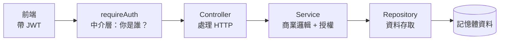

# POC V5 — 完整架構 + 登入功能

> **解鎖條件**：完成 Part 4-D（後端架構 + 認證）後

這是 Part 4 的集大成之作。你的 Todo App 第一次有了「使用者」的概念——要登入才能用，每個人只看得到自己的待辦，而管理員能看到所有人的。後端也從「一支 server.ts 打天下」重構成專業的分層架構。

---

## 這個版本做了什麼

- **後端分層架構**：Controller（HTTP）/ Service（商業邏輯 + 授權）/ Repository（資料存取）各司其職
- **註冊 / 登入**：密碼用 `bcrypt` 雜湊儲存，登入成功簽發 JWT
- **受保護的 API**：`requireAuth` 中介層，沒登入不能操作待辦
- **資料隔離**：每筆待辦綁定擁有者，一般使用者只能看 / 改 / 刪自己的
- **角色權限（RBAC）**：第一個註冊的帳號是 `admin`，能看到所有人的待辦

---

## 相較於 V4 的改變

- **新增**：完整的認證系統（註冊、登入、JWT、bcrypt 密碼雜湊）
- **新增**：分層架構，後端拆成 `auth/` 與 `todo/` 兩個領域，各有三層
- **新增**：`requireAuth` / `requireRole` 認證授權中介層
- **新增**：前端登入頁，所有請求自動帶上 `Authorization: Bearer <token>`
- **修改**：Todo 多了 `ownerId` 欄位，操作都會檢查擁有權與角色

```
V4：工程成熟，但是「單人工具」，任何人都能操作
V5：有使用者、有登入、有權限 —— 一個真實應用該有的骨架
```

---

## 後端架構：一個請求的旅程



每一層只做一件事：中介層驗身分、Controller 翻譯 HTTP、Service 管規則與權限、Repository 管資料。想把資料換成真資料庫（V6 要做的），只要改 Repository 一層。

---

## 專案結構

```
poc/v5/
├── shared/
│   └── types.ts                 # Todo / PublicUser / AuthResponse（前後端共用）
├── backend/
│   ├── .env / .env.example      # 含 JWT_SECRET（不進版控）
│   └── src/
│       ├── server.ts            # 組裝：中介層 + 路由
│       ├── errors.ts            # NotFound / Forbidden / Validation 語意錯誤
│       ├── types/express.d.ts   # 擴充 Request（userId / userRole）
│       ├── middleware/
│       │   ├── auth.ts          # requireAuth、requireRole
│       │   └── errorHandler.ts  # 全域安全網
│       ├── auth/
│       │   ├── auth.controller.ts
│       │   ├── auth.service.ts   # bcrypt + JWT
│       │   └── user.repository.ts
│       └── todo/
│           ├── todo.controller.ts
│           ├── todo.service.ts   # 擁有權 + 角色授權規則
│           └── todo.repository.ts
└── frontend/                     # Vite，登入頁 + 待辦頁
    └── src/main.ts               # 登入狀態管理 + 帶 token 的 apiFetch
```

---

## 如何跑起來

需要**開兩個終端機**，並先準備好 `.env`。

### 後端

```bash
cd poc/v5/backend
cp .env.example .env        # 含 FRONTEND_ORIGIN 與 JWT_SECRET
npm install
npm run dev
```

### 前端

```bash
cd poc/v5/frontend
cp .env.example .env
npm install
npm run dev
```

打開 Vite 印出的 `http://localhost:5173`。

---

## 體驗登入與權限（建議照順序玩一遍）

1. **註冊第一個帳號**（例如 `admin@x.com`）——它會自動成為 **admin**。新增幾筆待辦。
2. **登出**，再**註冊第二個帳號**（例如 `bob@x.com`）——它是一般 user。
3. 用 bob 新增幾筆待辦，確認你**看不到 admin 的待辦**（資料隔離）。
4. **登出，用 admin 重新登入**——你會看到**所有人**的待辦（admin 的特權）。
5. 打開 DevTools → Application → Local Storage，看看 `todo-v5-token`，把它貼到 jwt.io，觀察 Payload 裡的 `userId` 和 `role`。

---

## 安全要點回顧（課程 4-D 的實踐）

- **密碼從不存明文**：`user.repository` 存的是 `passwordHash`，bcrypt 雜湊（4-D-4）
- **JWT 只放識別資訊**：token 裡只有 `userId` 和 `role`，沒有密碼（4-D-3）
- **`JWT_SECRET` 是機密**：放後端環境變數，`.env` 不進版控（4-C-3）
- **401 vs 403**：沒登入回 401，登入了但沒權限回 403（4-D-2、4-D-7）
- **錯誤訊息模糊化**：登入失敗一律回「帳號或密碼錯誤」，不洩漏哪些 email 存在（4-D-4）

---

## 學到了什麼

- 分層架構：Controller / Service / Repository 的職責切分
- 完整登入流程：bcrypt 雜湊、JWT 簽發與驗證
- 中介層認證授權：`requireAuth`、`requireRole` 的「一行上鎖」
- 用擁有權與角色做資料隔離與權限控制（RBAC）

---

## 還有的限制（V6 之後會解決）

- **資料還在記憶體**：重啟後端，使用者和待辦全部消失。這是最後一個「記憶體限制」了——**V6 會接上真正的資料庫（SQLite + Prisma）**，而且因為有分層架構，只要改 Repository 一層。
- **單一 access token**：沒有 refresh token 機制（4-D-6 介紹了概念，完整實作是進階主題）。
- **token 存 localStorage**：入門夠用，但對 XSS 較脆弱，正式產品常用更安全的方式。

> 下一版 **V6** 解鎖條件：完成 Part 5（資料庫）後。
