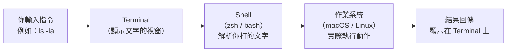

# [E-1-1] Terminal 是什麼？為什麼工程師都用它

> **這篇在說什麼**：解釋 Terminal 是什麼、跟你平常用的電腦畫面有什麼不同，以及為什麼工程師這麼愛用它。

## 概念說明

你第一次打開 Terminal，看到的是這個：

```
Last login: Thu May  8 10:23:01 on ttys003
liyi@MacBook-Pro ~ %
```

黑底白字。沒有按鈕，沒有選單，沒有圖示。游標在閃。

你心裡可能浮現一個問題：「這是什麼鬼東西？」

其實，你平常操作電腦的方式有兩種，只是你只意識到其中一種：

**第一種：用眼睛找、用滑鼠點（GUI）**

GUI 是 Graphical User Interface（圖形化使用者介面）的縮寫。你開資料夾、拖檔案、點選單，全都是 GUI。這是大多數人操作電腦的方式，直觀、好上手。

**第二種：用文字命令叫電腦做事（CLI）**

CLI 是 Command Line Interface（命令列介面）的縮寫。Terminal 就是 CLI 的入口——你用鍵盤打字，電腦照你說的做。

舉個例子：

- GUI 做法：打開 Finder → 進入某個資料夾 → 按右鍵 → 新增資料夾 → 打名稱 → 按 Enter
- CLI 做法：`mkdir my-project`（按 Enter 結束）

同樣的事，CLI 版本快了很多。

---

那問題來了——GUI 這麼直觀，為什麼工程師還要用 Terminal 這種「看起來很古老」的東西？

理由有幾個：

**一、速度**

習慣之後，打一行指令比移動滑鼠點好幾下快太多。工程師一天可能要建幾十個資料夾、移動幾百個檔案——這種重複性工作，CLI 完勝。

**二、自動化**

CLI 的指令可以寫成腳本（script），讓電腦自己跑。你上班前讓電腦自動 pull 最新程式碼、跑測試、發通知——這些都靠 Terminal。GUI 沒辦法被「寫進腳本」，你沒辦法叫電腦自動幫你點滑鼠。

**三、遠端伺服器只有 CLI**

你的網站跑在雲端的伺服器上。那台伺服器沒有螢幕、沒有鍵盤，當然也沒有漂亮的視窗畫面。你要操作它，唯一的方法就是透過 Terminal 連線進去打指令。

**四、精確**

GUI 有時候會有歧義——那個「刪除」按鈕是刪到垃圾桶，還是直接永久刪除？CLI 的指令明確得多：`rm file.txt` 就是刪，`rm -i file.txt` 就是刪之前問你確不確定。你說什麼，電腦就做什麼。

---

## 深入一點

### 一段簡短的歷史（因為有點好玩）

Terminal 這個概念其實超級古老。

早期的電腦是「打孔卡」（punch card）時代——你把程式打在硬紙卡上，交給操作員，等幾個小時拿回結果。效率低到不行，而且一個打錯的孔，程式就全壞掉了。

後來出現了「電傳打字機」（teletype machine，簡稱 TTY）。這是一台像老式電報機一樣的機器，你打字，它把字傳到主機，主機算完再把結果打印出來——是真的把字「印」在紙上，像收據一樣。

再後來，螢幕出現了。印在紙上的模式變成「顯示在螢幕上」，這就是「終端機」（terminal）的雛形。整棟辦公大樓裡，幾十台終端機連到同一台大主機（mainframe），大家共用運算能力。

到了今天，你的 MacBook 本身就是一台超強電腦，不需要連到大主機。但那個「打字 → 電腦執行 → 顯示結果」的模式保留下來了。我們現在用的 Terminal.app、iTerm2，都叫做「終端機模擬器」（terminal emulator）——因為它們是在模擬那個時代的終端機行為。

---

### Terminal、Shell、bash/zsh：這三個到底是什麼關係？

很多人搞混這三個詞，其實它們是三個不同層次的東西：

```
你打字的地方     → Terminal（視窗本身）
解讀你指令的程式  → Shell
Shell 的具體品種  → bash 或 zsh
```

用餐廳來比喻：

- **Terminal** 是餐廳的「點餐介面」——你看到的那個畫面
- **Shell** 是「服務生」——接收你的點餐，傳達給廚房
- **bash / zsh** 是服務生的「語言」——決定他聽得懂哪些話

macOS 從 Catalina（2019 年）開始，預設的 Shell 從 `bash` 換成了 `zsh`（讀作 "Z shell"）。你如果看到提示符號長這樣：

```
liyi@MacBook-Pro ~ %
```

結尾是 `%`，代表你用的是 zsh。如果是 `$`，那是 bash。功能大致相同，語法有一些細節差異，但在這門課用到的指令，兩種都能跑。

---

### 資料從你腦袋到螢幕的旅程



這張圖說明：你打的文字，先被 Terminal 收到，交給 Shell 解析意思，Shell 再請作業系統真正去做事，最後把結果顯示給你看。Terminal 本身只是一個「顯示文字」的視窗，Shell 才是真正懂你在說什麼的那個角色。

---

### 工程師常用的 Terminal 選擇

| 工具 | 說明 |
|------|------|
| macOS Terminal.app | 內建，夠用，不需要安裝 |
| iTerm2 | 功能更強的第三方選擇，很多工程師用它 |
| Warp | 新一代 Terminal，支援 AI 補全，介面更現代 |
| VS Code 內建 Terminal | 寫程式的同時可以直接在編輯器裡開 Terminal |

剛開始學的話，macOS 內建的 Terminal.app 就完全夠用了。

---

## 延伸閱讀

- 學會基本導航指令，就能在 Terminal 裡自由移動 → [課外讀物 E-1-2：基本導航指令](./E-1-2-basic-navigation.md)
