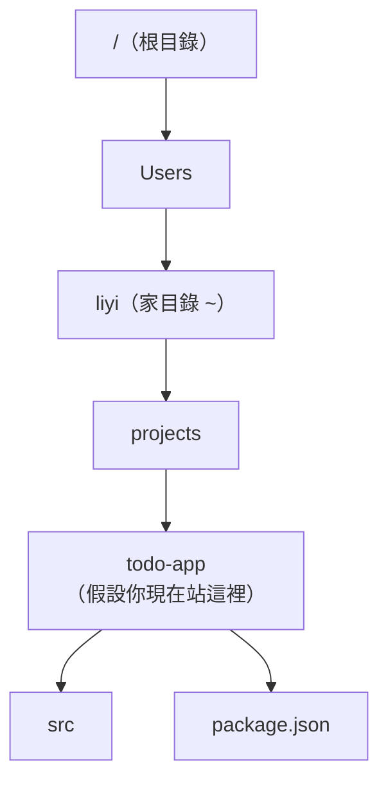

# [E-1-2] 基本導航指令：`ls` / `cd` / `pwd` / `mkdir` / `rm`

> **這篇在說什麼**：教你在 Terminal 裡「走路」——怎麼看自己在哪、看周圍有什麼、移動到別的資料夾、建立和刪除資料夾。學會這五個指令，你就能在命令列裡自由移動了。

## 概念說明

用 Finder（或 Windows 的檔案總管）的時候，你「在哪個資料夾」是用眼睛看的——視窗標題、左邊的路徑列，一目了然。你要進某個資料夾，就用滑鼠雙擊它。

Terminal 沒有這些視覺提示。但概念其實一模一樣：**任何時刻，你都「站在」某一個資料夾裡**。差別只是——你看不到它，要用指令去問、用指令去移動。

可以想像你是一個在「資料夾迷宮」裡走路的人：

```
你現在站在某個房間（資料夾）裡。
你看不到全貌，只能：
    問「我在哪個房間？」      → pwd
    問「這個房間裡有什麼？」  → ls
    走到隔壁房間              → cd
    蓋一個新房間              → mkdir
    拆掉一個房間              → rm
```

這五個動作，就是這篇的全部內容。

---

## 深入一點

### `pwd`：我現在在哪？

`pwd` 是 **p**rint **w**orking **d**irectory（印出目前工作的目錄）的縮寫。它回答最基本的問題：「我現在站在哪？」

```
% pwd
/Users/liyi/projects/todo-app
```

它印出一條「從最頂層一路到你現在位置」的完整路徑。每次你迷路了——不確定自己在哪——`pwd` 就是你的 GPS。

---

### `ls`：這裡有什麼？

`ls` 是 **l**i**s**t（列出）的縮寫，列出目前資料夾裡有哪些檔案和子資料夾：

```
% ls
index.html   package.json   src   node_modules
```

光是 `ls` 看到的資訊有限。加上「選項（option）」可以看更多。最常用的是 `ls -la`：

```
% ls -la
drwxr-xr-x   5 liyi  staff   160 Jun  5 10:00 .
drwxr-xr-x  12 liyi  staff   384 Jun  5 09:55 ..
-rw-r--r--   1 liyi  staff   220 Jun  5 10:00 .gitignore
-rw-r--r--   1 liyi  staff  1024 Jun  5 10:00 index.html
```

那個 `-la` 是兩個選項合在一起：

```
-l → long，用「長格式」顯示，多印出權限、大小、修改時間
-a → all，連「隱藏檔」也顯示出來（檔名以 . 開頭的，平常會被藏起來）
```

注意上面出現的 `.gitignore`——這種以 `.` 開頭的檔案平常 `ls` 看不到，要加 `-a` 才現形。（還記得 `.env`、`.gitignore` 嗎？它們都是隱藏檔。）

---

### `cd`：移動到別的資料夾

`cd` 是 **c**hange **d**irectory（改變目錄）的縮寫，是你在迷宮裡「走路」的指令：

```
% cd src              ← 進入目前資料夾底下的 src
% cd ..               ← 回到「上一層」資料夾
% cd ~                ← 回到「家目錄」（你的使用者資料夾）
% cd /                ← 跳到整個系統的「最頂層」
```

這裡出現了三個特殊符號，它們在路徑裡很常見，記住它們：

```
.   代表「目前這個資料夾」
..  代表「上一層資料夾」
~   代表「家目錄」（例如 /Users/liyi）
/   代表「根目錄」（整個檔案系統的最頂層）
```

---

### 相對路徑 vs 絕對路徑

`cd` 後面接的路徑有兩種寫法，理解它們能省去很多困惑：

```
相對路徑：從「我現在的位置」出發
    cd src/components     ← 進入「目前資料夾」底下的 src/components

絕對路徑：從「根目錄 /」出發，寫完整的全名
    cd /Users/liyi/projects/todo-app/src
```

用地址類比：

```
相對路徑像「往前走兩個路口右轉」——取決於你現在站在哪。
絕對路徑像「台北市信義區市府路 1 號」——不管你在哪，它永遠指同一個地方。
```



這張圖是一棵「資料夾樹」。假設你現在站在 `todo-app`：`cd src` 會往下走到 `src`（相對路徑）；`cd ..` 會往上回到 `projects`；而 `cd /Users/liyi`（絕對路徑）不管你在哪都直接跳回家目錄。

---

### `mkdir`：蓋一個新資料夾

`mkdir` 是 **m**a**k**e **dir**ectory（建立目錄）的縮寫：

```
% mkdir my-project        ← 建立一個叫 my-project 的資料夾
% mkdir -p a/b/c          ← 一次建立多層（連 a、a/b 也一起建好）
```

`-p` 選項的意思是「需要的中間層也一起建」——沒有它，你想建 `a/b/c` 但 `a` 還不存在的話，會報錯。

---

### `rm`：刪除——這個要特別小心

`rm` 是 **r**e**m**ove（移除）的縮寫。它很有用，但也是 Terminal 裡**最危險**的指令之一：

```
% rm old-file.txt         ← 刪除一個檔案
% rm -r old-folder        ← 刪除一個資料夾（-r = recursive，連裡面的東西一起刪）
% rm -i important.txt     ← 刪除前先問你「確定嗎？」（-i = interactive）
```

為什麼說危險？因為——

> **常見錯誤 / 危險警告** — 在 Terminal 用 `rm` 刪東西，**不會進垃圾桶**：
>
> 用 Finder 刪檔案，東西會跑到垃圾桶，後悔了還能還原。但 `rm` 是**直接、永久刪除**，沒有後悔藥。
>
> 尤其要對 `rm -rf` 保持高度警覺——`-f`（force）會「不問任何問題、強制刪除」。網路上有個著名的災難指令 `rm -rf /`（刪除整個系統），千萬不要好奇去執行。
>
> 養成習慣：刪資料夾前先用 `ls` 看清楚裡面是什麼、用 `pwd` 確認自己站在對的位置，不確定時加 `-i` 讓它一個一個問你。

---

### 把五個指令串成一次真實操作

實際建立一個專案時，這幾個指令會自然地接力出現：

```
% pwd                     ← 先確認我在哪
/Users/liyi/projects

% mkdir todo-app          ← 建一個專案資料夾
% cd todo-app             ← 走進去
% mkdir src               ← 在裡面建一個 src 資料夾
% ls                      ← 看一下，確認 src 建好了
src

% pwd                     ← 再確認一次我現在的位置
/Users/liyi/projects/todo-app
```

這就是工程師每天在 Terminal 裡做的事——看、移動、建立，行雲流水。一開始要刻意想每個指令，練幾天就會變成肌肉記憶。

---

## 延伸閱讀

- 還不確定 Terminal 到底是什麼、跟一般視窗有何不同？ → [課外讀物 E-1-1：Terminal 是什麼？](./E-1-1-what-is-terminal.md)
- 學會在自己電腦導航後，怎麼連到「遠端伺服器」、在那台機器上導航？ → [課外讀物 E-1-7：SSH 基礎](./E-1-7-ssh-basics.md)
