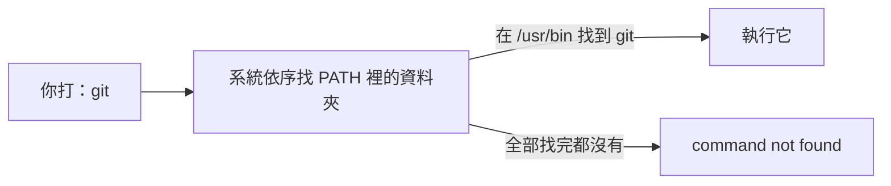

# [E-1-5] 環境變數：PATH 是什麼，為什麼指令「找不到」

> **目標**：理解環境變數是什麼，尤其是 `PATH`——它決定了你打的指令系統去哪找，搞懂它就不會被「command not found」困住。

## 環境變數：給系統的「設定值」

**環境變數（environment variable）** 是「**作業系統層級的設定值**」——一些「鍵=值」的設定，讓程式知道環境的資訊。例如：

- `HOME` = 你的家目錄路徑
- `USER` = 你的使用者名稱
- `PATH` = 指令去哪找（最重要，下面詳述）

看你目前的環境變數：

```bash
echo $HOME            # 印出某個環境變數（前面加 $）
env                   # 列出所有環境變數
```

## PATH：指令的「搜尋清單」

最重要、最常造成困惑的環境變數是 **`PATH`**。先看一個問題：

> 你打 `git`，系統怎麼知道「git 這個程式在哪？」它不會搜尋整個硬碟（太慢）——它只去 **`PATH` 列出的那幾個資料夾**找。

`PATH` 是一串「**用冒號分隔的資料夾清單**」：

```bash
echo $PATH
# /usr/local/bin:/usr/bin:/bin:/opt/homebrew/bin ...
```

當你打 `git`，系統**依序**去這些資料夾找有沒有叫 `git` 的程式，找到第一個就執行。



## 「command not found」是怎麼回事

新手最常見的困惑——明明裝了某個工具，打它的指令卻說「**command not found**」。原因幾乎都是：

> **那個程式所在的資料夾，不在你的 `PATH` 裡。** 系統「找不到」它，不是它不存在，而是「沒在搜尋清單上」。

解法：把它所在的資料夾「加進 PATH」：

```bash
export PATH="$PATH:/新工具所在的資料夾"
# 把新資料夾「附加」到現有 PATH 後面
```

（注意是 `$PATH:新路徑`——保留原本的、再加新的。如果寫成 `export PATH=/新路徑` 會把原本的洗掉，那就慘了，連 `ls` 都找不到。）

## 讓設定永久生效

上面 `export` 只在「目前這個終端機視窗」有效，關掉就沒了。要**永久生效**，得寫進 shell 的設定檔（開新視窗會自動載入）：

```bash
# 把 export 那行寫進設定檔（依你的 shell）
# bash → ~/.bashrc 或 ~/.bash_profile
# zsh（Mac 預設）→ ~/.zshrc
echo 'export PATH="$PATH:/新工具資料夾"' >> ~/.zshrc
```

這就是為什麼裝某些工具後，它會叫你「把某行加進 ~/.zshrc」——它在幫你把自己的位置加進 PATH。

## 其他常見的環境變數用途

環境變數還常用來「**傳設定給程式**」，尤其是**機密**（呼應 infra Part 4、basic Part 4-C）：

```bash
export DATABASE_URL="postgres://..."     # 資料庫連線
export API_KEY="secret123"               # API 金鑰
```

把機密放環境變數（而非寫死在程式碼），程式用 `process.env.API_KEY` 之類讀取——這樣機密不會進版本控制，是重要的安全習慣。

## 小結

- 環境變數 = 作業系統層級的「鍵=值」設定（HOME、USER、PATH…）。
- **PATH** = 指令的「搜尋資料夾清單」。打指令時系統只在 PATH 列的資料夾找。
- **command not found** 多半是「那程式不在 PATH 裡」——把它的資料夾加進 PATH。
- 永久生效要寫進 shell 設定檔（~/.zshrc 等）。
- 環境變數也常用來傳機密（API key 等），避免寫死在程式碼。

> 機密管理與環境變數 → 參見 **basic 課程** Part 4-C；終端機基礎 → [課外讀物 E-1-1：Terminal 是什麼](./E-1-1-what-is-terminal.md)
