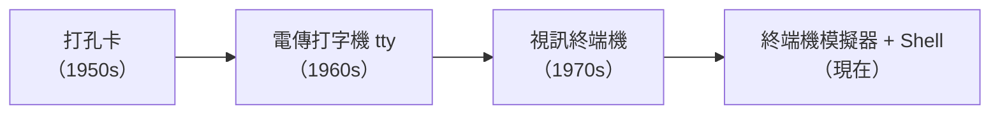

# [E-1-8] 趣味：Terminal 的歷史——從打孔卡到現代 shell

> **目標**：輕鬆認識終端機的歷史——為什麼這個「黑黑的、打字的視窗」長這樣、又為什麼歷久不衰。

## 為什麼工程師還在用「黑黑的打字視窗」

有人會疑惑：都什麼年代了，為什麼工程師還在用終端機這種「古老」的介面，而不是漂亮的圖形視窗？答案藏在它的歷史裡——而且它「古老」的外表下，藏著歷久彌新的設計智慧。

## 一段簡史

**① 打孔卡時代（1950s-60s）**

最早的電腦沒有螢幕鍵盤。程式寫在**打孔卡（punch card）**上——一張張卡片，用「打洞/不打洞」代表資料。你把一疊卡片交給電腦房，等很久才拿到結果。出一個錯，整疊重來。慘。

**② 電傳打字機 Teletype（1960s-70s）**

後來有了 **Teletype（電傳打字機，縮寫 tty）**——一台像打字機的機器，你打字下指令、它印出回應（印在紙上！）。這是「互動式」的開始。今天你在終端機看到的 `tty` 這個詞，就是從這來的——`ps` 輸出裡的 TTY 欄位，是它的歷史遺跡。

**③ 終端機 Terminal（1970s）**

接著出現「**視訊終端機（video terminal）**」——一台「螢幕 + 鍵盤」，連到主機。你打字、螢幕顯示。這就是「Terminal」這個名字的由來（它是連到大型主機的「終端」）。著名的 VT100 終端機，定義了很多沿用至今的標準。

**④ 現代：終端機模擬器 + Shell（現在）**

今天你 Mac 上的「終端機 App」，其實是**終端機模擬器（terminal emulator）**——它「模擬」當年那種終端機。而你打的指令由 **Shell**（如 bash、zsh）解讀執行。「Shell（殼）」這個名字也很傳神——它是「包在作業系統核心（kernel）外面的殼」，是你和核心溝通的介面。

## 為什麼它歷久不衰

終端機看似古老，卻是工程師的最愛，因為它體現了 Unix 的設計哲學（這些理念至今超強）：

- **一切皆文字**：指令的輸入輸出都是純文字 → 可以用管道 `|`（E-1-3）把指令「串」起來，像樂高一樣組合出強大功能。圖形介面做不到這種組合。
- **小工具、做好一件事**：每個指令（ls、grep、cat…）只做一件事、做到好，再透過組合完成複雜任務（呼應 SOLID 的單一職責，E-7-2）。
- **可自動化**：文字指令能寫成腳本，自動重複執行（infra Part 6）。圖形介面的「點擊」很難自動化。
- **遠端友善**：純文字傳輸量小，透過 SSH（E-1-7）遠端操作伺服器超順。

這些特性讓終端機在「自動化、組合、遠端」上完勝圖形介面——所以它非但沒被淘汰，反而是工程師生產力的核心工具。

## 一個體悟

終端機的故事告訴我們：**好的設計理念能超越時代。** 1970 年代的「一切皆文字、小工具組合、可自動化」這些思想，到了 AI 時代依然強大。當你熟練使用終端機，你其實是在運用半世紀淬鍊出來的工程智慧。

## 小結

- 終端機從打孔卡 → 電傳打字機（tty 之名由此來）→ 視訊終端機（Terminal 之名）→ 現代的「模擬器 + Shell」。
- Shell（殼）= 包在作業系統核心外、讓你溝通的介面。
- 它歷久不衰，因為體現了 Unix 哲學：一切皆文字、小工具組合（管道）、可自動化、遠端友善。
- 好的設計理念能超越時代。

> 終端機是什麼 → [課外讀物 E-1-1](./E-1-1-what-is-terminal.md)；Unix 的「一切皆檔案」哲學 → 參見 **infra 課程** Part 2-1
