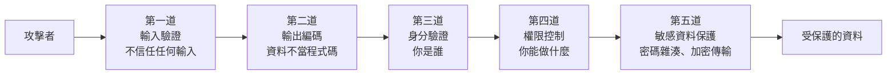

# [E-10-1] Web 安全總覽：OWASP Top 10 是什麼

> **這篇在說什麼**：不懂安全的工程師，就像一個從不鎖門的保全——你蓋的房子再漂亮，門開著就什麼都守不住。這篇帶你認識業界公認的安全清單 OWASP Top 10，知道最常見的威脅長什麼樣子。

## 概念說明

先講個誤會。

很多剛入行的工程師會覺得：「安全是資安團隊的事吧？我只要把功能寫出來就好。」

這就像一個保全，覺得「抓小偷是警察的事，我只要站在門口看起來很專業就好」——然後他從來不鎖門。功能（站門口）做得再好，只要有一個洞沒補，整棟樓的東西都可能被搬空。

**安全不是某個人的職責，而是每一行程式碼的職責。** 一個沒做好輸入驗證的表單、一個直接把密碼存成明文的資料庫、一個忘記檢查權限的 API——任何一個，都足以讓整個系統淪陷。

那要怎麼知道「該防哪些東西」？這就是 OWASP 出場的地方。

### OWASP 是什麼

**OWASP（Open Worldwide Application Security Project，開放全球應用程式安全專案）** 是一個非營利組織，專門研究、整理 Web 應用程式的安全問題。它做的事情很單純但很有價值：把全世界真實發生過的資安事故收集起來，歸納出「最常見、危害最大」的弱點類型，公開給所有工程師參考。

它最有名的產出，就是 **OWASP Top 10**。

### OWASP Top 10 是什麼

想像你是一棟房子的屋主，有人遞給你一張清單：

```
最常被闖空門的 10 個破綻：
1. 大門沒上鎖
2. 窗戶忘了關
3. 鑰匙藏在門口踏墊下
...
```

你不需要是安全專家，照著這張清單一條一條檢查，就能擋掉絕大多數的小偷。

**OWASP Top 10 就是 Web 世界的這張清單。** 它每隔幾年更新一次，列出當下「最該優先處理」的十大安全風險類別。它不是法律、也不是唯一標準，但它是業界的共識起點——幾乎所有資安檢查、滲透測試、程式碼審查，都會拿它當基準。

> 注意：Top 10 是「**類別**」，不是「十個具體 bug」。例如「注入」是一個類別，底下涵蓋 SQL 注入、指令注入等很多種攻擊。

## 深入一點

### 房子的多道防線

安全不是「裝一道超強的門就高枕無憂」。真正穩固的系統靠的是**多道防線（defense in depth，縱深防禦）**——就算一道被突破，後面還有第二道、第三道。



這張圖在表達：一個請求要碰到核心資料，得先穿過層層關卡。每一層擋掉一類威脅，沒有任何一層是「唯一的鎖」。

### 幾個最常見的威脅類別

下面挑 OWASP Top 10 裡最常碰到、也最該先懂的幾類，先有個輪廓就好，後面幾篇會深入。

**1. 注入（Injection）**

把使用者輸入，當成「程式碼」執行了。最經典的是 SQL 注入——使用者在登入框輸入一段精心設計的字串，結果這段字串被當成 SQL 指令跑進資料庫。核心問題永遠是同一句話：**把資料和程式碼混在一起。**

**2. XSS（Cross-Site Scripting，跨站腳本攻擊）**

注入的近親，但發生在瀏覽器端。攻擊者讓惡意的 JavaScript 透過你的網站，跑進了其他使用者的瀏覽器裡。一樣是「使用者輸入被當成程式碼執行」。這個我們在 [E-10-2](./E-10-2-xss.md) 會專門講。

**3. 身分驗證失效（Identification and Authentication Failures）**

「你是誰」這件事沒驗好。例如：允許弱密碼、登入沒有防暴力破解、token 設計有漏洞——或者最糟的，**把密碼存成明文**。密碼怎麼安全儲存，我們在 [E-10-6](./E-10-6-password-storage.md) 細講。

**4. 權限控制失效（Broken Access Control）**

「你能做什麼」這件事沒檢查好。最典型的例子：使用者 A 把網址裡的 `/orders/123` 改成 `/orders/124`，就看到了別人的訂單。後端只驗證了「你有登入」，卻忘了驗證「這筆資料是不是你的」。

> **常見錯誤** — 很多人以為「前端把按鈕藏起來」就等於做了權限控制：
>
> ```typescript
> // ❌ 前端隱藏按鈕，以為這樣就安全了
> if (currentUser.role === "admin") {
>   showDeleteButton()
> }
> ```
>
> 問題是：前端的判斷只是「畫面好不好看」，攻擊者根本不需要你的按鈕——他可以直接用工具對後端 API 發請求。**所有權限檢查，最終都必須在後端做。** 前端的隱藏只是體驗，不是防線。
>
> 正確做法是後端在每個敏感操作都驗證身分與權限：
>
> ```typescript
> // ✅ 後端才是真正的關卡
> function deleteOrder(currentUser: User, orderId: string): void {
>   const order = orderRepository.findById(orderId)
>   if (order.ownerId !== currentUser.id) {
>     throw new Error("你沒有權限刪除這筆訂單")
>   }
>   orderRepository.delete(orderId)
> }
> ```

### 一個貫穿全部的核心心法

如果這篇你只記得一句話，請記這句：

> **永遠不要信任使用者輸入（Never trust user input）。**

注入、XSS、權限失效……表面上是不同的攻擊，骨子裡都是同一個錯誤——**把「使用者給的東西」當成「可以信任的東西」**。輸入框的字串、網址裡的 ID、HTTP header、上傳的檔名，全都是使用者可以任意控制的，全都要當成「潛在的攻擊」來處理。

把這個心法刻進腦子裡，你已經擋掉一大半的問題了。

### 安全不是「最後才加上去」的功能

最後提醒一個常見的迷思：很多團隊把安全當成「功能都做完了，上線前再來補一補」的收尾工作。

這就像房子蓋到一半才想到「啊還沒留管線的位置」——拆掉重來的成本，遠高於一開始就規劃好。安全也一樣：一個從設計階段就考慮過「這裡的輸入會不會被濫用」的系統，遠比事後到處貼 OK 繃的系統來得穩固。

好消息是，你不需要一次就懂全部。你只要在寫每個功能時，多問自己幾個問題：

- 這裡有使用者輸入嗎？我有沒有把它當資料、而不是程式碼？
- 這個操作需要「你是誰」（身分驗證）嗎？需要「你能不能做」（權限）嗎？
- 這裡有敏感資料（密碼、token）嗎？它有沒有被妥善保護？

養成這個習慣，安全就會自然長在你的程式碼裡，而不是事後補丁。OWASP Top 10 就是幫你記住「該問哪些問題」的那張清單。

## 延伸閱讀

> 最常見的瀏覽器端攻擊，也是「不信任輸入」的最佳教材 → [E-10-2 XSS（跨站腳本攻擊）](./E-10-2-xss.md)

> 身分驗證裡最該做對的一件事：密碼怎麼安全儲存 → [E-10-6 密碼儲存：為什麼不能存明文](./E-10-6-password-storage.md)
