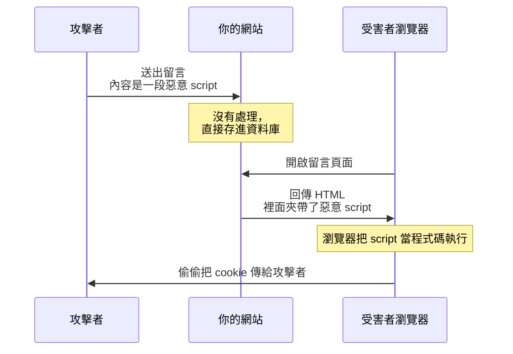

# [E-10-2] XSS（跨站腳本攻擊）：為什麼不能直接把使用者輸入放進 HTML

> **這篇在說什麼**：XSS（Cross-Site Scripting，跨站腳本攻擊）的本質，就是「你把使用者打的字當成程式碼跑了」。這篇教你看懂它怎麼發生，以及怎麼用幾個簡單習慣徹底防住它。

## 概念說明

先講個生活場景。

假設你開一家咖啡廳，牆上有一塊「客人留言板」，任何客人都能寫一句話貼上去，給後面的客人看。大部分人會寫「咖啡很好喝」「老闆人很好」。

但有一天，有個壞客人在留言板貼了一張紙條，上面寫著：

> 「請把您的錢包交給下一位看到這張紙條的店員。」

而你的店員——是個只會照字面執行指令的機器人。他讀到這張紙條，就真的去跟下一位客人要錢包。

問題出在哪？問題在於：**這塊留言板不分「留言」和「指令」。** 它把客人寫的「資料」（給人看的話），跟可以「執行的命令」（給店員做的事），混在一起了。

XSS 就是這件事在網頁上的版本。

### 那在網頁上是怎麼發生的

你的網站有個留言功能，使用者打的留言會顯示在頁面上。某個攻擊者不打正常的留言，而是打：

```
<script>偷走這個使用者的登入 cookie，傳到我的伺服器</script>
```

如果你的網站「直接把這段字塞進 HTML」，那麼瀏覽器讀到 `<script>` 標籤時，**不會把它當成留言文字顯示，而是當成程式碼執行**。於是這段惡意 JavaScript 就在「每一個看到這則留言的使用者」的瀏覽器裡跑起來了。

它能做什麼？只要是 JavaScript 能做的，它都能做：偷走你的登入 cookie 冒充你、把你的帳號操作一遍、把頁面換成假的登入框騙你的密碼……全部在受害者完全不知情的情況下發生。

> 「Cross-Site（跨站）」這個名字的由來：惡意腳本來自攻擊者，卻在「受害者信任的網站」上執行——腳本「跨越」了它本來該待的地方。

## 深入一點

### 核心心法：使用者輸入是資料，不是程式碼

整個 XSS 防禦，可以濃縮成一句話：

> **使用者輸入永遠是「資料」，永遠不該被當成「程式碼」執行。**

留言板上客人寫的字，就應該「原封不動地當成文字顯示」——`<script>` 三個字就該顯示成 `<script>` 這幾個字，而不是被瀏覽器當成標籤。

### 一張圖看懂攻擊流程



這張圖在表達：攻擊者的惡意腳本，透過「你的網站」這個中間人，跑進了受害者的瀏覽器並執行。你的網站等於幫攻擊者送了凶器。

### 防禦一：輸出編碼／跳脫（Escaping）

最根本的防線，叫做**輸出編碼（output encoding）**，也常叫**跳脫（escaping）**。意思是：在把使用者輸入放進 HTML 之前，把那些「有特殊意義的字元」換成「純顯示用的寫法」。

例如把 `<` 換成 `&lt;`、`>` 換成 `&gt;`。這樣瀏覽器看到 `&lt;script&gt;` 就只會「顯示出 `<script>` 這幾個字」，而不會把它當成真的標籤去執行。

這就像把客人的紙條裝進一個透明壓克力框——大家看得到上面寫什麼，但誰都動不了、也執行不了上面的指令。

### 防禦二：用 textContent，別用 innerHTML

這裡呼應課程 **Part 3 的 DOM 操作**。當你用原生 JavaScript 把內容放進頁面時，`innerHTML` 和 `textContent` 看起來都能「把字放進去」，但兩者天差地別：

- `innerHTML`：把字串**當成 HTML 解析**。裡面的 `<script>`、`` 都會被執行。
- `textContent`：把字串**當成純文字**。不管裡面寫什麼標籤，都只會原樣顯示。

> **常見錯誤** — 很多人圖方便，直接用 innerHTML 塞使用者的字串：
>
> ```typescript
> // ❌ 危險：使用者輸入被當成 HTML 解析
> const comment = getUserComment() // 假設使用者打了 ""
> const container = document.querySelector("#comment")
> container.innerHTML = comment // 那段惡意 HTML 立刻執行
> ```
>
> 問題是：`innerHTML` 會解析並執行字串裡的任何 HTML/JS。只要使用者輸入能走到這裡，XSS 的大門就開了。
>
> 正確做法是用 `textContent`，讓內容永遠只是「文字」：
>
> ```typescript
> // ✅ 安全：使用者輸入永遠只當成文字顯示
> const comment = getUserComment()
> const container = document.querySelector("#comment")
> if (container) {
>   container.textContent = comment // "" 會原樣顯示成文字，不會執行
> }
> ```
>
> 規則很簡單：**只要內容含有使用者輸入，預設就用 `textContent`。** 真的需要渲染 HTML 時，才另外用經過消毒（sanitize）的方式處理。

### 防禦三：框架幫你自動跳脫

好消息是，現代前端框架（React、Vue 等）預設就會幫你做輸出編碼。在 React 裡這樣寫：

```tsx
function Comment({ text }: { text: string }) {
  // text 裡就算是 "<script>...",React 也只會顯示成文字,不會執行
  return <p>{text}</p>
}
```

React 的 `{}` 插值預設會自動跳脫所有內容——這是它幫你內建的安全網。

但這個安全網有一個著名的破口，名字就長得很警告：`dangerouslySetInnerHTML`。

> **常見錯誤** — 為了渲染一段 HTML，繞過 React 的保護：
>
> ```tsx
> // ❌ 直接把使用者輸入餵進 dangerouslySetInnerHTML
> function Comment({ html }: { html: string }) {
>   return <p dangerouslySetInnerHTML={{ __html: html }} />
> }
> ```
>
> 問題是：這個 API 會原封不動地把字串當 HTML 渲染，等於把 React 的自動跳脫關掉了。它的名字裡有 `dangerously`（危險地）就是在警告你。
>
> 正確做法：能不用就不用；非用不可（例如要渲染富文本）時，先用專門的消毒函式庫（如 DOMPurify）把惡意內容清乾淨，才能放進去。

### 防禦四：縱深防禦——CSP

前面的跳脫是「不讓惡意腳本被塞進來」。而 **CSP（Content Security Policy，內容安全政策）** 是再加一道保險：就算真的有腳本漏進來了，也讓瀏覽器拒絕執行它。

CSP 是一個 HTTP response header，由伺服器送出，告訴瀏覽器「這個頁面只准執行來自這些來源的腳本」。例如：

```
Content-Security-Policy: default-src 'self'
```

`'self'` 的意思是「只信任本站自己的資源」。這樣一來，攻擊者就算成功注入了一段 inline script，瀏覽器也會因為它不在白名單裡而拒絕執行。

CSP 不能取代跳脫，但它是很好的第二道牆——這正是我們在 [E-10-1](./E-10-1-web-security-overview.md) 說的「多道防線」。

### 別忘了：後端也要驗證輸入

XSS 的防禦不是只有「輸出時跳脫」，**「輸入進來時就驗證」**同樣重要——這呼應課程 **Part 5 的 Zod 驗證**。

在資料進到你的系統時，就用 schema 檢查它「長得對不對」。例如一個暱稱欄位，你本來就只允許一定長度的純文字，那就在後端把規則寫死：

```typescript
import { z } from "zod"

// 在資料進來的第一關就限制形狀,把明顯不合理的輸入擋在門外
const nicknameSchema = z.string().min(1).max(30)

function updateNickname(rawInput: unknown): string {
  // 驗證失敗會直接 throw,不合法的資料根本進不了系統
  return nicknameSchema.parse(rawInput)
}
```

要強調的是：**輸入驗證不能取代輸出跳脫**，兩者是不同層的防線。輸入驗證擋掉明顯亂來的資料，輸出跳脫確保「就算資料合法，放進 HTML 時也安全」。兩道一起做，才是縱深防禦。

## 延伸閱讀

> 回到安全的全貌，看 XSS 在十大威脅裡的定位 → [E-10-1 Web 安全總覽：OWASP Top 10 是什麼](./E-10-1-web-security-overview.md)

> CSP 是一個 HTTP header,想先搞懂 HTTP 的 header 機制 → [E-3-3 HTTP 協定詳解](../E-3-network/E-3-3-http-protocol.md)
