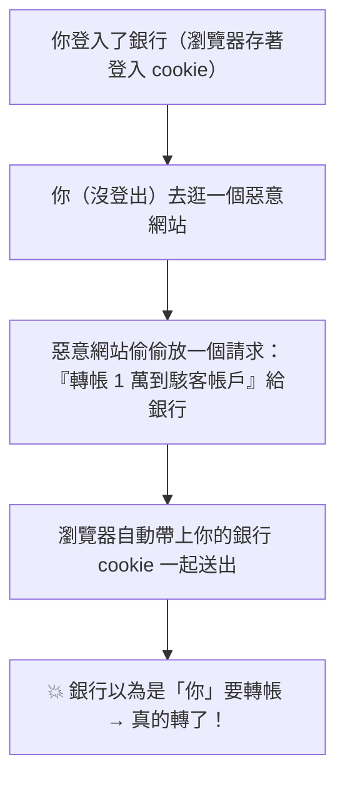

# [E-10-3] CSRF（跨站請求偽造）：為什麼要有 CSRF token

> **目標**：理解 CSRF 攻擊怎麼「冒用你的身分」做事，以及 CSRF token 怎麼防它。

## 一個狡猾的攻擊

**CSRF（Cross-Site Request Forgery，跨站請求偽造）** 是一種「**冒用你的身分，在你不知情下做事**」的攻擊。它很狡猾——它不偷你的密碼，而是「**借用你已登入的狀態**」。

## 攻擊怎麼發生

關鍵背景：你登入銀行後，瀏覽器會存一個「**登入憑證（cookie）**」。之後你對銀行的每個請求，瀏覽器會**自動帶上這個 cookie**（證明「是已登入的你」）。問題就出在這個「自動帶上」。

攻擊情境：



步驟：

1. 你登入銀行，瀏覽器存著登入 cookie（還沒登出）。
2. 你（在另一個分頁）逛到一個**惡意網站**。
3. 那個網站偷偷藏了一個「向銀行發出『轉帳給駭客』請求」的程式碼（可能偽裝成一張圖、一個自動送出的表單）。
4. 瀏覽器發這個請求時，**自動帶上你的銀行 cookie**（因為是發給銀行的）。
5. 銀行收到請求 + 合法的 cookie → 以為「是你本人要轉帳」→ **真的執行了！**

可怕之處：**駭客根本不知道你的密碼**，只是「**騙你的瀏覽器，用你的登入狀態，做了你沒想做的事**」。

## 防法：CSRF Token

最經典的防法是 **CSRF Token**：

> 伺服器在你「合法的頁面/表單」裡，埋一個「**隨機的、只有這次有效的祕密 token**」。真正的操作請求，必須附上這個 token。而**惡意網站「猜不到、也拿不到」這個 token**，所以它偽造的請求會被拒絕。

```
你的合法表單：附帶 CSRF token "x7k9..."（伺服器發的隨機值）
→ 轉帳請求帶著 token → 伺服器驗證 token 正確 → 執行 ✅

惡意網站的偽造請求：不知道 token（拿不到你頁面裡的祕密值）
→ 沒有 token 或 token 錯 → 伺服器拒絕 ❌
```

關鍵：**惡意網站能讓瀏覽器「帶上 cookie」（自動的），但無法讓它「帶上正確的 CSRF token」**（那是藏在你合法頁面裡的祕密，跨站拿不到）。這就擋住了偽造。

## 其他防法

現代還有其他防 CSRF 的機制，常一起用：

- **SameSite Cookie**：設定 cookie 為 `SameSite=Strict/Lax`——告訴瀏覽器「**從別的網站發來的請求，別自動帶這個 cookie**」。這從根源擋掉 CSRF（瀏覽器不自動帶 cookie，攻擊就失效）。現在這是很重要的防線。
- **檢查 Origin/Referer 標頭**：驗證請求「是不是真的從你的網站來的」。

## CSRF vs XSS（別混淆）

CSRF 和 XSS（E-10-2）名字像、都是 Web 攻擊，但不同：

| | CSRF | XSS |
|---|------|-----|
| 攻擊本質 | **冒用你的登入狀態**發請求 | 在網頁**注入惡意腳本**執行 |
| 偷什麼 | 借用你的身分做事（不偷密碼）| 可偷 cookie、改畫面、竊資料 |
| 防法 | CSRF token、SameSite cookie | 跳脫使用者輸入（別直接放進 HTML）|

## 小結

- **CSRF**：惡意網站「借用你已登入的狀態（cookie 會自動帶上）」，在你不知情下發出請求（如轉帳）——駭客不需要你的密碼。
- 防法：**CSRF Token**（藏在合法頁面的隨機祕密，惡意網站拿不到）、**SameSite Cookie**（瀏覽器別自動帶跨站 cookie）、檢查 Origin。
- 別和 XSS 混淆——CSRF 是「冒用身分」，XSS 是「注入腳本」。

> Web 安全總覽 → [E-10-1：OWASP Top 10](./E-10-1-web-security-overview.md)；XSS → [E-10-2](./E-10-2-xss.md)
