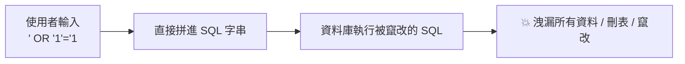

# [E-10-4] SQL Injection：一個引號如何摧毀整個資料庫

> **目標**：理解 SQL Injection（SQL 注入）這個經典又致命的攻擊——把惡意 SQL「注入」你的查詢，以及怎麼用參數化查詢防它。

## 一個經典又致命的攻擊

**SQL Injection（SQL 注入）** 是最古老、最有名、也至今仍常見的 Web 攻擊之一（穩居 OWASP Top 10，E-10-1）。它的原理是——**把惡意的 SQL 程式碼「注入」進你的資料庫查詢**，讓資料庫執行攻擊者想要的事。

## 問題：直接「拼字串」組 SQL

漏洞的根源是「**把使用者輸入，直接拼進 SQL 字串**」。例如登入查詢：

```javascript
// ❌ 危險：直接把使用者輸入拼進 SQL
const query = "SELECT * FROM users WHERE name = '" + userInput + "'";
```

正常情況，使用者輸入 `alice`，組出：

```sql
SELECT * FROM users WHERE name = 'alice'
```

沒問題。但如果攻擊者**輸入精心設計的字串**呢？

## 攻擊：用引號「跳脫」出來

攻擊者在輸入框打：`' OR '1'='1`。拼進去變成：

```sql
SELECT * FROM users WHERE name = '' OR '1'='1'
```

看出問題了嗎？`'1'='1'` **永遠為真**——所以這個查詢會「回傳**所有**使用者」！攻擊者用一個引號，「跳脫」出了你預期的字串範圍，改寫了整個查詢的邏輯。

更可怕的攻擊：輸入 `'; DROP TABLE users; --`，可能變成：

```sql
SELECT * FROM users WHERE name = ''; DROP TABLE users; --'
```

這會「**刪掉整個 users 資料表**」！一個輸入框，就能摧毀你的資料庫。這就是標題說的「一個引號摧毀整個資料庫」。



## 防法：參數化查詢（最重要）

防 SQL Injection 的**根本解法**是——**永遠不要「拼字串」組 SQL，改用「參數化查詢（Parameterized Query / Prepared Statement）」**：

```javascript
// ✅ 安全：參數化查詢——把「資料」和「SQL 指令」分開
const query = "SELECT * FROM users WHERE name = ?";
db.execute(query, [userInput]);    // userInput 被當「純資料」，不會被當 SQL 執行
```

關鍵差別：

> 參數化查詢把「**SQL 指令的結構**」和「**使用者提供的資料**」**徹底分開**。`?` 是個佔位，使用者輸入被當成「**純粹的資料值**」傳入——資料庫**絕不會把它當成 SQL 指令執行**。所以就算使用者輸入 `' OR '1'='1`，它也只會被當成「一個（很怪的）名字字串」去查，不會改寫查詢邏輯。

這是防 SQL Injection 的**黃金法則**：**用參數化查詢，永不拼字串**。

## ORM 通常幫你擋掉了

好消息——現代的 **ORM**（如 Prisma、EF Core，csharp Part 6、E-4）和查詢建構器，**預設就用參數化查詢**。所以你用 ORM 寫：

```javascript
db.user.findMany({ where: { name: userInput } })   // ORM 自動參數化，安全
```

ORM 自動把 `userInput` 當參數處理，幫你擋掉了 SQL Injection。**這是「用 ORM」的一大安全好處**。

但要小心——如果你用 ORM 的「**raw query（原始 SQL）**」功能、又自己拼字串，漏洞就回來了。所以即使用 ORM，也別「手動拼 SQL 字串」。

## 其他防線（縱深防禦）

除了參數化查詢（主要防線），還可以：

- **輸入驗證**：驗證輸入的格式合理（呼應 E-10-1）——但這是輔助，**不能取代**參數化查詢。
- **最小權限**：資料庫帳號只給「必要的權限」（呼應 aws-2-2 最小權限）——萬一被注入，限制損害（例如唯讀帳號就不能 DROP TABLE）。

## 小結

- **SQL Injection**：把惡意 SQL「注入」進查詢——根源是「把使用者輸入直接拼進 SQL 字串」。
- 攻擊：用引號等「跳脫」出字串、改寫查詢邏輯（`' OR '1'='1`）→ 洩漏全部資料、甚至刪表。
- **黃金防法：參數化查詢**——把「SQL 結構」和「使用者資料」分開，輸入只當「純資料」，絕不當指令執行。
- **ORM 預設參數化**，自動幫你擋（用 ORM 的安全好處）——但別自己拼 raw SQL。
- 輔助：輸入驗證、資料庫最小權限。

> Web 安全總覽 → [E-10-1](./E-10-1-web-security-overview.md)；ORM → 參見 **csharp 課程** Part 6；最小權限 → 參見 **aws 課程** Part 2-2
