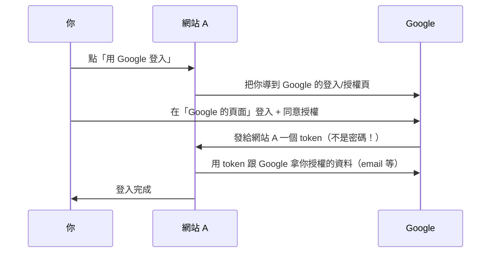

# [E-10-5] OAuth 2.0 與第三方登入：Google / GitHub 登入怎麼運作

> **目標**：理解「用 Google/GitHub 登入」背後的 OAuth 2.0——它怎麼讓你「不用給密碼」就能授權第三方存取，以及核心的「授權而非密碼」思維。

## 「用 Google 登入」背後

你一定用過「用 Google 登入」「用 GitHub 登入」——不用為每個網站註冊新帳號密碼，點一下就用 Google 帳號登入了。這背後是 **OAuth 2.0**（一套授權標準）。

它解決一個關鍵問題：

> **怎麼讓「網站 A」存取「你在 Google 的某些資料（如 email、頭像）」，而「不用把你的 Google 密碼給網站 A」？**

## 核心思維：授權，不是給密碼

OAuth 最重要的觀念——**它是「授權（authorization）」，不是「給密碼」**：

```
❌ 危險的做法：把你的 Google 密碼給網站 A，讓它「用你的帳號去拿資料」
   → 網站 A 拿到密碼 = 能做任何事、密碼可能外洩，超危險

✅ OAuth 的做法：你在「Google 自己的頁面」登入、授權，
   Google 發給網站 A 一個「有限的通行證（token）」
   → 網站 A 只拿到 token（不是密碼）、只能做「你授權的有限的事」
```

用類比：OAuth 像飯店的「**房卡**」。你不會把「萬能總鑰匙（密碼）」給代客泊車的人——你給他一張「只能開你房間、今天有效」的房卡（token）。他能做有限的事，且你隨時能讓房卡失效。

## OAuth 的流程（簡化）



關鍵步驟：

1. 你點「用 Google 登入」。
2. 網站 A 把你**導到 Google 自己的頁面**（重點：你是在 **Google** 輸入密碼，不是在網站 A）。
3. 你在 Google 登入、並同意「授權網站 A 存取我的 email」。
4. Google 發給網站 A 一個 **token（通行證）**——不是你的密碼。
5. 網站 A 用這個 token 跟 Google 拿「你授權的那些資料」。

整個過程，**你的 Google 密碼從沒給過網站 A**——它只拿到一個「有限的、可撤銷的 token」。

## 好處

- **不洩漏密碼**：你的 Google 密碼只給 Google，第三方網站永遠拿不到。
- **有限授權**：你能控制「授權哪些資料」（只給 email？還是也給聯絡人？），網站 A 只能做你同意的事。
- **可撤銷**：你能隨時在 Google 設定裡「撤銷」對某個網站的授權，token 立刻失效。
- **方便**：不用為每個網站記新密碼。

## OAuth vs 「認證」的澄清

一個常見的混淆——**OAuth 嚴格說是「授權（authorization）」協定，不是「認證（authentication）」**（兩者差別見 basic Part 4-D）。它本來是設計來「授權存取資源」的。

但因為「用 Google 登入」太方便，大家把它**也拿來當「登入/認證」用**——於是有了建在 OAuth 之上的 **OpenID Connect（OIDC）**，專門處理「用第三方來『認證身分』（登入）」。所以你看到的「用 Google 登入」，技術上常是 OAuth 2.0 + OpenID Connect。你知道「它本質是授權、被延伸來做登入」即可。

## 小結

- **OAuth 2.0**：讓第三方網站「存取你在 Google/GitHub 的部分資料」，而「不用給它你的密碼」。
- 核心思維：**授權（給有限的 token）≠ 給密碼**（像飯店房卡 vs 萬能鑰匙）。
- 流程：導到 Google 頁面登入授權 → Google 發 token 給網站 → 網站用 token 拿授權的資料。
- 好處：不洩漏密碼、有限授權、可撤銷、方便。
- OAuth 本質是「授權」；「用 Google 登入」是它 + OpenID Connect 延伸出的「認證」用法。

> 認證 vs 授權 → 參見 **basic 課程** Part 4-D；JWT token → 參見 **csharp 課程** Part 7、basic Part 4-D；Web 安全 → [E-10-1](./E-10-1-web-security-overview.md)
