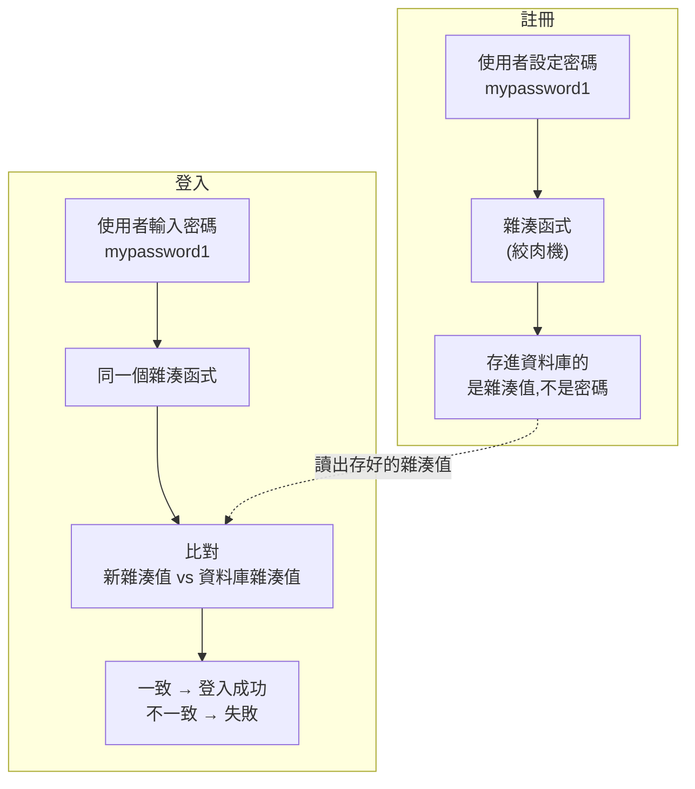

# [E-10-6] 密碼儲存：為什麼不能存明文，bcrypt 是什麼

> **這篇在說什麼**：密碼絕對不能原封不動地存進資料庫。這篇用「絞肉機」的類比，講清楚雜湊（hash）是什麼、為什麼 bcrypt 特別適合存密碼，以及一個安全的登入流程長什麼樣子。

## 概念說明

先問一個問題：你的資料庫，遲早有一天會外洩。

這不是悲觀，是現實。再大的公司都發生過資料庫外洩。所以真正的問題不是「會不會外洩」，而是「外洩的那一天，使用者的密碼會不會跟著裸奔」。

如果你把密碼**明文（plaintext，原始未加工的文字）**存進資料庫：

```
| email             | password    |
|-------------------|-------------|
| alice@example.com | mypassword1 |
| bob@example.com   | qwerty12345 |
```

那麼資料庫一旦外洩，攻擊者連解都不用解，直接拿到所有人的密碼。更糟的是——很多人會在不同網站用同一組密碼，所以你網站的疏忽，會害你的使用者連銀行、email 一起淪陷。

**結論很簡單：密碼，永遠不能存明文。** 那不存明文，要存什麼？

### 絞肉機：單向雜湊

想像一台絞肉機。

你把一塊牛排（密碼）放進去，轉一轉，出來一堆絞肉（一串看起來亂七八糟的字元）。這個過程有兩個關鍵特性：

1. **同一塊牛排，絞出來永遠是一樣的絞肉。**（同樣的密碼，永遠得到同樣的結果）
2. **你沒辦法把絞肉變回牛排。**（這是「單向」的，無法逆推回原始密碼）

這台絞肉機，就是**雜湊函式（hash function）**。把密碼丟進去，得到一串固定長度、無法逆推的字串，叫做**雜湊值（hash）**。

我們存進資料庫的，是這串絞肉，不是原始的牛排：

```
| email             | password_hash                          |
|-------------------|----------------------------------------|
| alice@example.com | $2b$10$N9qo8uLOickgx2ZMRZoMye...（一長串） |
```

現在就算資料庫外洩，攻擊者拿到的也只是一堆絞肉——他變不回原本的密碼。

## 深入一點

### 那登入的時候怎麼比對？

既然絞肉變不回牛排，使用者下次登入，我們怎麼知道他打的密碼對不對？

答案藏在絞肉機的第一個特性裡：**同樣的密碼，絞出來永遠一樣。**

所以流程是：使用者登入時，把他這次打的密碼，用同一台絞肉機再絞一次，然後比對「這次絞出來的絞肉」和「資料庫裡存的絞肉」是不是同一份。一樣，密碼就對。



這張圖在表達：我們從頭到尾都不需要「還原密碼」。註冊時雜湊一次存起來，登入時再雜湊一次拿來比對——全程不需要知道原始密碼長什麼樣。

### 光雜湊還不夠：加鹽（salt）

到這裡你可能覺得問題解決了，但有個陷阱。

如果兩個人用了同一組密碼（例如都是 `123456`），那他們的雜湊值會**一模一樣**。攻擊者只要事先算好一張「常見密碼 → 對應雜湊值」的對照表（這種預先算好的表叫 **rainbow table，彩虹表**），拿外洩的雜湊值去查表，就能反查出原始密碼。

解法叫做**加鹽（salt）**：在雜湊之前，先在每個密碼後面加上一段**隨機的字串**。

```
牛排 + 隨機的鹽巴 → 一起絞 → 獨一無二的絞肉
```

因為每個人的鹽都不同，就算兩個人密碼一樣，存進資料庫的雜湊值也完全不同。攻擊者預先算好的彩虹表就整個失效了——他必須針對每一個鹽，重新一個一個破解。

### 為什麼用 bcrypt 而不是普通雜湊

你可能聽過 MD5、SHA-256 這些雜湊函式。它們確實是單向雜湊，但**不適合拿來存密碼**——因為它們被設計得「非常快」。

對一般用途來說，快是優點。但對密碼來說，快是災難：攻擊者拿到外洩的雜湊值後，可以用顯示卡每秒嘗試「幾十億組」密碼去暴力猜，快雜湊讓他猜得飛快。

**bcrypt** 就是為了解決這件事而生的。它的設計哲學很反直覺——**故意把自己變慢**。而且它的慢是可以調整的：你可以設定一個「成本參數（cost factor）」，數字越大，算一次雜湊就越慢。

慢到什麼程度？對正常登入的使用者，慢個零點幾秒完全無感。但對想要暴力破解幾十億組密碼的攻擊者，這零點幾秒乘以幾十億，就變成天文數字的時間，破解在現實上變得不划算。

而且 bcrypt 還把「加鹽」內建好了——你不用自己生成、保管鹽，它會自動幫每個密碼產生隨機的鹽，並把鹽一起包進輸出的雜湊字串裡。

### TypeScript 實作：完整登入流程

這正是課程 **Part 4-D-4「完整登入流程」**想連到的精準目標。我們用 `bcrypt` 套件實作註冊和登入兩段。

**註冊時：把密碼雜湊後再存**

```typescript
import bcrypt from "bcrypt"

// cost factor 越高越安全也越慢,10~12 是常見的平衡點
const SALT_ROUNDS = 12

async function registerUser(email: string, plainPassword: string): Promise<void> {
  // hash 會自動產生 salt 並包進結果,我們永遠不碰原始密碼
  const passwordHash = await bcrypt.hash(plainPassword, SALT_ROUNDS)

  // 注意:存進資料庫的是 passwordHash,絕不是 plainPassword
  await userRepository.create({ email, passwordHash })
}
```

**登入時：用 bcrypt.compare 比對**

```typescript
import bcrypt from "bcrypt"

async function login(email: string, plainPassword: string): Promise<User> {
  const user = await userRepository.findByEmail(email)

  // 即使帳號不存在,也要呼叫 compare 並回傳一樣模糊的錯誤
  // 否則回應時間差會洩漏「這個 email 有沒有註冊過」
  if (!user) {
    throw new Error("帳號或密碼錯誤")
  }

  // compare 會用存好的雜湊裡的 salt,重新雜湊輸入的密碼再比對
  const isPasswordCorrect = await bcrypt.compare(plainPassword, user.passwordHash)
  if (!isPasswordCorrect) {
    throw new Error("帳號或密碼錯誤")
  }

  return user
}
```

注意幾個刻意的設計：

- 我們從不自己寫 `if (hash1 === hash2)`，而是用 `bcrypt.compare`。它會從存好的雜湊裡讀出當初的鹽，用同樣的鹽重新雜湊輸入的密碼再比對——這些細節 bcrypt 都幫你處理好了。

> **常見錯誤** — 為了「貼心」，把錯誤訊息講得太清楚：
>
> ```typescript
> // ❌ 分開告訴使用者哪裡錯
> if (!user) throw new Error("這個 email 還沒註冊")
> if (!isPasswordCorrect) throw new Error("密碼錯誤")
> ```
>
> 問題是：這等於免費告訴攻擊者「這個 email 是有效帳號」。他可以拿一大堆 email 來試，篩出哪些是真實使用者，再針對這些帳號集中火力猜密碼。
>
> 正確做法是**錯誤訊息模糊化**——不管是帳號不存在還是密碼錯誤，都回一樣的訊息：
>
> ```typescript
> // ✅ 對外永遠是同一句,不洩漏是帳號還是密碼的問題
> throw new Error("帳號或密碼錯誤")
> ```

### 為什麼這些密碼還是要走加密連線

最後補一個容易忽略的點：上面講的全是「密碼在伺服器端怎麼存」。但密碼從使用者的瀏覽器**傳到伺服器的路上**，也必須是加密的。

否則使用者打的明文密碼，在送往伺服器的途中就可能被攔截——還沒到你的雜湊函式，就已經外洩了。這道防線靠的是加密連線（HTTPS）。

## 延伸閱讀

> 回到安全的全貌,看密碼儲存在身分驗證裡的定位 → [E-10-1 Web 安全總覽：OWASP Top 10 是什麼](./E-10-1-web-security-overview.md)

> 密碼與登入 token 在傳輸途中靠加密連線保護 → [E-3-2 HTTPS 與 TLS](../E-3-network/E-3-2-https-tls.md)
