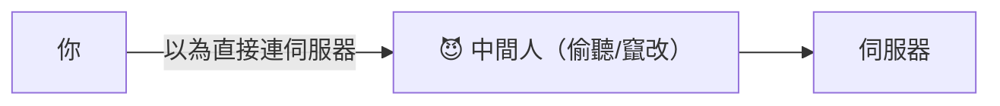

# [E-10-7] HTTPS 不是萬能的：中間人攻擊與憑證釘扎

> **目標**：理解「中間人攻擊（MITM）」是什麼、HTTPS 怎麼防它、以及 HTTPS 仍有的限制與進階防護（憑證釘扎）。

## 中間人攻擊（MITM）

**中間人攻擊（Man-in-the-Middle, MITM）** 是指——**攻擊者「偷偷站在你和伺服器之間」，攔截、甚至竄改你們的通訊**，而雙方都不知道。

例如：你連到一個「假冒的 Wi-Fi 熱點」，攻擊者就能攔截你所有的網路流量——看你傳的密碼、改你收到的內容。如果通訊是「明文（HTTP）」，這就是災難。

## HTTPS 怎麼防 MITM

你學過 HTTPS（E-3-2、infra Part 4-4）——它用 TLS 加密通訊。它對 MITM 的防護有兩層：

**① 加密**：通訊內容被加密——中間人就算攔截到，也只看到一團亂碼，看不懂、改不了（改了會被發現）。

**② 憑證驗證身分**：HTTPS 用「**憑證（certificate）**」證明「你連的真的是 google.com，不是假冒的」（E-3-2、infra Part 4-4）。憑證由可信的 CA（憑證機構）簽發，瀏覽器會驗證——假冒的網站拿不到「google.com 的合法憑證」，所以冒充不了。

所以 **HTTPS 大幅防範了 MITM**——這就是為什麼「用 HTTP（明文）傳密碼」超危險、現代網站都該用 HTTPS（E-3-2）。

## 但 HTTPS 不是萬能的

標題說「HTTPS 不是萬能」——它防了大部分 MITM，但仍有限制與漏洞：

**① 使用者忽略警告**：瀏覽器發現「憑證有問題」會跳警告，但**很多使用者直接點「繼續」**——那防護就破功了。

**② CA 被攻破或亂發憑證**：HTTPS 的信任建立在「CA 是可信的」。如果某個 CA 被駭、或被騙而「**亂簽發了 google.com 的假憑證**」給攻擊者——那攻擊者就能冒充 google.com，瀏覽器還以為是真的。歷史上真的發生過 CA 被攻破的事件。

**③ 連線「之前」的攻擊**：例如 DNS 被竄改（E-3-5）把你導到假網站、或「降級攻擊」逼你用不安全的舊協定。

**④ 端點本身被攻破**：HTTPS 只保護「傳輸途中」。如果你的裝置中毒、或伺服器本身被駭，HTTPS 也保護不了。

## 進階防護：憑證釘扎（Certificate Pinning）

針對「CA 亂發憑證」的風險，有個進階防護——**憑證釘扎（Certificate Pinning）**：

> **App「事先記住」它信任的「特定憑證（或其指紋）」**。連線時，除了「CA 簽的是否有效」，還檢查「**憑證是不是我釘住的那個**」。這樣就算有 CA 亂簽發了假憑證，因為「不是我釘住的那個」，App 也會拒絕。

這常用在「**手機 App**」（App 把伺服器的憑證指紋寫死在裡面）——多一層保險，防範 CA 被攻破的情況。缺點是「憑證更新時 App 也要更新」（較不靈活），所以主要用在高安全需求的 App（如銀行 App）。

## 給你的認知

- **務必用 HTTPS**：它防範了絕大多數的 MITM，是基本安全要求（E-3-2）。「用 HTTP 傳機密」是嚴重錯誤。
- **但別以為 HTTPS = 絕對安全**：它有限制（CA 風險、使用者忽略警告、端點被攻破）。安全是「縱深防禦」——HTTPS 是重要一層，但不是唯一一層（呼應 E-10-1、SRE 為失敗而設計）。
- 高安全需求（銀行 App 等）會加憑證釘扎等進階防護。

## 小結

- **中間人攻擊（MITM）**：攻擊者偷偷站在你和伺服器之間，攔截/竄改通訊。
- **HTTPS 防 MITM**：加密（看不懂、改了會發現）+ 憑證驗證身分（防冒充）。
- 但 **HTTPS 不是萬能**：使用者忽略警告、CA 被攻破亂發憑證、連線前的攻擊（DNS）、端點被攻破。
- 進階防護：**憑證釘扎**（App 記住特定憑證，防 CA 亂發），常用於高安全 App。
- 認知：務必用 HTTPS，但安全要縱深防禦、別以為它絕對安全。

> HTTPS 與 TLS → [E-3-2](../E-3-network/E-3-2-https-tls.md)；Web 安全總覽 → [E-10-1](./E-10-1-web-security-overview.md)；HTTPS 實作 → 參見 **infra 課程** Part 4-4
