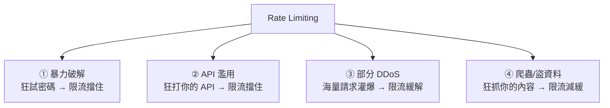

# [E-10-8] Rate Limiting：防止暴力破解與 DDoS

> **目標**：理解「限流（Rate Limiting）」怎麼用「限制請求次數」防範暴力破解、濫用與部分 DDoS 攻擊。

## 一個簡單卻有效的防線

**Rate Limiting（限流）** 是「**限制『同一來源』在『單位時間內』能發多少請求**」的機制。超過就拒絕（回傳 `429 Too Many Requests`）。它簡單，卻能擋掉好幾種攻擊與濫用。

（你在 SRE Part 8-2 從「保護系統不過載」的角度學過限流；這篇從「資安」角度看它。）

## 限流防什麼



**① 防暴力破解（Brute Force）**

攻擊者「**狂試密碼**」想登入你的帳號——一秒試幾千個組合。如果沒限制，遲早試中。**限流**：「同一 IP/帳號，登入失敗 5 次後，鎖 15 分鐘」——攻擊者一小時只能試幾次，暴力破解變得不可行（呼應 infra Part 8-3 的 fail2ban，也是限流精神）。

**② 防 API 濫用**

有人狂打你的 API（爬資料、佔資源、想搞垮你）。限流：「每個 API key 每分鐘最多 100 次」——擋掉異常的高頻濫用。

**③ 緩解 DDoS（部分）**

DDoS（分散式阻斷服務）攻擊用「海量請求」灌爆你的服務。限流能擋掉「單一來源的洪水」（但對「大量不同來源」的分散式 DDoS，要配合 CDN/WAF 等更強的防護）。

**④ 防爬蟲/盜內容**

有人寫爬蟲狂抓你的內容（搶資料、盜版）。限流能減緩這種大規模抓取。

## 怎麼做限流

限流通常「依某個 key 計數」——例如依「IP」「使用者帳號」「API key」：

```
概念：
  每收到一個請求 → 對它的 key（如 IP）計數 +1
  如果「這個 key 在過去 1 分鐘的次數 > 上限」→ 拒絕（回 429）
  否則 → 放行
```

常見的限流演算法（知道有這些即可）：

- **固定視窗（Fixed Window）**：「每分鐘最多 N 次」，簡單。
- **滑動視窗（Sliding Window）**：更平滑，避免「視窗邊界」的爆量。
- **令牌桶（Token Bucket）**：允許「平常存額度、偶爾突發」（呼應 aws-3-3 T 系列的 credit 概念）。

實作上常用 **Redis**（快取課程 cache-5-2）來做計數——因為要快、且多台伺服器要共享計數（呼應分散式快取）。

## 限流的回應與體驗

限流拒絕請求時，標準做法：

- 回傳 **`429 Too Many Requests`** 狀態碼。
- 附上 `Retry-After` 標頭，告訴對方「等多久再試」。
- 對「正常使用者偶爾超標」要友善（給清楚的訊息），對「明顯惡意」可以更嚴格。

要注意「**別誤傷正常使用者**」——限額設太低，正常使用者會被擋（體驗差）；設太高，擋不住攻擊。要依實際情況調整（呼應 SRE Part 8-2 的取捨）。

## 限流 vs 其他防護

限流是「縱深防禦」的一環，常和別的一起用：

- **限流**：擋「高頻」的濫用/攻擊。
- **驗證碼（CAPTCHA）**：擋「機器人」（多次失敗後要求驗證）。
- **WAF（Web 應用防火牆）**：擋已知的攻擊模式。
- **CDN**：吸收/分散大規模流量（cache-4、aws CloudFront）。

## 小結

- **Rate Limiting（限流）**：限制「同一來源、單位時間」的請求數，超過就拒絕（429）。
- 防：暴力破解（狂試密碼）、API 濫用、部分 DDoS、爬蟲盜資料。
- 做法：依 key（IP/帳號/API key）計數；演算法有固定視窗、滑動視窗、令牌桶；常用 Redis 實作。
- 回 429 + Retry-After；要小心別誤傷正常使用者。
- 是縱深防禦一環，常配 CAPTCHA、WAF、CDN。

> 限流的系統保護角度 → 參見 **sre 課程** Part 8-2；fail2ban（限流防暴力破解）→ **infra 課程** Part 8-3；Redis → 快取課程 cache-5-2
