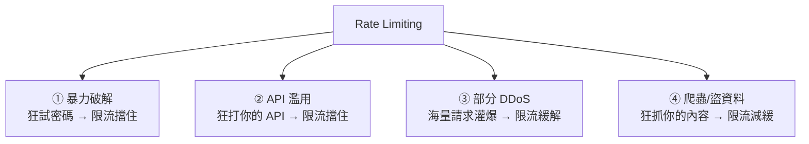
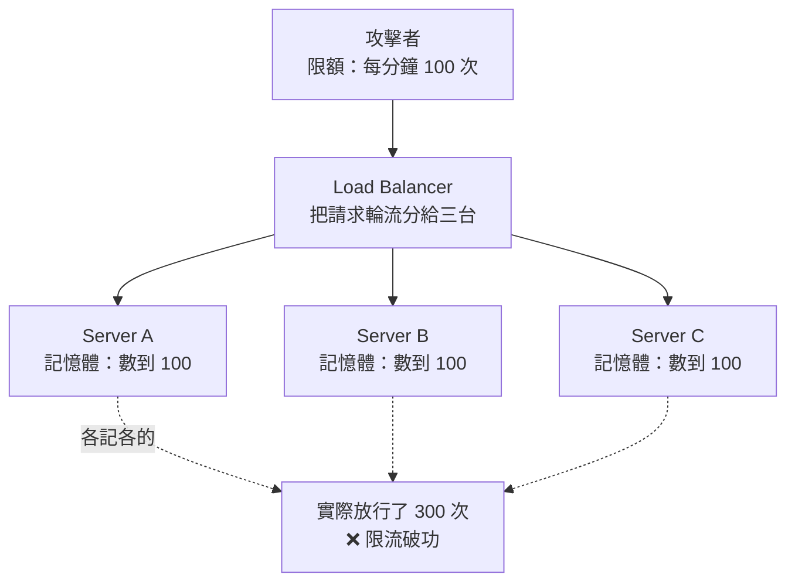
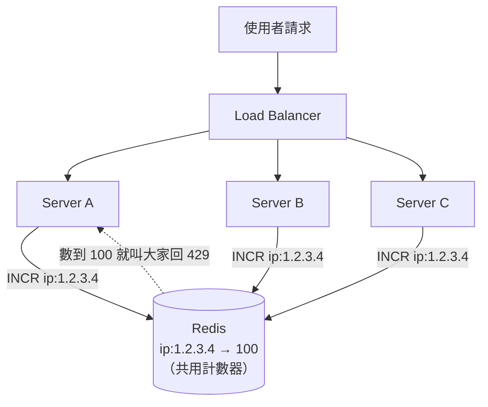

# [E-10-8] Rate Limiting：防止暴力破解與 DDoS

> **目標**：理解「限流（Rate Limiting）」怎麼用「限制請求次數」防範暴力破解、濫用與部分 DDoS 攻擊。

## 一個簡單卻有效的防線

**Rate Limiting（限流）** 是「**限制『同一來源』在『單位時間內』能發多少請求**」的機制。超過就拒絕（回傳 `429 Too Many Requests`）。它簡單，卻能擋掉好幾種攻擊與濫用。

（你在 SRE Part 8-2 從「保護系統不過載」的角度學過限流；這篇從「資安」角度看它。）

## 限流防什麼


```mermaid
graph TB
    RL["Rate Limiting"]
    RL --> BRUTE["① 暴力破解<br/>狂試密碼 → 限流擋住"]
    RL --> ABUSE["② API 濫用<br/>狂打你的 API → 限流擋住"]
    RL --> DDOS["③ 部分 DDoS<br/>海量請求灌爆 → 限流緩解"]
    RL --> SCRAPE["④ 爬蟲/盜資料<br/>狂抓你的內容 → 限流減緩"]
```

**① 防暴力破解（Brute Force）**

攻擊者「**狂試密碼**」想登入你的帳號——一秒試幾千個組合。如果沒限制，遲早試中。**限流**：「同一 IP/帳號，登入失敗 5 次後，鎖 15 分鐘」——攻擊者一小時只能試幾次，暴力破解變得不可行（呼應 infra Part 8-3 的 fail2ban，也是限流精神）。

**② 防 API 濫用**

有人狂打你的 API（爬資料、佔資源、想搞垮你）。限流：「每個 API key 每分鐘最多 100 次」——擋掉異常的高頻濫用。

**③ 緩解 DDoS（部分）**

DDoS（分散式阻斷服務）攻擊用「海量請求」灌爆你的服務。限流能擋掉「單一來源的洪水」（但對「大量不同來源」的分散式 DDoS，要配合 CDN/WAF 等更強的防護）。

**④ 防爬蟲/盜內容**

有人寫爬蟲狂抓你的內容（搶資料、盜版）。限流能減緩這種大規模抓取。

## 限流要「誰」來做？不一定是你的 server

一個常見的誤會是「限流一定要在後端程式裡自己寫」。其實不是——限流可以放在請求路徑上的**很多層**，越外層擋掉，你的 server 越省力。實務上常常是「好幾層一起做」：

| 放在哪一層 | 由誰實作 | 特性 |
|---|---|---|
| CDN / WAF（如 Cloudflare） | 買服務、設定規則 | 最外層，海量流量在到你機房前就被吸收 |
| API Gateway / 反向代理（Nginx、Kong） | 改設定檔，不寫程式 | 擋掉「粗粒度」的高頻濫用，你的 app 完全不用管 |
| **你的應用程式（server code）** | 自己寫 or 用套件 | 最有彈性——能依「登入失敗」「使用者的方案等級」這種**業務邏輯**限流 |

原則：**越通用的限流（依 IP、全站每分鐘幾次）越往外層丟；越貼近業務的限流才在 server 自己做。**

前面提到的「登入失敗 5 次就鎖 15 分鐘」，就**必須** server 來實作——因為只有 server 知道「這次登入是失敗的」，CDN 和 Nginx 看不懂你的業務邏輯。

## 怎麼做限流

限流通常「依某個 key 計數」——例如依「IP」「使用者帳號」「API key」：

```
概念：
  每收到一個請求 → 對它的 key（如 IP）計數 +1
  如果「這個 key 在過去 1 分鐘的次數 > 上限」→ 拒絕（回 429）
  否則 → 放行
```

常見的限流演算法（知道有這些即可）：

- **固定視窗（Fixed Window）**：「每分鐘最多 N 次」，簡單。
- **滑動視窗（Sliding Window）**：更平滑，避免「視窗邊界」的爆量。
- **令牌桶（Token Bucket）**：允許「平常存額度、偶爾突發」（呼應 aws-3-3 T 系列的 credit 概念）。

### 最簡單版：單台 server 用記憶體計數

概念就是維護一張「key → 這一分鐘的次數」的表。對應到程式碼大概長這樣（Express，示意用，不用背）：

```typescript
const counts = new Map<string, number>()   // key: IP，value: 這一分鐘的次數

function rateLimit(req, res, next) {
  const key = req.ip
  const current = (counts.get(key) ?? 0) + 1
  counts.set(key, current)

  if (current === 1) {
    // 第一次出現才設定歸零計時，避免每次請求都重設
    setTimeout(() => counts.delete(key), 60_000)
  }

  if (current > 100) {
    res.setHeader("Retry-After", "60")
    return res.status(429).json({ error: "請求太頻繁，請稍後再試" })
  }
  next()
}
```

實務上你通常不會自己寫，而是用 `express-rate-limit` 這類套件——但底層邏輯就是上面這張表。**不過這個版本有個致命問題** 👇

### 為什麼要用 Redis？多台 server 會「各記各的」

一旦你水平擴展成**多台 server**（很常見），上面那個 `Map` 存在**每台機器自己的記憶體**裡，彼此不知道對方數到幾了：


```mermaid
graph TB
    U["攻擊者<br/>限額：每分鐘 100 次"]
    LB["Load Balancer<br/>把請求輪流分給三台"]
    S1["Server A<br/>記憶體：數到 100"]
    S2["Server B<br/>記憶體：數到 100"]
    S3["Server C<br/>記憶體：數到 100"]

    U --> LB
    LB --> S1
    LB --> S2
    LB --> S3

    S1 -.->|"各記各的"| X["實際放行了 300 次<br/>❌ 限流破功"]
    S2 -.-> X
    S3 -.-> X
```

這張圖說的是：限額設 100，但三台各數各的，攻擊者實際打進來 **300 次**——限流形同虛設。

**解法：把「計數」從各台記憶體搬到一個大家共用的地方——Redis。** Redis 是所有 server 都連得到的中央記憶體，計數放這裡，三台就會看到同一個數字：


```mermaid
graph TB
    U["使用者請求"]
    LB["Load Balancer"]
    S1["Server A"]
    S2["Server B"]
    S3["Server C"]
    R[("Redis<br/>ip:1.2.3.4 → 100<br/>（共用計數器）")]

    U --> LB
    LB --> S1 & S2 & S3
    S1 -->|"INCR ip:1.2.3.4"| R
    S2 -->|"INCR ip:1.2.3.4"| R
    S3 -->|"INCR ip:1.2.3.4"| R
    R -.->|"數到 100 就叫大家回 429"| S1
```

這張圖的重點：**三台 server 不再各自計數，而是每次都去問同一個 Redis。** 不管請求落到哪台，看到的都是同一個累計數字，限流才準。

Redis 剛好有兩個原子指令特別適合做這件事：`INCR`（數字 +1）和 `EXPIRE`（設定幾秒後自動刪除）：

```typescript
async function rateLimit(req, res, next) {
  const key = `ratelimit:${req.ip}`

  const count = await redis.incr(key)   // 原子 +1，回傳加完的值

  if (count === 1) {
    // 這個 key 第一次出現 → 設定 60 秒後自動消失（等於「每分鐘」的視窗）
    await redis.expire(key, 60)
  }

  if (count > 100) {
    res.setHeader("Retry-After", "60")
    return res.status(429).json({ error: "請求太頻繁" })
  }
  next()
}
```

`INCR` 是**原子操作**——就算三台 server 同一瞬間都來 +1，Redis 也會正確排隊、不會算錯。這正是分散式限流的關鍵（呼應快取課程 cache-5-2 分散式快取）。

> ⚠️ 上面這是最單純的「固定視窗」。它有個小瑕疵：視窗交界處可能瞬間放行到接近兩倍量（第 59 秒打 100 次 + 下一分鐘第 1 秒再打 100 次）。要更平滑就用**滑動視窗**或**令牌桶**——那會用到 Redis 的 sorted set 或一段 Lua script，但概念上都還是「把狀態存在 Redis、大家共用」。

### 令牌桶的實作味道

令牌桶的概念不是「數請求數」，而是「桶裡有幾個令牌」：

```
桶子固定容量（如 100 個令牌），以固定速率補充（如每秒補 10 個）
每來一個請求：
    如果桶裡還有令牌 → 拿走一個，放行
    如果桶空了 → 回 429
```

好處：平常沒人用時令牌會存滿，所以能容忍「突然一波正常尖峰」，但長期平均速率仍被限制住。AWS T 系列機型的 CPU credit 就是同一個機制。

## 限流的回應與體驗

限流拒絕請求時，標準做法：

- 回傳 **`429 Too Many Requests`** 狀態碼。
- 附上 `Retry-After` 標頭，告訴對方「等多久再試」。
- 對「正常使用者偶爾超標」要友善（給清楚的訊息），對「明顯惡意」可以更嚴格。

要注意「**別誤傷正常使用者**」——限額設太低，正常使用者會被擋（體驗差）；設太高，擋不住攻擊。要依實際情況調整（呼應 SRE Part 8-2 的取捨）。

## 限流 vs 其他防護

限流是「縱深防禦」的一環，常和別的一起用：

- **限流**：擋「高頻」的濫用/攻擊。
- **驗證碼（CAPTCHA）**：擋「機器人」（多次失敗後要求驗證）。
- **WAF（Web 應用防火牆）**：擋已知的攻擊模式。
- **CDN**：吸收/分散大規模流量（cache-4、aws CloudFront）。

## 小結

- **Rate Limiting（限流）**：限制「同一來源、單位時間」的請求數，超過就拒絕（429）。
- 防：暴力破解（狂試密碼）、API 濫用、部分 DDoS、爬蟲盜資料。
- **不一定 server 自己做**：通用限流往 CDN/Gateway 丟；貼業務的（登入失敗鎖定）才在 server 實作。
- 做法：依 key（IP/帳號/API key）計數；演算法有固定視窗、滑動視窗、令牌桶。
- **單台用記憶體就夠；多台一定要用 Redis 共用計數**（`INCR` + `EXPIRE`），否則各記各的會讓限流破功。
- 回 429 + Retry-After；要小心別誤傷正常使用者。
- 是縱深防禦一環，常配 CAPTCHA、WAF、CDN。

> 限流的系統保護角度 → 參見 **sre 課程** Part 8-2；fail2ban（限流防暴力破解）→ **infra 課程** Part 8-3；Redis → 快取課程 cache-5-2
