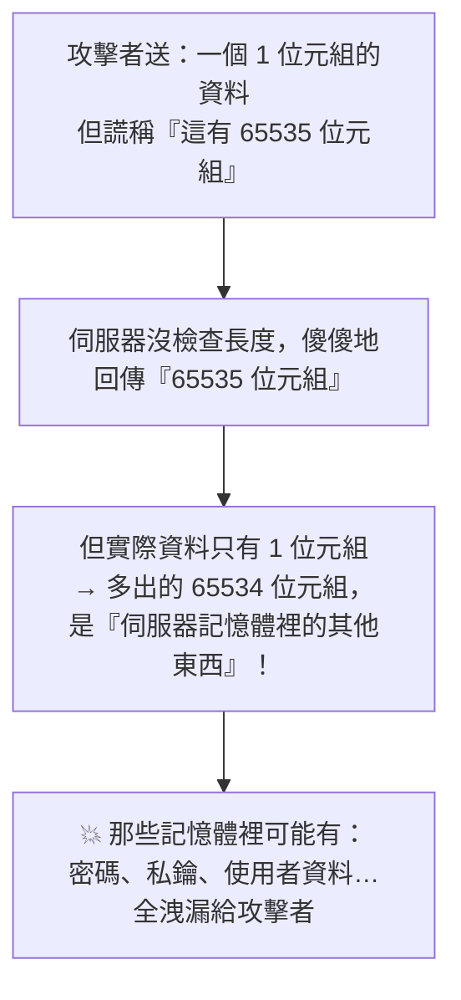

# [E-10-9] 趣味：史上最貴的安全漏洞——Heartbleed

> **目標**：透過 2014 年的 Heartbleed 漏洞，輕鬆體會「一個小小的程式 bug」如何變成全球性的安全災難。

## 一個讓半個網路流血的漏洞

2014 年，一個安全漏洞震驚了全世界，它有個很有畫面的名字——**Heartbleed（心臟淌血）**。它被稱為史上影響最廣、最嚴重的安全漏洞之一，影響了**全球約三分之二的網站**。

## 漏洞在哪：OpenSSL

問題出在 **OpenSSL**——一個「**幾乎全世界都在用**」的開源加密函式庫。你用的 HTTPS（E-3-2）加密，背後很多就是靠 OpenSSL。它如此普及，以至於「它有漏洞 = 半個網路有漏洞」。

漏洞出在 OpenSSL 的一個叫「**Heartbeat（心跳）**」的功能——這功能是用來「確認連線還活著」的（像 SRE 的健康檢查）。你送一個「心跳」訊息，伺服器回應你，確認連線正常。

## bug 是什麼：沒檢查長度

Heartbeat 的運作大概是：「你送一段資料 + 說『這段資料有 N 個位元組』，伺服器把『N 個位元組』回給你」。bug 在於——

> **伺服器「沒有檢查」你說的 N，是不是真的等於你送來的資料長度。**

攻擊者於是這樣做：

攻擊者「**謊報長度**」——說「我這資料有 65535 位元組」，但實際只送 1 位元組。伺服器沒檢查，就「**多回傳了 65534 位元組它記憶體裡的內容**」——而那些內容可能是**其他使用者的密碼、伺服器的私鑰、敏感資料**！攻擊者反覆這樣做，就能「一點一點挖出」伺服器記憶體裡的機密。而且**這種攻擊不留痕跡**，神不知鬼不覺。

這就是「Heartbleed（心跳淌血）」名字的由來——透過「心跳」功能，讓伺服器「淌血」洩漏記憶體。

## 災難有多大

- 影響全球約 **2/3 的網站**（都用了有漏洞的 OpenSSL 版本）。
- 無數密碼、私鑰可能已被竊取——全球網站緊急「打補丁 + 重新發憑證 + 要使用者改密碼」。
- 估計造成的清理成本高達數億美元。
- 它成了「**開源軟體安全**」的警鐘。

## 它教我們什麼

Heartbleed 帶來幾個深刻教訓：

**① 一個小 bug，全球災難**

漏洞的本質就是「**沒檢查輸入的長度**」——一個很基本的疏忽。但因為 OpenSSL 太普及，這個小 bug 放大成全球災難（呼應 left-pad E-2-5、連鎖故障）。**驗證輸入**（E-10-1）這種「基本功」，在關鍵程式碼裡攸關全球安全。

**② 「大家都在用」不等於「安全」**

OpenSSL 被全世界依賴，但它其實長期「**資源不足、維護者很少**」——一個如此關鍵的基礎建設，竟靠少數志工維護。Heartbleed 後，業界才驚覺「**我們的數位世界，建立在一些『沒人好好維護的開源專案』上**」，並開始投入資源支持關鍵開源專案。這呼應了供應鏈安全的議題（E-2-5 left-pad 也是）。

**③ 記憶體安全的重要**

這個 bug 是「讀取了不該讀的記憶體」——這類「記憶體安全」漏洞在 C/C++ 這種「手動管理記憶體」的語言很常見。這也是為什麼現代越來越推崇「記憶體安全的語言」（如 Rust）來寫關鍵基礎建設。

## 小結

- **Heartbleed（2014）**：OpenSSL（全球都在用的加密函式庫）的漏洞，影響約 2/3 的網站。
- bug 本質：心跳功能「沒檢查輸入長度」→ 攻擊者謊報長度 → 伺服器多回傳記憶體內容（含密碼、私鑰）。
- 教訓：一個小 bug（沒驗證輸入）可成全球災難；「大家都用」≠ 安全（關鍵開源缺維護）；記憶體安全很重要。

> 輸入驗證、Web 安全 → [E-10-1](./E-10-1-web-security-overview.md)；供應鏈/依賴風險 → [E-2-5：left-pad 事件](../E-2-npm/E-2-5-left-pad.md)
