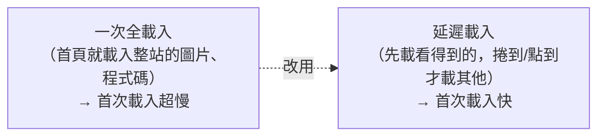

# [E-11-1] 前端效能優化：Lazy Loading、Code Splitting、Memoization

> **目標**：認識幾個前端效能優化的核心手段——延遲載入、程式碼分割、記憶化，讓網頁「載得快、跑得順」。

## 前端的「快」很重要

使用者對「慢」非常無感容忍度低——網頁載入慢一秒，就有人離開（E-11-7 的 Amazon 研究）。前端效能優化的目標就是讓網頁「**載得快、互動順**」。這篇介紹幾個核心手段。

## ① Lazy Loading（延遲載入）：要用時才載

**Lazy Loading** 的精神：**別一開始就把所有東西載進來，「要用到時」才載**。

常見應用：

- **圖片延遲載入**：頁面很長、有很多圖。先只載「使用者目前看得到的」，捲動到下面時才載那些圖。（HTML 的 `loading="lazy"` 就能做。）
- **元件/路由延遲載入**：使用者沒進到某個頁面，就先別載那頁的程式碼。

效果：**首次載入只載「必要的」**，快很多；其餘「需要時才載」。

## ② Code Splitting（程式碼分割）：拆成小塊

現代前端會把所有 JS「打包」成檔案。問題是——如果打包成「一個巨大的檔案」，使用者第一次就要下載整包（很慢）。

**Code Splitting** 把這一大包「**分割成小塊（chunk）**」，按需載入：

- 進首頁 → 只載「首頁需要的那塊」。
- 點到「設定頁」→ 才載「設定頁那塊」。

這和 Lazy Loading 常搭配——**分割成小塊 + 延遲載入需要的塊**。打包工具（Vite、webpack，basic Part 4-C）會幫你做分割。效果：首次只下載「當前頁需要的」，而非整站的程式碼。

> 這也和快取課程 cache-3-5 的「hash 檔名」呼應——分割出的每塊有自己的 hash 檔名，能各自永久快取。

## ③ Memoization（記憶化）：別重複算

**Memoization** 的精神：**把「算過的結果記起來」，下次同樣的輸入直接用，不重算**——這其實就是「快取」用在「運算」上（呼應快取課程 cache-1-1）。

前端常見場景（尤其 React，basic Part 6）：

- 一個「很耗效能的計算」（如過濾、排序一大筆資料）——用 memoization 記住結果，只在「輸入真的變了」時才重算（React 的 `useMemo`）。
- 避免元件「不必要的重新渲染」——記住結果，輸入沒變就不重畫（React 的 `memo`、`useCallback`）。

效果：避免「每次都重複做昂貴的運算/渲染」，讓互動更順。

> ⚠️ 別過度用 memoization——它本身有成本（要存、要比較）。只在「真的有效能問題、且運算真的昂貴」時用（呼應「過早最佳化是萬惡之源」，E-11-6）。

## 其他前端效能手段（簡述）

| 手段 | 做什麼 |
|------|--------|
| **壓縮資源** | JS/CSS/圖片壓縮、用現代圖片格式 |
| **CDN** | 靜態資源用 CDN 就近載入（cache-4、E-11-5）|
| **瀏覽器快取** | 設好 Cache-Control，重複造訪超快（cache-3、E-11-2）|
| **減少請求** | 合併資源、避免太多小檔 |

## 核心心法

前端效能優化的核心邏輯：

> **① 少載一點（lazy load、code split：只載必要的）② 少算一點（memoization：別重複算）③ 載快一點（CDN、快取、壓縮）。**

但記得（呼應 E-11-6）——**先量測、找出真正的瓶頸，再優化**。別憑感覺亂優化（過早最佳化）。

## 小結

- 前端效能優化讓網頁「載得快、跑得順」（慢一秒就流失使用者）。
- **Lazy Loading**：要用時才載（圖片、元件）。
- **Code Splitting**：把程式碼拆成小塊、按需載入（配 lazy loading）。
- **Memoization**：記住算過的結果別重算（運算層的快取，React useMemo）。
- 其他：壓縮、CDN、瀏覽器快取、減少請求。
- 心法：少載、少算、載快——但先量測找瓶頸再優化。

> 瀏覽器快取 → [E-11-2](./E-11-2-browser-cache.md) 及快取課程 Part 3；CDN → [E-11-5](./E-11-5-cdn.md)；先量測再優化 → [E-11-6](./E-11-6-backend-profiling.md)；React → 參見 **basic 課程** Part 6
