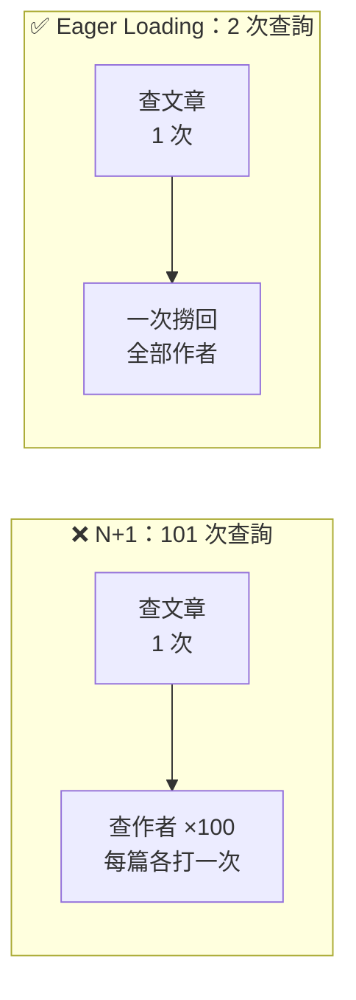

# [E-11-4] 資料庫效能：N+1 問題、索引、分頁設計

> **目標**：認識資料庫常見的效能問題與優化手段——索引、N+1、分頁，資料庫往往是後端效能的關鍵瓶頸。

## 資料庫常是後端的瓶頸

後端變慢，元兇常常是「資料庫」（SRE Part 7-2 負載測試常證實）。所以「**讓資料庫查詢快**」是後端效能優化的重點。這篇彙整幾個核心手段（其中一些有專章深入）。

## ① 索引：讓查詢快的根本

最重要的——**為「常被查的欄位」建索引**（E-4-1 深入過）。

> 沒索引 → 查一筆要「掃描整張表」（一百萬筆掃一百萬次，慢）。有索引 → 像查字典直接定位（快幾百上千倍）。

舉個具體例子。假設你很常用 email 找使用者：

```sql
SELECT * FROM users WHERE email = 'alice@example.com';
```

- **沒建索引**：資料庫只能從第一筆逐列比對到最後一筆（全表掃描），一百萬筆就比對一百萬次。
- **建了索引**：像查字典一樣直接跳到那筆，瞬間定位。

```sql
-- 為常被查的 email 欄位建索引
CREATE INDEX idx_users_email ON users(email);
```

查詢慢時，**第一個該檢查的就是「該建索引的欄位有沒有建」**。但別亂建（索引拖慢寫入、佔空間，E-4-1 的取捨）——「常被查的」才建。

## ② N+1 問題：ORM 的隱藏殺手

第二常見的——**N+1 查詢問題**（E-4-4 深入過）。它特別陰險，因為**程式碼看起來完全正常**，跑起來卻慢到爆。用一個「列出文章、每篇顯示作者名字」的例子最清楚。

### 先搞懂問題怎麼發生的

先用 pseudo code 看它的結構：

```
查出所有文章            ← 這是那個「1」
對每一篇文章：
    再去查它的作者      ← 每一圈都打一次 DB，這是那個「N」
```

> **常見錯誤** — 很多人會很自然地這樣寫：

```typescript
// ❌ N+1：查文章 1 次，再為「每一篇」各查一次作者
const posts = await db.post.findMany()          // 1 次：SELECT * FROM posts

for (const post of posts) {
  const author = await db.user.findUnique({     // ← 迴圈裡打 DB！
    where: { id: post.authorId },
  })
  console.log(`${post.title} — ${author.name}`)
}
```

這段程式碼邏輯上完全正確，但打開 ORM 印出來的 SQL 日誌，就會看到查詢爆炸：

```
SELECT * FROM posts;                     -- 1 次（查全部文章）
SELECT * FROM users WHERE id = 1;        -- 第 1 篇的作者
SELECT * FROM users WHERE id = 2;        -- 第 2 篇的作者
SELECT * FROM users WHERE id = 3;        -- ...
-- 100 篇文章 → 1 + 100 = 101 次查詢！
```

問題在於：**每一次查詢都有一趟網路來回延遲**，101 趟累加起來，一個頁面就從幾十毫秒變成好幾秒。文章越多越慢——這就是「N+1」名字的由來（1 次主查詢 + N 次關聯查詢）。



這張圖對比：同樣的結果，N+1 打了 101 次 DB，Eager Loading 只打 2 次。

### 解法：Eager Loading（預先載入）

叫 ORM「查文章的同時，把關聯的作者一起查回來」，用 `include`（不同 ORM 名稱略有差異，Prisma/Sequelize 都叫 `include`）：

```typescript
// ✅ include 讓 ORM 一次把作者一起載入
const posts = await db.post.findMany({
  include: { author: true },     // 關聯一起載入
})

for (const post of posts) {
  // post.author 已經在手上了，迴圈裡不再打 DB
  console.log(`${post.title} — ${post.author.name}`)
}
```

ORM 底層會聰明地合併成 2 次查詢——用 `IN` 一次把所有作者撈回來：

```
SELECT * FROM posts;
SELECT * FROM users WHERE id IN (1, 2, 3, ...);   -- 一次撈回所有作者
-- 總共 2 次
```

**怎麼揪出 N+1？** 它在程式碼裡看不出破綻，要靠**打開 ORM 的 SQL 日誌**——只要看到「同一種查詢在迴圈裡重複跑了幾十上百次」，幾乎就是它。

> 這裡的壞味道是「在迴圈裡逐筆查詢」，正確心法是「**批次處理**」（一次撈一批，而非一筆一趟）→ 深入探討見 [E-4-4](../E-4-database/E-4-4-n-plus-one.md)。

## ③ 分頁：別一次撈全部

第三個常見問題——**一次查太多資料**。例如「列出所有訂單」，如果有一百萬筆，一次全撈回來：

- 資料庫累、網路傳輸大、前端也卡。

解法：**分頁（pagination）**——一次只查「一頁」（例如 20 筆）：

```sql
SELECT * FROM orders ORDER BY id LIMIT 20 OFFSET 40;   -- 第 3 頁（每頁 20）
```

兩種分頁方式：

| 方式 | 做法 | 取捨 |
|------|------|------|
| **Offset 分頁** | `LIMIT 20 OFFSET N`（跳過前 N 筆）| 簡單，但「翻到很後面」時慢（要跳過大量資料）|
| **Cursor 分頁** | 「從『上一頁最後一筆』之後拿 20 筆」| 翻深也快，適合大資料/無限捲動 |

大資料、無限捲動（像社群動態）傾向用 **cursor 分頁**（效能穩定）。

## ④ 其他資料庫優化手段

| 手段 | 做什麼 |
|------|--------|
| **只查需要的欄位** | `SELECT name` 而非 `SELECT *`（少傳資料）|
| **快取** | 熱門查詢結果存 Redis，不重複查 DB（快取課程 cache-5）|
| **讀寫分離** | 讀分散到副本（aws Read Replica，E-13-12）|
| **避免複雜 join** | 太多表 join 很慢，有時要調整資料模型 |

## 怎麼找出慢查詢

優化前要先「**找出哪個查詢慢**」（呼應 E-11-6 先量測）：

- **用 `EXPLAIN`**：資料庫的 `EXPLAIN` 指令會顯示「這個查詢的執行計畫」——有沒有用到索引、是不是在全表掃描。這是診斷慢查詢的第一招。
- **慢查詢日誌**：資料庫能記錄「跑超過 X 秒的查詢」，揪出元兇。
- **監控/APM**：觀測性工具（E-14）能顯示「哪些查詢慢、被呼叫幾次」。

## 小結

- 資料庫常是後端瓶頸，優化重點：
  - **索引**：為常查的欄位建（E-4-1）——查詢慢先檢查這個。
  - **N+1**：用 Eager Loading 避免「1+N 次查詢」（E-4-4）。
  - **分頁**：別一次撈全部（offset vs cursor 分頁）。
  - 其他：只查需要的欄位、快取、讀寫分離。
- 優化前先用 `EXPLAIN`、慢查詢日誌找出「哪個查詢慢」。

> 索引深入 → [E-4-1](../E-4-database/E-4-1-what-is-index.md)；N+1 深入 → [E-4-4](../E-4-database/E-4-4-n-plus-one.md)；快取 → **快取課程** Part 5；先量測再優化 → [E-11-6](./E-11-6-backend-profiling.md)
