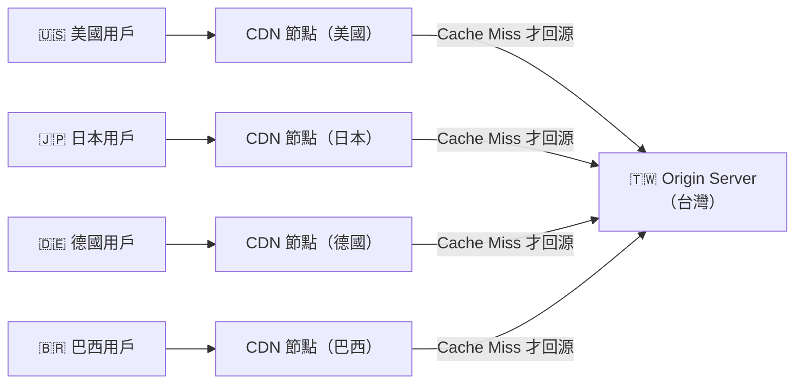

# [E-11-5] CDN 是什麼？靜態資源如何加速

> **你會了解**：CDN 的運作原理，為什麼全球用戶的網頁載入速度差這麼多，以及你在部署時該注意什麼。

---

## 台灣的伺服器，巴西的用戶

你辛苦做完了一個網站，部署到台灣的伺服器上。一切都很順，朋友從台灣打開，快到不行。

然後你的網站被一個巴西的部落客分享了。他的讀者打開你的網站……等了 3 秒，圖片才載完。

為什麼？

因為那張圖片要從台灣一路傳到巴西，直線距離約 **17,000 公里**。就算是光速，這趟來回也要差不多 **150ms**。加上路由器轉發、TCP 握手、伺服器處理……慢是正常的。

這就是 **CDN（Content Delivery Network，內容交付網路）** 想解決的問題。

---

## 沒有 CDN 的世界

每一個靜態資源請求（圖片、CSS、JavaScript 檔案、影片）都要跑回你的 Origin Server（原始伺服器）：

```
問題一：距離帶來延遲
  - 巴西用戶 → 台灣伺服器：來回 ~150ms
  - 德國用戶 → 台灣伺服器：來回 ~200ms
  - 這還只是網路延遲，不算伺服器處理時間

問題二：伺服器承受全球流量壓力
  - 全球用戶都打同一台機器
  - 流量高峰時容易崩潰

問題三：頻寬費用
  - 台灣出口頻寬貴，每 GB 都是錢
```

---

## CDN 的解法：在全球備貨

比喻：Amazon 的物流倉庫。

Amazon 不是每次有人在美國下訂單，就從台灣出貨寄過去。他們在美國各地都有**本地倉庫**，提前把商品備好放在那裡。用戶下訂單，從最近的倉庫出貨，隔天就到。

CDN 的做法一樣：

- 在全球各地建立「**邊緣節點**」（Edge Node，有時叫 PoP，Point of Presence）
- 把你的靜態資源**複製**到這些節點上
- 用戶發請求時，自動連到**距離最近的節點**，而不是你的 Origin Server



這張圖說明：各地用戶連到當地的 CDN 節點，只有當節點沒有快取時才需要向台灣的原始伺服器回源。

---

## CDN 怎麼知道要把你導到哪個節點？

這發生在 DNS 解析階段。

當你輸入 `www.example.com`，DNS 伺服器查詢時，CDN 的智慧 DNS 會根據你的 **IP 位置**，回傳一個距離你最近的 CDN 節點的 IP 位址。

更進階的是 **Anycast 路由**：同一個 IP 位址，在全球各地都有對應的機器，網路路由協定會自動幫你找到最近的那台。Cloudflare 就大量使用這個技術。

---

## Cache-Hit vs Cache-Miss

CDN 的快取邏輯跟 Redis 很類似：

**第一個巴西用戶打開你的網站：**

```
1. 瀏覽器向巴西 CDN 節點請求 logo.png
2. 巴西節點：「我沒有這個檔案」（Cache Miss）
3. 巴西節點向台灣 Origin Server 拿
4. 拿到後，存在巴西節點（快取起來）
5. 回傳給用戶
```

**第二個、第三個、第一千個巴西用戶：**

```
1. 瀏覽器向巴西 CDN 節點請求 logo.png
2. 巴西節點：「我有！」（Cache Hit）
3. 直接回傳，台灣 Origin Server 完全不知道這件事發生了
```

這就是 CDN 最大的價值：**讓原始伺服器的流量指數級下降**，同時讓用戶的體驗大幅提升。

---

## Cache-Control：你告訴 CDN 要快取多久

HTTP response 裡有一個 header 叫 `Cache-Control`，可以指示瀏覽器和 CDN 要怎麼快取這個資源：

```
Cache-Control: public, max-age=31536000
```

- `public`：這個資源可以被任何人快取（CDN 也可以）
- `max-age=31536000`：快取 31,536,000 秒 = 一整年

常見的設定組合：

| 情境 | Cache-Control 設定 |
|------|-------------------|
| 有 hash 的靜態資源（JS/CSS） | `public, max-age=31536000` |
| 首頁 HTML | `no-cache`（每次都重新驗證） |
| 用戶個人頭像 | `private, max-age=3600` |
| API 回應（不該快取） | `no-store` |

---

## 等等，一年快取那圖片更新了怎麼辦？

這是一個讓很多人第一次踩坑的問題。

答案是：**你不更新那個檔案，你換一個新的檔名**。

這個技巧叫做 **Cache Busting（快取破壞）**：每次 build 的時候，根據檔案內容的 hash 值產生唯一的檔名：

```
// 第一版
main.js → main.a1b2c3d4.js

// 更新內容後 build
main.js → main.f9e8d7c6.js   ← 完全不同的檔名
```

因為檔名不同，CDN 和瀏覽器都不會把舊的快取誤認為新的。舊的快取？一年後自然過期，沒關係。

好消息是你不用手動做這件事——**Vite、webpack 等現代工具都會自動處理 hash**。

---

## 主流 CDN 服務

你不需要自己架一個全球節點網路，直接用現成服務：

| 服務 | 特色 |
|------|------|
| **Cloudflare** | 最常用，有慷慨的免費方案，設定簡單 |
| **AWS CloudFront** | 跟 AWS 生態整合好，按量計費 |
| **Fastly** | 效能極高，大公司愛用，設定靈活 |

對於個人專案或小型產品，**Cloudflare 免費方案**已經非常夠用，設定也很直覺。

---

## 部署流程加上 CDN 後要注意什麼

| 沒有 CDN | 有 CDN |
|---------|-------|
| 更新程式 → 部署到伺服器 → 完成 | 更新程式 → 部署 → 可能還要手動清除 CDN 快取 |

如果你更新了 HTML 或重要設定，但 CDN 還在快取舊版本，用戶看到的就是舊的。

解法：
1. **HTML 不要快取太久**：`Cache-Control: no-cache`（每次都驗證）
2. **靜態資源用 hash 命名**：如上述，自動 cache busting
3. **有需要時手動 Purge**：Cloudflare 後台可以一鍵清除快取

---

## 小結

CDN 在全球各地建立邊緣節點，把靜態資源複製到離用戶最近的地方。第一個人請求時去 Origin 拿（Cache Miss），之後的人直接從節點拿（Cache Hit），大幅降低延遲和 Origin 伺服器的負擔。

部署時最重要的習慣：**靜態資源用 hash 命名，HTML 不要快取太久**。現代工具（Vite）會幫你自動產生 hash，不用手動操心。

---

## 延伸閱讀

> 想了解多層次快取如何協作 → [課外讀物 E-11-8：多層次快取全景：瀏覽器到資料庫](./E-11-8-cache-layers.md)
