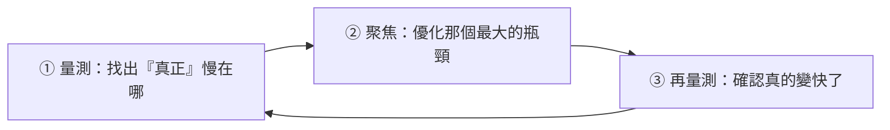

# [E-11-6] 後端效能分析：找出你的 API 慢在哪裡

> **目標**：學會「先量測、找出真正的瓶頸，再優化」的效能分析思維，避免「憑感覺亂優化」的常見錯誤。

## 最重要的一句話：先量測，別亂猜

談效能優化，最重要的觀念是這句話（電腦科學名言）：

> **「過早最佳化是萬惡之源（Premature optimization is the root of all evil）。」— Donald Knuth**

意思是——**別憑感覺、在不知道瓶頸在哪的情況下亂優化**。很多人「覺得」某段程式碼慢，花一堆時間優化它，結果發現「真正的瓶頸根本是別的地方」——白做工，還可能把程式搞複雜。

正確的順序永遠是：



**先量測 → 找到真正的瓶頸 → 針對它優化 → 再量測驗證**。別跳過「量測」這步。

## 為什麼「憑感覺」常常錯

效能瓶頸常常**違反直覺**——你「覺得」慢的地方，往往不是真正的元兇。例如：

- 你以為是「那段複雜的運算」慢，量測後發現是「一個 N+1 查詢」（E-4-4）佔了 90% 的時間。
- 你優化了「只佔 1% 時間的程式碼」，整體幾乎沒變快——因為你優化錯地方了。

有個原則叫 **「找最大的瓶頸」**——優化「佔最多時間的那 20%」，效益最大；優化「只佔 1% 的」，再怎麼努力也只省 1%。

## 怎麼量測：找出 API 慢在哪

幾種找瓶頸的工具與方法：

**① APM / 觀測性工具（最實用）**

**APM（Application Performance Monitoring）** 或觀測性工具（E-14、SRE Part 3）能告訴你：

- 哪個 API 端點慢（延遲 p95/p99，SRE Part 2-2）。
- 一個請求的時間「花在哪一段」——這就是**分散式追蹤（Traces，E-14-2、SRE Part 3-5）** 的價值：它顯示「這個請求，在資料庫花了 1.8 秒、在業務邏輯花了 50ms」——瓶頸一目了然。

**② Profiler（效能剖析器）**

Profiler 能深入「程式碼層級」——告訴你「**哪個函式佔了最多 CPU 時間/被呼叫幾次**」。當你要找「程式碼內部」的瓶頸時用它。

**③ 看日誌與指標**

- 慢查詢日誌（資料庫，E-11-4）：揪出慢的 SQL。
- 監控指標（SRE Part 3）：看 CPU、記憶體、I/O——哪個資源飽和了（SRE 的「飽和度」黃金訊號）。

## 後端常見的瓶頸

量測後，後端的瓶頸常落在這幾類（依常見度）：

| 瓶頸 | 說明 | 解法 |
|------|------|------|
| **資料庫** | 慢查詢、N+1、沒索引 | E-11-4、E-4（索引、Eager Loading、快取）|
| **外部呼叫** | 呼叫慢的第三方 API | 加逾時、快取、非同步（SRE Part 8-1）|
| **缺乏快取** | 重複算/查同樣的東西 | 加快取（快取課程）|
| **CPU 密集運算** | 複雜計算 | 優化演算法、快取結果、非同步處理 |
| **I/O 等待** | 等檔案/網路 | 非同步、並行處理 |

注意——**資料庫和外部呼叫，往往是後端最大的瓶頸**（而非「你的程式邏輯」）。所以量測常會指向它們。

## 一個務實的流程

```
1. 使用者反映「某功能慢」
2. 用 APM/追蹤看：哪個端點慢、慢在哪一段
   → 例如發現「卡在資料庫查詢那段」
3. 深入那段：用 EXPLAIN 看那個查詢
   → 發現「沒用索引、全表掃描」（E-4-1）
4. 優化：建索引
5. 再量測：確認延遲真的降下來了
→ 用數據驅動，而非憑感覺
```

## 小結

- **先量測，別亂猜**——「過早最佳化是萬惡之源」。憑感覺優化常常優化錯地方。
- 流程：**量測找瓶頸 → 優化最大的瓶頸 → 再量測驗證**。
- 工具：APM/觀測性（哪個端點慢、慢在哪段）、Profiler（哪個函式吃資源）、慢查詢日誌、監控指標。
- 後端常見瓶頸：資料庫（最常見）、外部呼叫、缺快取、CPU 密集、I/O 等待。

> 觀測性與追蹤 → [E-14](../E-14-observability/E-14-2-three-pillars.md)、**sre 課程** Part 3；資料庫效能 → [E-11-4](./E-11-4-database-performance.md)；負載測試找瓶頸 → **sre 課程** Part 7-2
