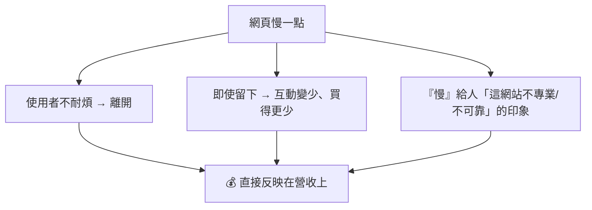

# [E-11-7] 趣味：Amazon 的研究——每 100ms 延遲損失 1% 銷售額

> **目標**：透過業界知名的「延遲 vs 營收」研究，輕鬆體會「為什麼『快』這件事，值這麼多錢」。

## 「快」到底值多少錢？

工程師花大把力氣做效能優化（E-11 整個系列）——但「快一點」到底有什麼實際價值？有幾個被引用到爛、卻很有說服力的業界數據，告訴你答案：**快，真的等於錢。**

## 那些經典數據

**① Amazon：每 100 毫秒延遲，損失 1% 銷售額**

最有名的——Amazon 的研究發現：**網頁每多 100 毫秒（0.1 秒）的延遲，銷售額就掉約 1%**。

100 毫秒——快到人「幾乎感覺不到」。但對 Amazon 這種規模，1% 的銷售額是**數十億美元**。所以對 Amazon，「快 100 毫秒」值好幾億。這就是為什麼大公司不惜重金做效能優化。

**② Google：延遲增加，搜尋量下降**

Google 的研究：搜尋結果**慢 0.5 秒，搜尋流量掉約 20%**。慢一點點，使用者就少用。

**③ 其他**

- 各種研究顯示：頁面載入超過 3 秒，過半使用者直接離開。
- 沃爾瑪（Walmart）：載入時間每快 1 秒，轉換率明顯提升。

## 為什麼「一點點延遲」影響這麼大

人對「慢」的容忍度，比你想像的低很多：

- **沒耐心**：使用者習慣了「即時」——慢一點就煩、就走（尤其手機時代）。
- **每一步都流失**：慢會讓「漏斗的每一步」都流失更多人（從進站到結帳）。
- **印象**：「慢」讓人覺得這網站「爛、不可靠」，傷品牌。

對「規模大」的服務，這些流失乘以「巨大的使用者數」，就是天文數字的營收差異。

## 它對工程師的啟示

這些數據解釋了為什麼「效能」是工程師的重要職責，不是「可有可無的優化」：

**① 效能 = 錢 = 使用者體驗**

效能優化不是「工程師的潔癖」，而是**直接影響營收和使用者留存**的事。當你優化「快了 200 毫秒」，你可能替公司省下/賺進可觀的錢。

**② 「快」是一種功能**

呼應 SRE Part 1-3 的「可靠性是一種功能」——**「快」也是一種功能、一種競爭力**。一個快的網站，本身就比慢的對手有優勢。

**③ 但要務實優化（E-11-6）**

知道「快很值錢」，不代表「無腦狂優化」。還是要**先量測、找真正的瓶頸**（E-11-6）——把力氣花在「真正影響使用者感受的延遲」上，而非「使用者根本感覺不到的微優化」。

**④ 延遲的目標要對齊使用者感受**

呼應 SRE Part 2-2——關注 **p95/p99 延遲**（最慢的那群使用者），因為「平均很快」可能掩蓋「一部分人很慢」，而那些慢的人正在流失。

## 小結

- 業界經典數據：Amazon「每 100ms 延遲損失 1% 銷售額」、Google「慢 0.5 秒搜尋掉 20%」——**快，等於錢**。
- 為什麼影響大：使用者沒耐心會離開、慢讓每步都流失、傷品牌印象；乘以巨大用戶數 = 天文數字。
- 啟示：效能 = 錢 = 體驗（不是潔癖）；「快」是一種功能/競爭力；但要務實優化（先量測，E-11-6）；關注 p95/p99。

> 效能優化手段 → [E-11-1 前端](./E-11-1-frontend-performance.md)、[E-11-4 資料庫](./E-11-4-database-performance.md)；先量測再優化 → [E-11-6](./E-11-6-backend-profiling.md)；延遲指標 p95/p99 → 參見 **sre 課程** Part 2-2
