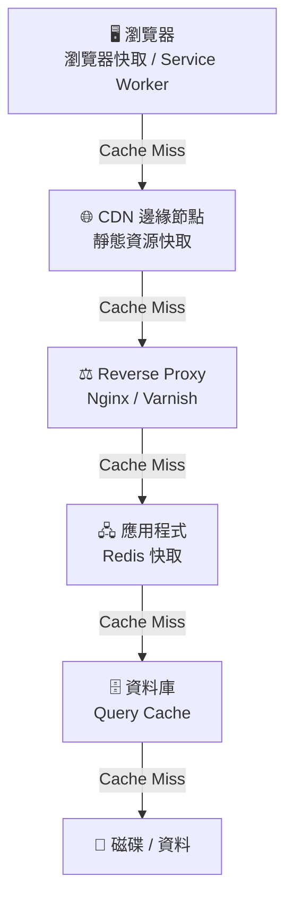

# [E-11-8] 多層次快取全景：瀏覽器到資料庫

> **你會了解**：一個請求從瀏覽器到資料庫的每一層快取如何運作，以及各層的特性與責任歸屬。

---

## 快取不只有一層

很多人以為快取就是 Redis。加了 Redis，快取這件事就做完了。

但實際上，一份資料在抵達你的瀏覽器之前，可能已經被快取了 4 到 5 次——在不同的地方，由不同的人負責。

從最靠近你的地方開始數：

1. 瀏覽器快取
2. Service Worker 快取
3. CDN 邊緣快取
4. Reverse Proxy / Load Balancer 快取
5. 應用程式快取（Redis）
6. 資料庫查詢快取

每一層都有不同的速度、不同的控制者、適合快取不同類型的資料。



這張圖說明：每一層快取命中就直接回傳，只有 Cache Miss 才繼續往下走。越靠近底層，速度越慢，但資料越完整。

---

## 第一層：瀏覽器快取

**控制者**：後端工程師（透過 HTTP response headers）

瀏覽器會把下載過的資源存在本機。下次你再訪問同一個網頁，圖片、CSS、JS 可能根本沒有發出任何網路請求——直接從你的電腦硬碟讀取。

關鍵 header：

```
Cache-Control: public, max-age=86400
```

這告訴瀏覽器：「這個資源可以快取 86400 秒（1 天）。」

有沒有碰過「我改了網站，但重新整理還是看到舊的」這個狀況？十之八九是瀏覽器快取的問題。強制刷新（Ctrl+Shift+R / Cmd+Shift+R）可以繞過它。

---

## 第二層：Service Worker 快取

**控制者**：前端工程師

Service Worker 是一個跑在瀏覽器背景的 JavaScript 程式，可以攔截所有網路請求，決定要從快取回傳還是發出真實請求。

這是 PWA（Progressive Web App）的核心技術，讓網頁在**離線狀態**下也能運作——所有必要的資源都提前快取到本機。

一般網站不一定需要這層，但如果你的應用要支援離線功能，這是必學的。

---

## 第三層：CDN 邊緣快取

**控制者**：運維 / DevOps（透過 CDN 設定和 Cache-Control）

CDN 把靜態資源複製到全球各地的節點，讓用戶從最近的地方取得資料。這層主要負責**靜態資源**（圖片、CSS、JS、影片）。

API 請求通常不過 CDN（因為 API 回應是動態的、用戶專屬的），但有些 CDN 服務（如 Cloudflare）也提供 API 快取功能，進階使用。

---

## 第四層：Reverse Proxy 快取

**控制者**：運維 / DevOps

在流量打到你的應用程式之前，通常會先過一層 **Reverse Proxy**，最常見的是 **Nginx**。

Nginx 不只是轉發流量，它也可以快取後端的 API 回應。如果同一個 URL 的回應在 5 分鐘內不會改變，Nginx 就可以把第一次的回應存起來，之後直接回傳，根本不讓請求碰到你的 Node.js/Python 應用程式。

另一個常見工具是 **Varnish**，專門設計用來做 HTTP 快取，效能極高，大型媒體網站愛用。

---

## 第五層：應用程式快取（Redis）

**控制者**：後端工程師

這是後端工程師最直接操控的一層。

Redis 存放的是**動態資料的快取**——通常是資料庫查詢的結果。用戶發出 API 請求，後端先查 Redis，沒有才查資料庫，查完結果存入 Redis。

這層的靈活度最高：你可以針對不同的資料設定不同的 TTL，可以主動清除特定的快取，可以儲存任意格式的資料。

---

## 第六層：資料庫查詢快取

**控制者**：資料庫本身（或 DBA 設定）

PostgreSQL 和 MySQL 等資料庫內部都有自己的快取機制。

執行一個 SQL 查詢，資料庫會先到記憶體裡找看看這個查詢的結果有沒有被快取過。如果有，直接回傳，不用真的去掃描磁碟上的資料。

這層通常由資料庫自動管理，工程師不需要手動操作，但了解它的存在可以幫助理解為什麼「第一次查詢慢，後面幾次快」。

---

## 各層特性對比

| 層級 | 速度 | 控制者 | 適合快取什麼 |
|------|------|--------|------------|
| 瀏覽器 | 最快（本機） | HTTP headers | HTML / CSS / JS / 圖片 |
| Service Worker | 最快（本機） | 前端工程師 | 離線所需的完整頁面資源 |
| CDN | 極快（最近節點） | 運維 / CDN 設定 | 靜態資源 |
| Reverse Proxy | 快（伺服器端） | 運維 | 可共用的 API 回應 |
| Redis | 快（伺服器記憶體） | 後端工程師 | 動態 API 回應 / Session |
| DB Cache | 中（資料庫記憶體） | 資料庫自動管理 | SQL 查詢結果 |

---

## 快取一致性：最難的問題

多層快取帶來一個棘手的問題：資料更新後，**每一層的舊快取都要跟著失效**。

舉個例子：用戶修改了個人簡介。

```
資料庫更新了 ✅
Redis 裡還是舊的 ❌（TTL 還有 30 分鐘）
CDN 快取的 API 回應還是舊的 ❌
瀏覽器快取還是舊的 ❌
```

用戶重新整理，可能還是看到舊的資料。

解法沒有完美的，只有取捨：

- **主動清除**：更新資料後，主動刪除 Redis key、呼叫 CDN Purge API
- **縮短 TTL**：越靠近用戶的層，TTL 越短，減少看到舊資料的時間
- **接受最終一致性**：很多場景下，資料晚幾分鐘更新是可以接受的

一個合理的 TTL 設計原則：**越靠近用戶，TTL 越短**。因為靠近用戶的快取清除成本高（你無法控制每個用戶的瀏覽器），所以讓它快點過期。Redis 和 DB 的快取你可以主動清除，TTL 可以設長一點。

---

## 什麼不應該快取？

不是所有資料都適合進快取，有幾類要特別小心：

**用戶個人化資料**：
快取時要確保隔離，不然 A 用戶的購物車資料被 B 用戶看到，這是嚴重的安全問題。

設定 `Cache-Control: private`，告訴 CDN 這份資料不能放在共用節點。

**即時性資料**：
股票價格、聊天訊息、庫存數量——這些東西幾秒就會變，快取意義不大，反而容易造成用戶看到錯誤資訊。

**含有 Authorization 的請求**：
帶著用戶身份驗證 token 的 API 請求，回傳的結果是用戶專屬的，絕對不能被 CDN 快取成公開資源。

一個保險的做法：API 回應預設加上 `Cache-Control: no-store`，需要快取的才明確開放。

---

## 小結

從瀏覽器到資料庫，快取可以發生在六個不同的層次。每一層的速度、控制者和適用場景都不同。了解這張全景圖，你才能在對的地方加快取、知道出問題時要去哪一層找原因。

快取的終極原則只有一句話：**用對地方，資料存夠久，更新時記得清乾淨**。

---

## 延伸閱讀

> 想了解 Redis 的設計細節 → [課外讀物 E-11-3：Redis 與快取策略](./E-11-3-redis-cache.md)

> 想了解 CDN 的全球部署原理 → [課外讀物 E-11-5：CDN 是什麼？靜態資源如何加速](./E-11-5-cdn.md)
