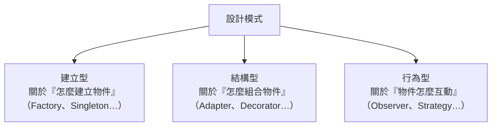

# [E-12-1] 什麼是設計模式？為什麼它們重要

> **目標**：理解「設計模式」是什麼——前人解決常見問題留下的「解法食譜」，以及為什麼懂它們能讓你寫出更好、也更好溝通的程式。

## 設計模式是「解法食譜」

寫程式時，你會一再遇到「**結構上類似的問題**」——例如「怎麼把建立物件的邏輯藏起來」「怎麼讓一個物件變動時通知其他物件」。這些問題前人都遇過，並整理出「**經過驗證的解法**」。這些解法就是**設計模式（Design Patterns）**。

用類比：設計模式像**食譜**。你不用每次煮菜都從零摸索——「糖醋」「紅燒」是前人試過、好用的做法。碰到對應的食材（問題），拿出對應的食譜（模式）就好。

> 重點：**設計模式不是「死背」的東西，也不是「一定要用」的規則。** 它是「**碰到問題時，知道有這道菜可以參考**」。硬套模式（沒問題卻硬用）反而是壞習慣（over-engineering）。

## 為什麼設計模式重要

**① 站在前人肩膀上**：常見問題不用自己重新發明解法——用驗證過的模式，少踩坑。

**② 共通的語言**：當你說「這裡用 Repository 模式」「這是個 Observer」，同事立刻懂你的設計——不用解釋一長串。設計模式是工程師之間的**通用詞彙**，大幅提升溝通效率。

**③ 寫出更好維護的程式**：好的模式通常體現了 SOLID 原則（課外讀物 E-7）——讓程式更好擴充、更好測、更好改。

## 設計模式的分類

經典的設計模式分三大類（你知道有這三類即可）：

這個系列會挑幾個**後端開發最常碰到、最實用**的來講：MVC（E-12-2）、Repository（E-12-3）、Factory（E-12-4）、Observer（E-12-5）、Singleton（E-12-6）、Strategy（E-12-7），最後深入 Data Access Layer（E-12-9、E-12-10）。

## 一個重要提醒：別為了模式而模式

設計模式很有用，但有個常見的壞習慣——**「學了模式就到處想套用」**，結果把簡單的東西搞複雜（over-engineering）。

正確的態度：

> **先有「問題」，才找「對應的模式」。** 不是先有「想用的模式」，再去硬找地方套。沒遇到那個問題，就別用那個模式——簡單的程式碼往往才是最好的。

這呼應 Clean Code（E-6）和 KISS（Keep It Simple）原則——模式是工具，不是目的。

## 小結

- 設計模式 = 前人對「常見問題」留下的「驗證過的解法食譜」。
- 三大價值：站在前人肩膀上、工程師的通用語言、更好維護。
- 分建立型/結構型/行為型三類。
- **別為了模式而模式**——先有問題，才找模式。

> 想了解模式背後的設計原則 → [課外讀物 E-7-1：SOLID 總覽](../E-7-solid/E-7-1-solid-overview.md)
