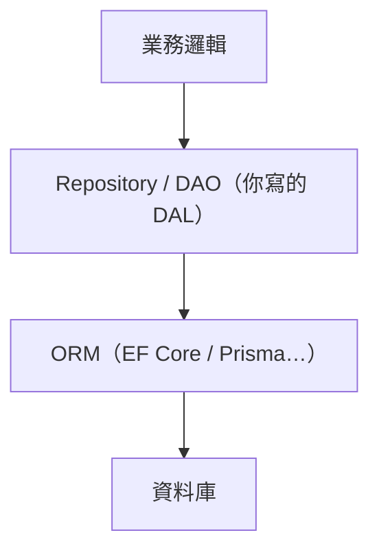

# [E-12-10] 【深入版】DAL 的實作模式：Repository、DAO、Unit of Work

> **目標**：深入 Data Access Layer 的幾種實作模式——Repository、DAO、Unit of Work，它們與 ORM 的關係，以及常見的反模式。

## 從概念到實作

E-12-9 講了「為什麼要 DAL」。這篇深入「**怎麼實作 DAL**」——有幾種經典模式，名字常被混用，這裡幫你釐清。

## 模式一：DAO（Data Access Object）

**DAO（資料存取物件）** 是最「貼近資料表」的做法：**一張表 / 一個資料來源，對應一個 DAO**，提供對它的 CRUD 操作。

```
class UserDAO:
    function insert(user)
    function update(user)
    function deleteById(id)
    function findById(id)
```

特性：DAO 比較「**資料導向**」——它的方法對應「對這張表做什麼操作」，思維貼近資料庫。

## 模式二：Repository

**Repository**（E-12-3）比較「**業務/領域導向**」——它把資料存取包裝成「**像在操作一個物件集合**」，更貼近業務語言：

```
class UserRepository:
    function findById(id)
    function findActiveUsers()          // 業務導向的查詢
    function save(user)
    function remove(user)
```

**DAO vs Repository 的差別**（常被混用，但有細微區別）：

| | DAO | Repository |
|---|-----|-----------|
| 思維 | 資料導向（貼近表）| 領域/業務導向（貼近物件集合）|
| 方法 | insert/update/delete（CRUD）| 像操作集合（add/remove/find...）|
| 抽象層級 | 較低（接近資料庫）| 較高（接近業務）|

實務上兩者界線模糊，很多人混用這兩個詞。重點是它們的**共同目的**——隔離資料存取（E-12-9）。

## 模式三：Unit of Work

**Unit of Work（工作單元）** 解決一個 Repository 不處理的問題——**交易（transaction）一致性**：

> 一個業務操作可能涉及「**改好幾個東西**」（例如「下單」要：建訂單 + 扣庫存 + 扣餘額）。這些要**「要嘛全部成功、要嘛全部失敗」**（交易，課外讀物 E-4-3 的 ACID）。Unit of Work 把「這一組操作」當成「一個工作單元」，統一提交（commit）或回滾（rollback）。

```
unitOfWork.begin()
orderRepository.save(訂單)
inventoryRepository.decrease(商品, 數量)
accountRepository.deduct(使用者, 金額)
unitOfWork.commit()       // 三個一起成功；任一失敗 → rollback 全部
```

它確保「跨多個 Repository 的操作」維持交易一致性。很多 ORM（如 EF Core 的 DbContext）內建了 Unit of Work 的概念。

## 與 ORM 的關係

**ORM（物件關聯對映，如 Prisma / EF Core / Hibernate）** 和這些模式什麼關係？常讓人困惑：



- **ORM** 負責「物件 ↔ 資料表」的對映、產生 SQL——它本身已經是一層抽象。
- **Repository/DAO** 常**建在 ORM 之上**，再包一層「業務導向」的介面，讓業務邏輯連 ORM 都不直接碰。

要不要「在 ORM 上再加 Repository」是個**取捨**：

- **小專案 / 簡單 CRUD**：直接用 ORM 可能就夠了（ORM 本身已是 DAL），再加 Repository 是多餘的樣板（over-engineering，E-12-1）。
- **大專案 / 複雜業務**：加 Repository 能讓業務邏輯更乾淨、更好測、更不被特定 ORM 綁定——值得。

沒有標準答案，依專案規模與需求判斷。

## DAL 的常見反模式

實作 DAL 時，這些壞味道要避開（呼應 E-6-6）：

**① SQL/查詢散落各處（漏掉 DAL）**：業務邏輯、Controller 裡到處直接寫查詢——這就是「沒有 DAL」，E-12-9 要解決的問題。

**② DAL 漏抽象（Leaky Abstraction）**：DAL 的介面「洩漏」了底層細節——例如回傳 ORM 特有的物件、或介面方法暴露了 SQL 概念。這樣上層還是被綁住了，等於白做。DAL 應該回傳「乾淨的領域物件」。

**③ 貧血的 Repository（一堆 getXXX）**：Repository 退化成「每個查詢一個方法」（getUserByName、getUserByEmail、getUserByNameAndAge…），方法爆炸。可考慮用「查詢物件 / Specification 模式」改善。

**④ 業務邏輯漏進 DAL**：DAL 應該只管「存取」，不該包含業務規則（折扣計算、驗證）。業務規則屬於 Service 層。混進來就違反了分層（E-12-9）。

## 小結

- DAL 的實作模式：**DAO**（資料導向）、**Repository**（業務導向）、**Unit of Work**（交易一致性）。
- 它們常建在 **ORM** 之上；要不要加是取捨（小專案 ORM 可能就夠）。
- 反模式：SQL 散落、漏抽象、方法爆炸、業務邏輯漏進 DAL。

> DAL 的概念與「為什麼分層」 → [課外讀物 E-12-9：DAL 概念版](./E-12-9-dal-concept.md)；交易與 ACID → 課外讀物 E-4-3；ORM 與資料存取的實作 → 參見 **csharp 課程** Part 6（EF Core）
