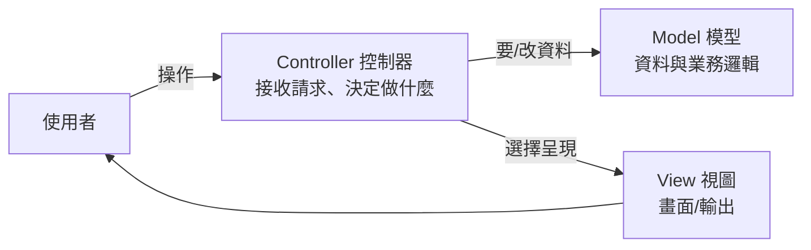

# [E-12-2] MVC 模式：Model / View / Controller 的分工

> **目標**：理解 MVC 這個最經典的架構模式——把「資料、畫面、控制」三者分開，各司其職。

## 一個亂成一團的廚房

想像一間廚房，所有事擠在一起：算帳的人在炒菜、炒菜的人在端盤、端盤的人在記帳——亂到不行、出錯找不到誰負責。好的廚房會**分工**：廚師煮菜、服務生端盤、櫃台收錢。

程式也一樣。如果「**資料處理、畫面顯示、流程控制**」全混在一起，程式會亂到無法維護。**MVC** 就是把它們分成三個角色：

## 三個角色

| 角色 | 負責 | 廚房類比 |
|------|------|---------|
| **Model（模型）** | 資料與業務邏輯（怎麼存、怎麼算）| 廚師（處理食材的核心）|
| **View（視圖）** | 呈現給使用者的畫面/輸出 | 服務生（把菜端到客人面前）|
| **Controller（控制器）** | 接收使用者操作、協調 Model 和 View | 領班（接單、指揮）|

流程：使用者操作 → **Controller** 接收 → 叫 **Model** 處理資料 → 把結果交給 **View** 呈現 → 回給使用者。

## 為什麼分開這麼重要

**① 各自獨立、好維護**：改畫面（View）不用動業務邏輯（Model）；換資料庫（Model）不用改畫面。職責分離（呼應 E-7-2 單一職責）。

**② 好測試**：Model 的業務邏輯可以單獨測（不用管畫面）。

**③ 好分工**：前端做 View、後端做 Model/Controller，分工清楚。

**④ 可重用**：同一份 Model（資料），可以用不同 View 呈現（網頁、App、API）。

## MVC 無所不在

MVC 是最有影響力的架構模式之一，它的變體出現在各處：

- 後端框架：Spring MVC、ASP.NET MVC、Rails、Express（鬆散的 MVC）。
- 前端框架：早期的 Angular、許多框架的思想源頭。
- 衍生模式：MVP、MVVM（前端常見）等都是它的變形。

你 basic 課程 Part 4-D 學的「分層架構」、csharp Part 9-1 的 Controller/Service/Repository，都是 MVC 精神的延伸——**把不同職責拆開**。

## 小結

- MVC = 把程式分成 **Model（資料/邏輯）、View（畫面）、Controller（控制）** 三個角色。
- 核心價值：**職責分離** → 好維護、好測、好分工、可重用。
- 它是最經典的架構模式，變體無所不在。

> MVC 體現了「單一職責」 → [課外讀物 E-7-2：單一職責原則](../E-7-solid/E-7-2-srp.md)；後端分層架構 → 參見 **basic 課程** Part 4-D
