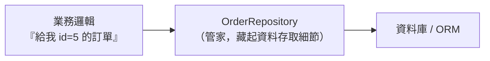

# [E-12-3] Repository 模式：把資料庫操作藏起來

> **目標**：理解 Repository 模式——在「業務邏輯」和「資料庫」之間加一層，把「怎麼存取資料」的細節藏起來。

## 一個問題：業務邏輯不該知道 SQL

想像你的業務邏輯（例如「處理訂單」）裡，到處散落著資料庫操作：

```
function 處理訂單(id):
    訂單 = 執行SQL("SELECT * FROM orders WHERE id = " + id)   // 直接寫 SQL
    ...業務邏輯...
    執行SQL("UPDATE orders SET ...")                          // 又一段 SQL
```

問題：

- 業務邏輯**和資料庫綁死**——哪天換資料庫、改 ORM，到處都要改。
- SQL 散落各處，重複、難維護（呼應 E-6 反模式）。
- 很難測試（測業務邏輯還要連真的資料庫）。

## 解法：Repository——資料的「管家」

**Repository 模式**在「業務邏輯」和「資料庫」之間加一層 **Repository（倉儲）**，專門負責「資料怎麼存取」。業務邏輯只跟 Repository 說「給我 id=5 的訂單」「存這筆訂單」，**完全不用知道背後是 SQL、是哪個資料庫、用什麼 ORM**。



用類比：Repository 像一個**圖書館管理員**。你（業務邏輯）只要說「我要這本書」，管理員幫你找——你不用知道書放在幾樓哪個架、用什麼系統編號。存取的細節被管理員藏起來了。

## Repository 提供的介面

一個 Repository 通常提供「**像操作集合一樣**」的方法，而不是 SQL：

```
interface OrderRepository:
    findById(id)          // 給我這筆
    findAll()             // 給我全部
    save(order)           // 存這筆
    delete(id)            // 刪這筆
```

業務邏輯用這些方法，乾淨又直覺：

```
// 業務邏輯，完全沒有 SQL
function 處理訂單(id):
    訂單 = orderRepository.findById(id)
    ...業務邏輯...
    orderRepository.save(訂單)
```

## 好處

**① 業務邏輯與資料存取解耦**：換資料庫、換 ORM，只要改 Repository 的實作，業務邏輯一行都不用動（呼應 E-7-6 依賴反轉）。

**② 集中管理資料存取**：所有 SQL/查詢集中在 Repository，不散落各處，好維護。

**③ 好測試**：測業務邏輯時，可以用「假的 Repository」（回傳測試資料），不用連真資料庫（呼應 E-9 測試替身）。

**④ 程式碼更乾淨**：業務邏輯讀起來是「業務」，不被 SQL 雜訊干擾。

## 與 ORM 的關係

你可能想：「ORM（如 Prisma、EF Core）不就已經把 SQL 藏起來了嗎，還要 Repository？」

- ORM 把「SQL → 物件」的轉換藏起來了，但它的 API 還是「資料庫導向」的。
- Repository 在 ORM 之上**再包一層「業務導向」的介面**——讓業務邏輯連 ORM 都不用直接碰。

要不要在 ORM 上再加 Repository，是個取捨（小專案可能 ORM 就夠；大專案加 Repository 更乾淨）。這在 E-12-9、E-12-10（Data Access Layer）會深入。

## 小結

- Repository 模式 = 在業務邏輯和資料庫之間加一層「管家」，藏起資料存取細節。
- 提供「像操作集合」的介面（findById/save…），業務邏輯不碰 SQL。
- 好處：解耦、集中管理、好測試、程式碼乾淨。

> Repository 體現了依賴反轉 → [課外讀物 E-7-6：依賴反轉原則](../E-7-solid/E-7-6-dip.md)；它是 Data Access Layer 的核心 → [課外讀物 E-12-9：Data Access Layer 概念版](./E-12-9-dal-concept.md)
