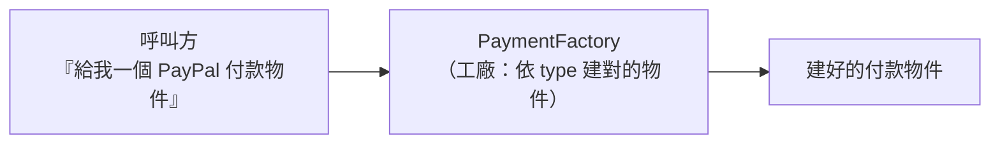

# [E-12-4] Factory 模式：把建立物件的邏輯封裝起來

> **目標**：理解 Factory（工廠）模式——把「怎麼建立物件」的複雜邏輯集中到一個「工廠」，呼叫方不用知道細節。

## 問題：建立物件的邏輯很複雜、又散落各處

有時「建立一個物件」不是簡單的 `new`，而是要依條件決定建哪種、或要做一堆設定：

```
// 散落各處的建立邏輯，又臭又長又重複
如果 type == "信用卡": payment = new 信用卡付款(設定A, 設定B...)
否則 如果 type == "PayPal": payment = new PayPal付款(設定C...)
否則 如果 type == "ATM": payment = new ATM付款(...)
```

問題：這段邏輯如果散落在很多地方，每次新增一種付款方式，**所有地方都要改**（違反 E-7-3 開放封閉原則）。

## 解法：Factory——統一的「製造工廠」

**Factory 模式**把「建立物件」的邏輯集中到一個「工廠」函式/類別。呼叫方只要說「我要一個付款物件（type=PayPal）」，工廠幫你建好、回傳，**呼叫方不用知道怎麼建的**。



用類比：你要一台車，不用自己組裝引擎、輪胎——跟**工廠**說「我要一台休旅車」，工廠幫你造好交車。建立的複雜細節被工廠包起來了。

## 程式碼示意

```
class PaymentFactory:
    function create(type):
        switch type:
            case "信用卡": return new 信用卡付款(預設設定...)
            case "PayPal": return new PayPal付款(預設設定...)
            case "ATM": return new ATM付款(...)

// 呼叫方：乾淨，不用知道怎麼建
payment = PaymentFactory.create("PayPal")
payment.付款(100)
```

## 好處

**① 建立邏輯集中**：所有「怎麼建」的邏輯在工廠一處，不散落（呼應 E-7-2 單一職責）。

**② 好擴充**：新增一種付款方式，只要改工廠一個地方（加一個 case），呼叫方完全不用動（呼應 E-7-3 開放封閉）。

**③ 呼叫方解耦**：呼叫方只依賴「抽象的付款介面」，不依賴具體的類別（呼應 E-7-6 依賴反轉）——它甚至不知道有哪些付款類別。

**④ 隱藏複雜性**：建立物件若需要複雜設定，全藏在工廠裡，呼叫方清爽。

## 什麼時候用

- 當「建立物件」需要**依條件決定建哪種**（多型）。
- 當「建立邏輯」**複雜**（很多設定、步驟）。
- 當你想**隔離呼叫方和具體類別**（呼叫方只認介面）。

但記得 E-12-1 的提醒——**簡單的 `new` 就夠時，別硬套工廠**。工廠是為了解決「建立邏輯複雜/多變」的問題。

## 小結

- Factory 模式 = 把「建立物件」的邏輯集中到工廠，呼叫方只要「點餐」、不用知道怎麼建。
- 好處：建立邏輯集中、好擴充（新增不改舊）、解耦、隱藏複雜性。
- 適合「建立邏輯複雜或多型」的場景；簡單建立別硬套。

> 工廠體現了開放封閉與依賴反轉 → [課外讀物 E-7-3：開放封閉原則](../E-7-solid/E-7-3-ocp.md)
