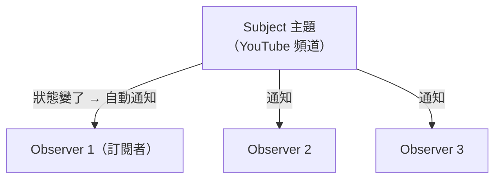

# [E-12-5] Observer 模式：事件驅動的設計思維

> **目標**：理解 Observer（觀察者）模式——當一個物件變化時，自動「通知」所有訂閱它的物件，這是事件驅動設計的核心。

## 一個生活例子：訂閱

你訂閱一個 YouTube 頻道。頻道**發新片時**，YouTube 自動**通知所有訂閱者**——你不用每天去頻道頁面「檢查有沒有新片」。

這就是 **Observer 模式**：

> **一個物件（主題 Subject）狀態改變時，自動通知所有「訂閱它」的物件（觀察者 Observer），不用觀察者一直去問。**



## 角色與流程

- **Subject（主題）**：被觀察的物件，狀態會變（頻道）。它維護一份「訂閱者名單」。
- **Observer（觀察者）**：訂閱主題的物件，主題變化時會被通知（訂閱者）。

流程：

1. Observer 向 Subject「**訂閱**」（加入名單）。
2. Subject 狀態改變。
3. Subject **通知名單上所有 Observer**。
4. 每個 Observer 收到通知、做自己的反應。

## 程式碼示意

```
class 頻道（Subject）:
    訂閱者 = []
    function 訂閱(observer): 訂閱者.add(observer)
    function 發新片(影片):
        for observer in 訂閱者:
            observer.收到通知(影片)        // 通知每個訂閱者

class 使用者（Observer）:
    function 收到通知(影片):
        印出("有新片！" + 影片)

// 使用
頻道.訂閱(小明)
頻道.訂閱(小華)
頻道.發新片("貓咪影片")   // → 小明和小華都自動收到通知
```

## 為什麼這個模式重要：解耦

Observer 最大的價值是**解耦（decoupling）**：

> **Subject 不需要知道「訂閱者是誰、要做什麼」——它只管「通知」。Observer 各自決定收到通知後做什麼。**

頻道不用管「小明收到通知要看片、小華要存起來」——它只負責「發通知」。雙方鬆散耦合，可以各自獨立變化、增減訂閱者。

## 它無所不在

Observer 是最常用的模式之一，你天天在用：

- **前端事件**：`button.addEventListener('click', ...)` ——按鈕（Subject）被點時通知處理函式（Observer）。你 basic Part 3-5 的事件驅動就是這個。
- **狀態管理**：React 的狀態變化通知元件重繪、各種 store 的訂閱。
- **訊息/事件系統**：發布-訂閱（Pub/Sub）、訊息佇列（E-13-5）都是 Observer 的延伸。
- **通知系統**：資料變了，通知相關的服務更新（甚至快取失效，cache-6-5）。

## Observer vs Pub/Sub

你可能聽過 **Pub/Sub（發布-訂閱）**——它是 Observer 的「升級版」：中間多一個「**訊息中介（broker）**」，發布者和訂閱者**完全不認識彼此**（都只跟 broker 打交道）。這讓解耦更徹底，常用於分散式系統（E-13-5 訊息佇列）。Observer 是「直接通知」，Pub/Sub 是「透過中介通知」——精神相同，耦合程度不同。

## 小結

- Observer 模式 = 主題變化時，自動通知所有訂閱它的觀察者（像 YouTube 訂閱）。
- 核心價值：**解耦**——主題只管通知，觀察者各自決定反應。
- 無所不在：前端事件、狀態管理、Pub/Sub、訊息佇列。

> 事件驅動的概念 → 參見 **basic 課程** Part 3-5；分散式的訊息佇列（Pub/Sub 延伸）→ [課外讀物 E-13-5：訊息佇列]
