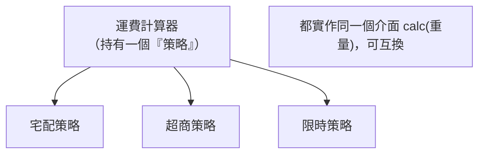

# [E-12-7] Strategy 模式：讓演算法可以互換

> **目標**：理解 Strategy（策略）模式——把「做某件事的不同方法」各自封裝成可互換的「策略」，執行時依需要選一個。

## 問題：一堆 if-else 切換做法

想像一個「運費計算」，依不同物流有不同算法：

```
function 算運費(物流, 重量):
    如果 物流 == "宅配": return 重量 * 10 + 50
    否則 如果 物流 == "超商": return 60
    否則 如果 物流 == "限時": return 重量 * 20 + 100
    // 每加一種物流，就多一個 else if……越來越長
```

問題：一堆 if-else、難維護、每加一種就要改這個函式（違反 E-7-3 開放封閉）。

## 解法：Strategy——把每種做法封裝成可換的「策略」

**Strategy 模式**把「每種演算法」各自封裝成一個獨立的「策略物件」，它們有**共同的介面**，可以互相替換。執行時，依需要「選一個策略」來用。



用類比：你要去某地，有不同**策略**——開車、坐捷運、騎車。它們的「介面」一樣（都能「把你送到目的地」），但內部做法不同。你依情況**選一個策略**。

## 程式碼示意

```
// 共同介面
interface 運費策略:
    function calc(重量)

// 各種策略，各自封裝一種算法
class 宅配策略 implements 運費策略:
    function calc(重量): return 重量 * 10 + 50
class 超商策略 implements 運費策略:
    function calc(重量): return 60

// Context：持有一個策略，可替換
class 運費計算器:
    策略: 運費策略
    function 設定策略(s): this.策略 = s
    function 算(重量): return this.策略.calc(重量)   // 用當前策略

// 使用：依需要切換策略
計算器.設定策略(new 宅配策略())
計算器.算(5)                      // 用宅配算法
計算器.設定策略(new 超商策略())
計算器.算(5)                      // 換成超商算法
```

## 好處

**① 消除一堆 if-else**：每種做法獨立，不擠在一個大函式裡。

**② 好擴充**：新增一種策略 = 新增一個類別，**不用改既有程式碼**（呼應 E-7-3 開放封閉）。

**③ 可在執行時切換**：依情況動態換策略。

**④ 好測試**：每個策略可以單獨測。

## 它無所不在

- **排序**：給排序函式傳入「比較策略」（怎麼比大小）——你用過的 `array.sort(比較函式)` 就是 Strategy。
- **付款方式**：信用卡/PayPal/ATM 各是一種付款策略。
- **折扣計算**：不同促銷活動 = 不同折扣策略。
- **驗證**：不同的驗證規則 = 不同策略。

## Strategy 與其他模式

- **Strategy vs Factory（E-12-4）**：Factory 管「**建立**哪個物件」，Strategy 管「**用**哪個演算法」。常一起用——用 Factory 建出對的 Strategy。
- Strategy 是「行為型」模式（E-12-1），關於「物件的行為怎麼可替換」。

## 小結

- Strategy 模式 = 把「做某件事的不同方法」各自封裝成可互換的策略（共同介面）。
- 解決「一堆 if-else 切換做法」的問題。
- 好處：消除 if-else、好擴充（新增不改舊）、可動態切換、好測試。
- 例子：`sort` 的比較函式、付款方式、折扣規則。

> 體現開放封閉原則 → [課外讀物 E-7-3：開放封閉原則](../E-7-solid/E-7-3-ocp.md)
