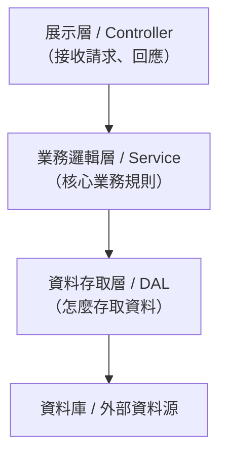

# [E-12-9] 【概念版】Data Access Layer：為什麼把資料存取獨立成一層

> **目標**：理解 Data Access Layer（資料存取層，DAL）是什麼、為什麼要把「存取資料」獨立成一個專門的層——這是分層架構的核心概念之一。

## 一個你可能聽過的詞

在公司你可能聽過「**DAL**」「**資料存取層**」「**data layer**」。它指的是一件很重要、但其實你已經學過影子的事：

> **Data Access Layer（資料存取層）= 應用程式裡，「專門負責跟資料來源（資料庫、API、檔案…）打交道」的那一層。把「怎麼存取資料」的所有細節，集中、隔離在這一層。**

它其實就是 E-12-3 Repository 模式的「**架構層級放大版**」——Repository 是「一個類別」，DAL 是「整個一層」。

## 為什麼需要「分層」

回想 basic Part 4-D、csharp Part 9-1 的「分層架構」——把後端分成幾層，各司其職：



**DAL 就是最底下那層**——它夾在「業務邏輯」和「資料庫」之間，是業務邏輯通往資料的唯一管道。

## 為什麼要把資料存取「獨立成一層」

如果不分層、業務邏輯裡到處直接寫 SQL/查詢（E-12-3 的反例），會很糟。把它獨立成 DAL，好處：

**① 業務邏輯不被資料細節污染**：業務邏輯層只關心「業務規則」（訂單怎麼算、折扣怎麼給），不關心「資料怎麼存」。讀起來乾淨、專注（呼應 E-7-2 單一職責）。

**② 換資料來源不影響業務**：哪天從 MySQL 換 PostgreSQL、從直接 SQL 換 ORM、甚至資料改從外部 API 拿——**只要改 DAL，業務邏輯一行不用動**（呼應 E-7-6 依賴反轉）。

**③ 集中管理**：所有資料存取邏輯集中在一層，不散落各處——好維護、好找、好優化（要加快取、改查詢，都在這層動）。

**④ 好測試**：測業務邏輯時，可以用「假的 DAL」回傳測試資料，不用連真資料庫（呼應 E-9 測試替身、E-12-3）。

## 用類比理解

DAL 像公司的**「採購部門」**：

- 其他部門（業務邏輯）需要物料時，**只跟採購部說「我要這個」**——不用自己去跟各家供應商交涉。
- 採購部（DAL）負責所有「怎麼跟供應商（資料庫）打交道」的細節——比價、下單、驗收。
- 哪天換供應商，只有採購部要調整，其他部門無感。

把「跟外界資料打交道」這件事集中到一個專門部門，整個公司（應用）運作更清晰。

## DAL 在分層架構的定位

一個請求的完整旅程（呼應 basic Part 4-D、csharp Part 9-1）：

```
請求進來
  → Controller（接收、驗證、回應）
  → Service（業務邏輯：訂單規則、折扣計算）
  → DAL（資料存取：「給我這筆訂單」「存這筆」）
  → 資料庫
```

每一層**只跟相鄰層打交道**、只負責自己的職責。DAL 的職責就是「**把資料存取的細節包起來，給上層一個乾淨的介面**」。

## 小結

- DAL（資料存取層）= 專門負責「跟資料來源打交道」的那一層，隔離資料存取細節。
- 它是 Repository 模式（E-12-3）的架構層級放大版。
- 好處：業務邏輯乾淨、換資料源不影響業務、集中管理、好測試。
- 類比：公司的「採購部門」——把「跟供應商交涉」集中到一個部門。

> 想看 DAL 的具體實作模式（Repository / DAO / Unit of Work）與反模式 → [課外讀物 E-12-10：DAL 深入版](./E-12-10-dal-deep.md)
> 分層架構 → 參見 **basic 課程** Part 4-D、**csharp 課程** Part 9-1
