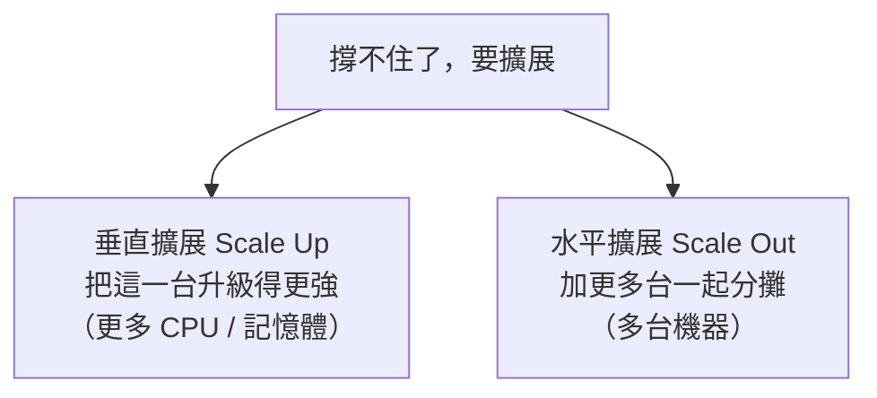

# [E-13-1] 從一台伺服器到多台：垂直擴展 vs 水平擴展

> **目標**：理解服務長大時的兩種擴展方式——垂直擴展（把一台變強）與水平擴展（加更多台），以及它們的取捨。

## 服務長大了，怎麼辦？

你的服務剛開始一台伺服器就夠。但使用者變多、流量變大，一台撐不住了——怎麼辦？有兩條路：

## 垂直擴展（Scale Up）：把一台變強

**做法**：把現有那台機器升級——換更強的 CPU、加更多記憶體。

用類比：小貨車載不下 → 換成大卡車。

- **優點**：簡單（不用改架構，程式照舊跑）。
- **缺點**：
  - **有上限**：再強的單機也有極限，總有一天升不上去。
  - **越高階越貴**：頂級硬體的「效能/價格比」很差。
  - **單點故障**：還是只有一台，它掛了就全掛（沒有冗餘）。

## 水平擴展（Scale Out）：加更多台

**做法**：不升級單機，而是**加開更多台機器**，一起分攤工作（前面放負載平衡器分流，E-13-7）。

用類比：一台小貨車不夠 → 多派幾台小貨車。

- **優點**：
  - **理論上可無限加**：要更多就加更多，沒有單機上限。
  - **天然有冗餘**：多台機器，掛一台還有別台（高可用）。
  - **用便宜的機器**：用多台「平價機器」湊出強大算力，比單台頂級划算。
- **缺點**：
  - **架構要支援**：應用要設計成「**無狀態**」（任何一台都能處理任何請求）才好水平擴展。
  - **複雜度高**：要處理負載平衡、資料一致性、多台協調——這就進入了「分散式系統」的世界（E-13-10）。

## 為什麼現代偏好水平擴展

雲端時代，**水平擴展是主流**，因為：

- 它沒有單機上限（垂直總會撞牆）。
- 它天然有冗餘（高可用）。
- 雲端讓「加機器」變得超容易（自動擴縮，aws Part 3-4、SRE Part 7-3）——流量大自動加、小自動減。

但前提是**應用要「無狀態」**——機器上不存「只有它有」的重要資料（資料存外部的資料庫/快取）。這樣任何一台都能處理任何請求，才能自由增減（SRE Part 7-3）。

## 兩者不是二選一

實務上常**先垂直、後水平**：

- 初期流量小 → 垂直擴展（簡單，升級一下就好）。
- 流量大到單機撐不住 / 需要高可用 → 改水平擴展。

也可以混用——每台機器用「適中規格」（垂直），同時開「多台」（水平）。

## 小結

- **垂直擴展**：把一台變強。簡單，但有上限、貴、單點故障。
- **水平擴展**：加更多台。可無限加、有冗餘，但要無狀態架構、較複雜。
- 現代偏好**水平擴展**（雲端 + 自動擴縮），前提是應用無狀態。
- 水平擴展帶你進入「分散式系統」的世界。

> 水平擴展的雲端實作 → 參見 **aws 課程** Part 3-4、**sre 課程** Part 7-3；自架的多台 → **infra 課程** Part 9；分散式系統的難處 → [課外讀物 E-13-10：分散式系統是什麼](./E-13-10-distributed-intro.md)
