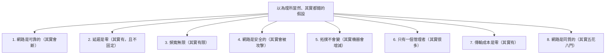

# [E-13-10]【概念版】分散式系統是什麼？為什麼這麼難

> **目標**：理解「分散式系統」到底是什麼、為什麼它出了名地難，並用「分散式運算的八個謬誤」建立直覺。

## 分散式系統是什麼

一句話：

> **分散式系統 = 「多台電腦透過網路合作，對使用者表現得像『一個系統』」。**

當你做水平擴展（E-13-1）、用多台機器、拆微服務（E-13-4）、資料庫分多台——你就進入了分散式系統的世界。它無所不在（你用的幾乎每個大型服務都是）。

聽起來不就是「多台電腦一起工作」嗎？有什麼難的？難就難在——**「網路」這個東西，遠比你想像的不可靠。**

## 為什麼這麼難：八個謬誤

1990 年代，Sun 公司的工程師整理了**「分散式運算的八個謬誤（Fallacies of Distributed Computing）」**——這些是工程師「**錯誤地以為理所當然**」的假設，而它們全都是錯的。理解它們，就理解了分散式為什麼難：

挑幾個最關鍵的解釋：

**① 網路是可靠的 → 錯**：在單機，你呼叫一個函式，它「一定會執行」。但跨網路呼叫另一台機器，**請求可能丟失、對方可能沒收到、回應可能遺失**。而最可怕的是——**當你沒收到回應時，你不知道「對方到底做了沒」**（可能做了但回應丟了，可能根本沒收到）。這個不確定性是分散式所有難題的根源。

**② 延遲是零 → 錯**：跨網路有延遲（光速也有限！），而且**延遲不固定**（有時快有時慢）。這讓「等多久才算對方掛了」很難判斷。

**⑤ 拓撲會變**：機器會增減（自動擴縮）、會掛掉、會重啟。系統要能應付「成員一直在變」。

這八個謬誤的共同訊息：

> **在單機理所當然的事（可靠、即時、一致），到了分散式全都不成立。** 你必須假設「網路會斷、訊息會丟、延遲不定、機器會掛」，並為此設計。

## 分散式帶來的核心難題

因為上面的不可靠，分散式系統有幾個招牌難題（這個系列接下來會深入）：

| 難題 | 是什麼 | 深入章節 |
|------|--------|---------|
| **一致性** | 多台機器的資料怎麼保持一致 | E-13-11（CAP/PACELC）|
| **複製與分片** | 資料分散多台怎麼放、怎麼備份 | E-13-12 |
| **共識** | 多台機器怎麼「達成一致的決定」 | E-13-13 |
| **分散式交易** | 跨多台的操作怎麼「全成或全敗」 | E-13-14 |
| **訊息可靠性** | 訊息可能丟/重複怎麼辦 | E-13-15 |

這些都源自同一件事——**網路不可靠 + 多台機器要協調**。

## 為什麼還是要用分散式

既然這麼難，為什麼不用單機就好？因為單機有極限（E-13-1 垂直擴展的天花板）：

- **規模**：單機扛不住巨大流量/資料量 → 必須多台（水平擴展）。
- **可用性**：單機是單點故障 → 多台才有冗餘（高可用，SRE Part 8-3）。
- **地理**：使用者全球分布 → 資料/服務要分散各地（就近服務，aws Multi-Region）。

所以分散式是「**為了規模和可靠，不得不承受的複雜**」。工程師的任務，就是用各種技術（後面幾章）來「**馴服**」這份複雜。

## 給你的心態

學分散式，最重要的心態轉變：

> **放棄「完美」的執念。** 在分散式系統，你常常無法「完美一致」「完美可靠」——而是要**在各種不完美之間做取捨**（CAP、最終一致、為失敗而設計）。接受「會出錯」並設計成「出錯也能撐住」，才是分散式的智慧（呼應 SRE Part 8）。

## 小結

- 分散式系統 = 多台電腦透過網路合作，表現得像一個系統。
- 它難，因為「分散式運算的八個謬誤」——網路其實不可靠、有延遲、會變。
- 核心難題：一致性、複製分片、共識、分散式交易、訊息可靠性（後續章節）。
- 用它是為了規模與可靠（單機有極限）。
- 心態：放棄完美，學會取捨、為失敗而設計。

> 一致性的取捨 → [課外讀物 E-13-11](./E-13-11-consistency-models.md)；CAP → [E-13-6](./E-13-6-cap-theorem.md)；為失敗而設計 → **sre 課程** Part 8
