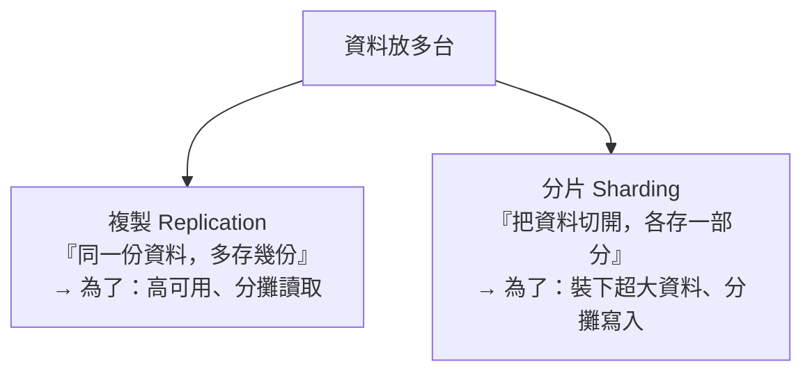
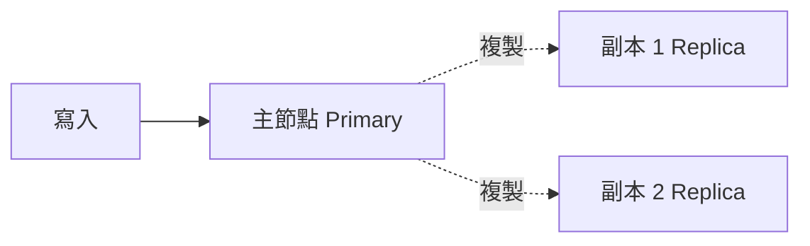
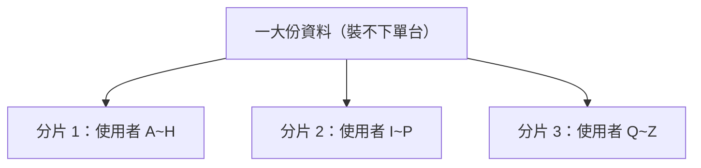
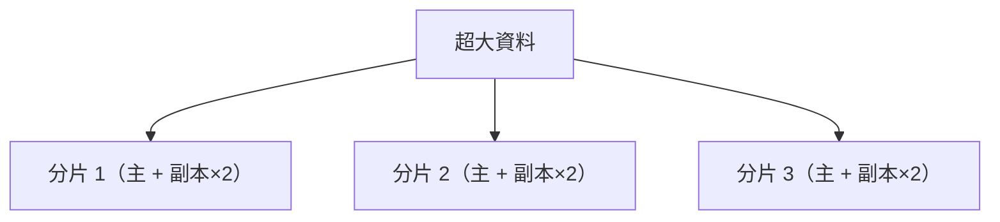

# [E-13-12]【深入版】資料複製與分片：Replication & Sharding

> **目標**：理解分散式資料的兩種基本手段——複製（replication，多存幾份）與分片（sharding，切開分散），以及它們解決的不同問題。

## 兩個不同的問題

當資料量大、或要高可用，你會把資料分散到多台。但有兩種完全不同的「分散」方式，解決不同問題：

別搞混——**複製是「多存幾份一樣的」，分片是「切開存不一樣的」**。

## 複製（Replication）：多存幾份

**複製**就是「同一份資料，在多台機器各存一份副本」。

最常見的是**主從複製（Primary-Replica）**（你在 aws Part 6-2 RDS 碰過）：

- **寫**：都寫到「主節點」。
- 主節點把資料**複製**到「副本」。
- **讀**：可以分散到副本（分攤讀取，aws Read Replica）。

**複製解決什麼**：

- **高可用**：主節點掛了，副本能頂上（故障轉移，SRE Part 8-3、aws Multi-AZ）。
- **分攤讀取**：讀多時，讀請求分散到副本（aws Read Replica，cache 也是類似精神）。

**複製的取捨**：副本的資料是「**從主節點同步過來**」的，可能有延遲——所以讀副本可能讀到「稍舊」的資料（最終一致，E-13-11）。要「強一致」就得「同步複製」（等所有副本確認），但那會慢。又是 CAP/PACELC 的取捨（E-13-6、E-13-11）。

## 分片（Sharding / Partitioning）：切開分散

**分片**是「把一大份資料**切成好幾塊**，每台機器各存「**一部分**」（不是全部）」。

例如使用者資料太多，單台裝不下 → 按「使用者 ID」切成幾片，各台存一部分。

**分片解決什麼**：

- **裝下超大資料**：單台裝不下 → 切開，每台只存一部分。
- **分攤寫入**：寫入也能分散（不像主從複製「寫都到主節點」會是瓶頸）。

**怎麼決定「哪筆資料放哪片」**：用一個「分片鍵（shard key）」（例如使用者 ID）來決定。這就用到了 cache-5-5 學的「分片」概念——簡單取模的問題、一致性雜湊的解法，在資料庫分片同樣適用（加減節點時別讓資料大搬風）。

**分片的取捨**：

- **跨片查詢變難**：要「查所有使用者」就得問所有片再合併，複雜又慢。
- **跨片交易變難**：一個交易涉及不同片的資料，就成了「分散式交易」（E-13-14）的難題。
- **分片鍵要選好**：選不好會「資料/流量分布不均」（某片爆滿、某片很閒，叫 hotspot）。

## 複製 + 分片：常常一起用

大型系統通常**兩個一起用**——先分片（切開裝下大資料 + 分攤寫入），每片再複製（高可用 + 分攤讀取）：

- **分片**橫向切開，解決「容量 + 寫入擴展」。
- 每片內**複製**，解決「高可用 + 讀取擴展」。

這就是大型分散式資料庫（如 Cassandra、分片的 MySQL/MongoDB）的基本架構。

## 一個對照表

| | 複製 Replication | 分片 Sharding |
|---|-----------------|--------------|
| 做什麼 | 同一份資料多存幾份 | 把資料切開各存一部分 |
| 主要解決 | 高可用、分攤讀取 | 裝下大資料、分攤寫入 |
| 副作用 | 副本可能稍舊（一致性）| 跨片查詢/交易變難 |
| 比喻 | 多印幾份備份 | 把書分章節放不同書架 |

## 小結

- **複製**：同一份資料多存幾份。為了高可用 + 分攤讀取。代價：一致性（副本可能舊）。
- **分片**：把資料切開分散。為了裝下大資料 + 分攤寫入。代價：跨片查詢/交易難、分片鍵要選好。
- 大型系統常「分片 + 每片複製」一起用。

> 主從複製的雲端實作 → **aws 課程** Part 6-2 RDS（Multi-AZ / Read Replica）；分片鍵與一致性雜湊 → 快取課程 cache-5-5；跨片交易難題 → [E-13-14](./E-13-14-distributed-transactions.md)
