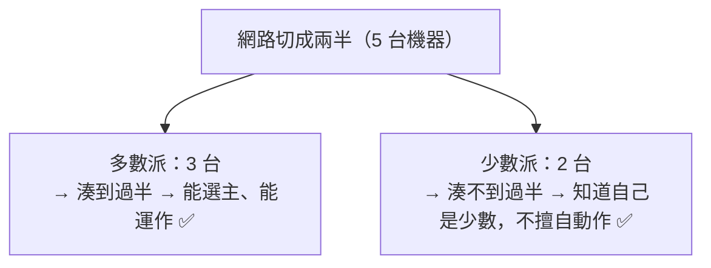
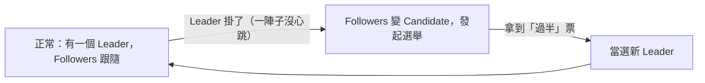

# [E-13-13]【深入版】共識演算法直覺：為什麼需要、Raft 在做什麼

> **目標**：理解分散式系統為什麼需要「共識」，以及共識演算法（以 Raft 為例）大致在做什麼——不深入數學，建立直覺。

## 一個根本問題：多台機器怎麼「達成一致」

分散式系統裡，多台機器常常需要「**對某件事達成一致的決定**」：

- 主節點掛了，剩下的副本要**一致同意「誰當新主節點」**（不能各推各的，否則出現兩個主節點 = 災難）。
- 多個副本要**一致同意「資料的順序」**（誰先誰後）。

這個「**讓多台機器，即使有些會掛、網路會斷，仍能達成一致決定**」的問題，叫**共識（Consensus）**。它是分散式系統最核心、也最難的問題之一。

## 為什麼這很難

回想 E-13-10 的「網路不可靠」——機器之間可能：

- 訊息丟失、延遲。
- 某些機器掛掉、又復活。
- 收不到回應時，不知道「對方掛了、還是只是慢」。

在這種混亂下，要讓大家「**達成一致、且不會分裂成兩派**」，非常棘手。最惡名昭彰的例子是「**腦裂（split-brain）**」：

> 網路把叢集切成兩半，兩半各自「以為對方掛了」、各自選出一個主節點 → **出現兩個主節點，各自接受寫入 → 資料衝突、無法收拾。**

共識演算法就是要**避免腦裂**、確保「永遠只有一個一致的決定」。

## 解法的核心：多數決（Quorum）

共識演算法的核心思想出奇地直覺——**多數決**：

> **任何決定，要「超過半數」的機器同意才算數。** 因為「兩個不同的決定」不可能「都拿到超過半數」（半數 + 半數 > 全部，矛盾），所以保證「不會有兩個衝突的決定同時成立」。

這就解決了腦裂——網路切成兩半時，「人數較少的那半」**湊不到多數**，所以**無法做決定**（它會知道自己是少數、不能擅自當主）。只有「人數過半的那半」能繼續運作。

這也是為什麼**叢集通常用「奇數」台**（3、5、7）——確保「過半」有明確的數字，且能容忍「(N-1)/2 台掛掉」仍運作。

## Raft：一個好懂的共識演算法

共識演算法中，最有名的是 **Paxos**（經典但極難懂）和 **Raft**（為了「好理解」而設計的，現在更流行）。我們用 Raft 建立直覺。

Raft 把問題拆成幾個角色與機制：

**角色**：每台機器是以下三種之一——

- **Leader（領導者）**：唯一負責處理寫入、協調的人（同一時間只有一個）。
- **Follower（跟隨者）**：聽 Leader 的，複製它的資料。
- **Candidate（候選者）**：Leader 掛了時，跳出來「競選」當新 Leader 的。

**核心機制——選舉（Leader Election）**：

1. Leader 定期發「**心跳**」告訴大家「我還活著」。
2. 如果 Followers 一段時間**沒收到心跳** → 認為 Leader 掛了 → 變成 Candidate、發起選舉、向大家拉票。
3. **拿到「過半」票**的 Candidate → 當選新 Leader（多數決，避免兩個 Leader）。
4. 新 Leader 繼續運作。

**資料複製**：所有寫入都先到 Leader，Leader 把它**複製給過半的 Followers** 確認後，才算「提交（committed）」。這保證了資料的一致順序。

你不用記細節——**重點是理解「靠多數決 + 選出唯一 Leader，來達成一致、避免腦裂」這個直覺**。

## 哪裡用到共識

共識演算法是很多分散式系統的「**地基**」，你用的東西底層常常有它：

- **etcd**（Kubernetes 的大腦存資料的地方，aws Part 7-5）用 Raft。
- 各種分散式資料庫的「選主」「一致性」靠共識。
- **ZooKeeper**、**Consul** 等協調服務。

好消息：**你通常不用自己實作共識**——你是「用」這些底層有共識的系統。但理解它，你就懂了「為什麼叢集要奇數台」「為什麼網路分區時少數派會停擺」這些實務現象。

## 小結

- **共識**：讓多台機器（即使有些會掛、網路會斷）達成「一致的決定」，避免腦裂。
- 核心是**多數決（quorum）**——過半同意才算數，所以不會有兩個衝突的決定（這也是叢集用奇數台的原因）。
- **Raft** 是好懂的共識演算法：選出唯一 Leader（靠多數決選舉）、由 Leader 複製資料。
- 你通常「用」底層有共識的系統（etcd、ZooKeeper…），不用自己實作。

> Kubernetes 的 etcd 用共識 → **aws 課程** Part 7-5；複製與多數派 → [E-13-12](./E-13-12-replication-sharding.md)
