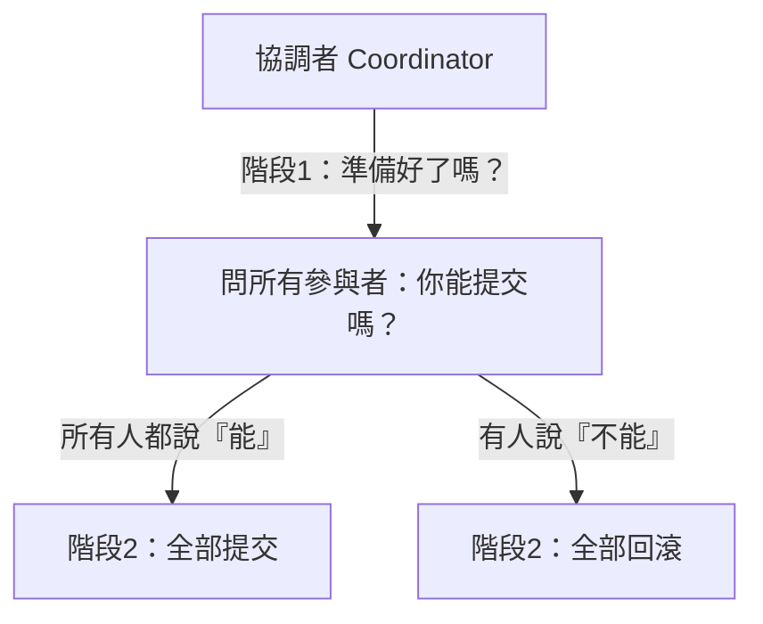

# [E-13-14]【深入版】分散式交易：2PC 的問題與 Saga 模式

> **目標**：理解為什麼「跨多個服務/資料庫的交易」很難，傳統 2PC 的問題，以及微服務常用的 Saga 模式。

## 單機交易很簡單，分散式很難

你學過資料庫交易（ACID，課外讀物 E-4-3）——「**要嘛全部成功、要嘛全部失敗**」。在單一資料庫，這很容易（資料庫內建支援）。

但在**分散式**——一個業務操作要跨「**多個服務 / 多個資料庫**」時，就難了。經典例子：

> **電商下單**：要 ①建訂單（訂單服務）②扣庫存（庫存服務）③扣款（支付服務）。這三個在**不同服務、不同資料庫**。要「全成或全敗」——但它們各自獨立，怎麼協調？

如果扣款失敗了，前面的「建訂單、扣庫存」要**全部回滾**——但它們在別的服務、別的資料庫，沒辦法用單一資料庫的交易機制。這就是**分散式交易**的難題（呼應 E-13-12 分片後跨片交易也是這問題）。

## 傳統解法：兩階段提交（2PC）及其問題

**兩階段提交（Two-Phase Commit, 2PC）** 是傳統解法。有個「協調者」分兩階段指揮：



1. **階段一（準備）**：協調者問所有參與者「你準備好提交了嗎？」，大家鎖定資源、回答「能/不能」。
2. **階段二（提交/回滾）**：如果**全部**說「能」→ 通知全部「提交」；只要**一個**說「不能」→ 通知全部「回滾」。

聽起來能達成「全成或全敗」，但 2PC 有嚴重問題：

- **阻塞（blocking）**：階段一到階段二之間，參與者要「**鎖住資源等待**」。如果協調者在這時掛了，參與者就**卡住、一直鎖著**（不知道該提交還是回滾）→ 系統停擺。
- **慢**：要兩階段、要等所有人，延遲高（呼應 PACELC，E-13-11）。
- **可用性差**：任一參與者掛了，整個交易就卡。

所以 2PC 在微服務裡**很少用**——它太脆弱、太慢、太綁。

## 微服務的解法：Saga 模式

微服務常用 **Saga 模式**——它放棄「強一致的全成或全敗」，改用「**最終一致 + 補償**」：

> **把一個大交易，拆成「一連串各自獨立的小步驟」。每一步都「立刻提交」（不鎖等）。如果某一步失敗了，就執行前面步驟的「補償動作（compensating action）」來「抵銷」已做的事。**


以下單為例：

```
正常：建訂單 → 扣庫存 → 扣款 → 完成
扣款失敗時（補償）：
  → 「補償扣庫存」= 把庫存加回去
  → 「補償建訂單」= 取消訂單
  → 達成「邏輯上的回滾」
```

關鍵：Saga 不是「真的回滾」（每步都已提交了），而是**用「反向操作」去抵銷**。例如不能「取消已扣的款」，而是「**退款**」（一個新的補償動作）。

**Saga 的兩種協調方式**：

- **編排（Choreography）**：各服務透過事件（訊息佇列，E-13-5）互相觸發——「訂單建立」事件 → 觸發扣庫存 → 「庫存扣了」事件 → 觸發扣款…。去中心化。
- **指揮（Orchestration）**：一個「Saga 協調者」中央指揮各步驟與補償。集中。

## Saga 的取捨

Saga 解決了 2PC 的阻塞問題，但有代價：

- **最終一致，不是強一致**：過程中會有「訂單建了、但款還沒扣」的中間狀態（短暫不一致，E-13-11）。要能接受。
- **要設計「補償動作」**：每一步都要想好「失敗了怎麼抵銷」——這是額外的設計負擔。
- **補償也可能失敗**：要處理「補償本身失敗」的情況（重試、人工介入）。
- **需要冪等**：補償和重試可能執行多次，要冪等（E-13-15）。

## 怎麼選 / 務實建議

- **能避免分散式交易就避免**：最好的分散式交易是「不需要分散式交易」——把「需要一起成敗」的資料盡量放同一個服務/資料庫（用單機交易就好）。設計時就考慮這點。
- **真的跨服務** → 用 **Saga**（最終一致 + 補償），這是微服務的主流。
- **2PC** 只在「少數需要強一致、且能接受其缺點」的場景。

這又回到分散式的核心智慧（E-13-10）——**放棄完美的強一致執念，接受最終一致 + 補償**。

## 小結

- 分散式交易 = 跨多服務/資料庫的操作要「全成或全敗」，很難（單機交易做不到）。
- **2PC**：兩階段提交，能達成但會「阻塞、慢、脆弱」，微服務少用。
- **Saga**：拆成小步驟、各自提交、失敗用「補償動作」抵銷。最終一致，微服務主流。
- 務實：能避免分散式交易就避免（資料放一起）；真要跨服務用 Saga。

> 交易與 ACID → 課外讀物 E-4-3；Saga 常靠訊息佇列 → [E-13-5](./E-13-5-message-queue.md)；冪等性 → [E-13-15](./E-13-15-idempotency.md)
