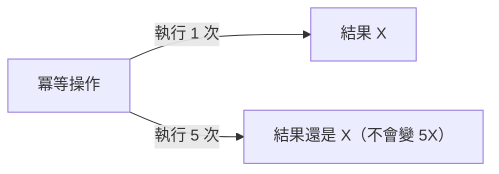
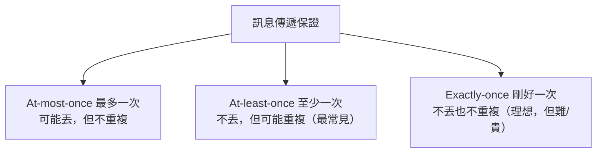

# [E-13-15]【深入版】冪等性、重試與訊息傳遞保證

> **目標**：理解分散式系統為什麼會「重複處理」訊息、什麼是冪等性、以及 at-least-once / exactly-once 等訊息傳遞保證。

## 一個分散式的必然問題：重複

E-13-10 說分散式的根源難題是「**收不到回應時，不知道對方做了沒**」。這直接導致一個必然問題——**重複**。

想像 A 服務呼叫 B 服務「扣款」：

```
A → B：扣款 100
B 扣了款，回應 A……但回應在網路上「丟失」了！
A 沒收到回應 → 以為失敗 → 重試 → 又叫 B 扣款 100
→ B 扣了「兩次」款！😱
```

問題核心：A 沒收到回應時，**無法分辨「B 沒做」還是「B 做了但回應丟了」**。如果重試，可能造成「做兩次」。在分散式（網路會丟訊息、訊息佇列可能重送，E-13-5），**重複幾乎無法完全避免**。

那怎麼辦？答案是——**讓「重複執行」不會出錯**。這就是冪等性。

## 冪等性（Idempotency）

> **冪等：同一個操作「執行一次」和「執行多次」，結果一樣。**

你在 SRE Part 6（Ansible）、infra Part 6 碰過這個詞。在分散式，它是對抗「重複」的關鍵武器：



**天然冪等 vs 非冪等的操作**：

| 操作 | 冪等嗎 | 為什麼 |
|------|:---:|--------|
| 「把餘額**設為** 100」 | ✅ 冪等 | 設幾次都是 100 |
| 「餘額**扣** 100」 | ❌ 非冪等 | 扣兩次就扣了 200 |
| 「**刪除** id=5」 | ✅ 冪等 | 刪幾次，結果都是「沒有 id=5」|
| 「**新增**一筆訂單」 | ❌ 非冪等 | 做兩次 = 兩筆訂單 |

「扣款、新增」這種非冪等操作，重複執行就會出事——所以要**想辦法讓它變冪等**。

## 怎麼讓操作變冪等

對「天生非冪等」的操作（扣款、下單），常用技巧：

**① 冪等鍵（Idempotency Key）——最常用**

讓每個操作帶一個「**唯一的 ID**」，服務記住「這個 ID 處理過了」，重複收到就忽略：

```
A → B：扣款 100，冪等鍵 = "req-abc123"
B：檢查「req-abc123 處理過嗎？」
   → 沒有 → 扣款，記下「req-abc123 已處理」
   → 有 → 直接回上次的結果，不重複扣 ✅
```

這樣 A 重試（用同一個冪等鍵），B 認得「這個我做過了」，就不會重複扣。很多支付 API（如 Stripe）就提供「Idempotency-Key」標頭，正是這個機制。

**② 用唯一約束**：例如「同一個訂單號只能建一次」（資料庫的 unique 約束擋掉重複）。

**③ 設計成天然冪等**：能用「設為 X」就別用「加 X」（如果業務允許）。

## 訊息傳遞保證：三種等級

訊息佇列（E-13-5）等系統，對「訊息會不會丟、會不會重複」有三種保證等級：



| 保證 | 意思 | 取捨 |
|------|------|------|
| **At-most-once（最多一次）** | 訊息**可能遺失**，但**絕不重複** | 簡單，但會丟訊息——適合「丟了沒差」的（如某些指標）|
| **At-least-once（至少一次）** | 訊息**絕不遺失**，但**可能重複** | **最常見、最實用**——但你的處理要**冪等**來應付重複 |
| **Exactly-once（剛好一次）** | 不丟也不重複 | 理想，但在分散式**極難、成本高**——常是「at-least-once + 冪等」模擬出來的 |

**關鍵實務認知**：

> **業界主流是「At-least-once（保證不丟）+ 讓處理冪等（應付重複）」。** 因為「絕不重複（exactly-once）」在分散式幾乎做不到（或代價極高），所以「允許重複、但讓重複無害」是務實的解法。

這就是為什麼**冪等性這麼重要**——它讓「at-least-once 的重複」變得無所謂，從而「實質上」達成了 exactly-once 的效果。

## 串起來：分散式的可靠處理

把這些概念串起來，分散式系統「可靠地處理一件事」的標準做法：

```
1. 用訊息佇列（E-13-5）傳遞任務 → 保證 at-least-once（不丟）
2. 處理時用「冪等鍵」→ 重複收到也只做一次（應付重複）
3. 失敗就重試（反正冪等，重試安全）
4. 跨服務的一致性用 Saga + 補償（E-13-14），補償也要冪等
→ 結果：訊息不丟、重複無害、失敗能重試 → 可靠
```

這套「at-least-once + 冪等 + 重試」是分散式可靠處理的基石，也呼應 SRE Part 8「為失敗而設計」（重試、逾時要搭配冪等才安全）。

## 小結

- 分散式必然有「**重複**」（收不到回應就重試，可能做兩次）。
- **冪等性**：同操作執行一次與多次結果相同——對抗重複的武器。
- 讓操作冪等：**冪等鍵**（記住處理過的 ID）、唯一約束、設計成天然冪等。
- 訊息傳遞保證：at-most-once（會丟）/ **at-least-once（會重複，最常見）** / exactly-once（理想難達成）。
- 主流：**at-least-once + 冪等**——允許重複，但讓重複無害。

> 冪等也出現在 Ansible/重試 → **sre 課程** Part 6、Part 8；訊息佇列 → [E-13-5](./E-13-5-message-queue.md)；Saga 補償需冪等 → [E-13-14](./E-13-14-distributed-transactions.md)
