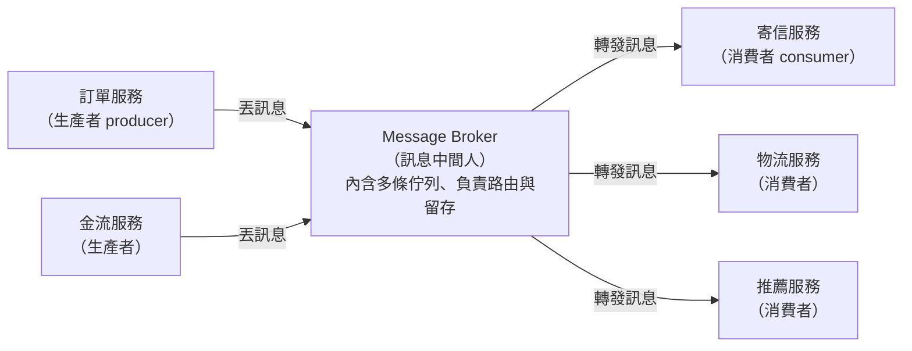
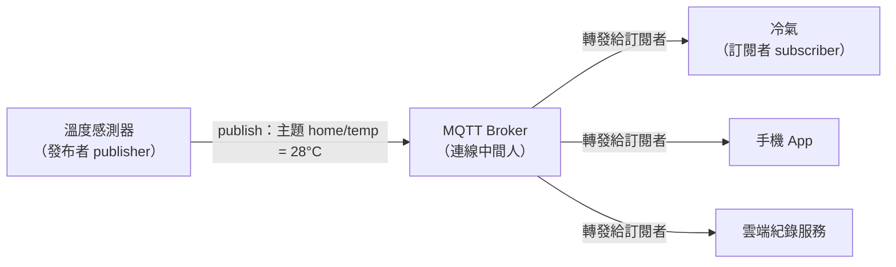

# [E-13-16] Broker：居中轉介的「中間人」

> **目標**：理解 Broker（中間人／仲介）這個通用概念——不管是服務之間傳訊息，還是裝置之間連線，背後都是同一招：讓雙方不直接打交道，透過一個居中的角色轉介，換來解耦、可管理、可擴充。

## 先搞懂「Broker」這個詞

在講技術之前，先講日常。**Broker** 這個英文字，本來的意思就是「**仲介、經紀人、中間人**」。生活裡到處都是：

- **房仲**：你要租房，不用自己一間一間去敲房東的門。你跟房仲說需求，房東把房子託給房仲，房仲居中媒合。
- **股票經紀人（stock broker）**：你要買股票，不會直接打電話給另一個想賣股票的陌生人；你透過券商（broker）下單，它幫你撮合。
- **公司總機／櫃檯**：你打去一間大公司，不會直接撥到某個員工的分機；你打給總機，總機幫你轉接。

這些角色有一個共同點：

> **雙方不直接接觸，中間插一個「轉介的人」。** 你只要認識中間人，不用認識另一端是誰。

為什麼要多這一層？直接找對方不是更快嗎？其實這個「中間人」帶來三個好處：

- **解耦（decoupling）**：租客不用認識每個房東，只要認識房仲。任何一邊換人，另一邊不受影響——你不用知道房子是哪個房東的，房東也不用知道租客是誰。
- **可管理**：所有往來都經過中間人，於是可以在這裡「統一處理」——記錄、過濾、收費、驗證身分。總機可以擋掉推銷電話。
- **可擴充**：想多接一個房東、多服務一個租客？跟中間人登記一下就好，兩邊本來的關係一行都不用改。

這個「**Broker＝居中轉介的中間人**」的抽象概念，在軟體世界被大量借用。接下來看兩種最常見的應用——它們長得不太一樣，但核心是同一招。

## 應用一：Message Broker（訊息中間人）

這是 Broker 在後端最主流的用法，值得多花點篇幅。

### 它跟「訊息佇列」的關係

你在 [E-13-5：訊息佇列](./E-13-5-message-queue.md) 學過：服務之間可以透過「**一個中間的佇列（留言板）**」非同步、解耦地溝通——生產者（producer）把訊息丟進佇列就走，消費者（consumer）之後自己來取。

那問題來了：**那個「中間的佇列」，是誰在管？** 佇列不會自己存在——總得有一個軟體負責「收訊息、存起來、發給該收的人」。

> **這個負責跑佇列的中間軟體，就叫 Message Broker（訊息中間人）。**

用一句話分清楚兩者：

- **Message Queue（訊息佇列）** 是「**那個留言板／那條隊伍**」——一個資料結構、一個概念。
- **Message Broker（訊息中間人）** 是「**管理留言板的那個中間人／那套軟體**」——它裡面可以有很多條佇列，負責收發、路由、留存。

用房仲類比：佇列像「房仲桌上那疊待媒合的委託單」，而 broker 就是「房仲本人」——是他在收單、分類、媒合、通知。

所以你之前聽到的 **RabbitMQ、Apache Kafka、AWS SQS**，嚴格說都是 **Message Broker**（跑訊息佇列的中間軟體）。平常口語會混著講「訊息佇列」，但心裡要知道：queue 是東西，broker 是管東西的中間人。

### 畫成圖：producer → broker → consumer

> 這張圖表達：生產者不直接呼叫消費者，全部訊息都先經過中間的 Broker，再由 Broker 轉發給該收的消費者——生產者完全不用認識消費者是誰、有幾個。

### 有了這個中間人，能做什麼

因為所有訊息都流經 Broker 這個「必經之地」，它就能在中間統一做很多事（呼應前面「中間人可管理」）：

- **路由（routing）**：依規則決定「這則訊息該給誰」——像總機的分機轉接。可以一對一，也可以廣播給多個消費者（就是 pub/sub，發布／訂閱）。
- **留存與緩衝**：訊息先存在 Broker 裡，消費者掛了也不會弄丟，恢復後再來取（呼應 E-13-5 的「削峰填谷」與「可靠」）。
- **傳遞保證**：Broker 幫你確保訊息「至少送到一次」（at-least-once），這也牽出重複與冪等的問題 → [E-13-15：冪等性與訊息傳遞保證](./E-13-15-idempotency.md)。

一句話收束第一種應用：**Message Broker 就是「服務之間傳訊息」時，那個居中收發、路由、留存的中間人。**

## 應用二：連線代理 / MQTT Broker（點到為止）

同一個「中間人」概念，換個場景又冒出來——這次是**裝置之間的連線**。

想像一個智慧家庭：溫度感測器、冷氣、手機 App、雲端伺服器…幾十上百個裝置要互通。如果每個裝置都要「直接連到其他每個裝置」，連線數會爆炸，而且裝置一上一下（IoT 裝置常斷線）就亂成一團。

於是同樣的解法登場：中間放一個 Broker，**所有裝置只連到 Broker**，彼此透過它轉介。這在物聯網（IoT，Internet of Things，把各種實體裝置連上網路互通）領域最典型的協定就是 **MQTT（Message Queuing Telemetry Transport，訊息佇列遙測傳輸）**，它的核心角色就叫 **MQTT Broker**。

它用的是 **pub/sub（publish / subscribe，發布／訂閱）** 模式：

- 感測器**發布（publish）**：「主題 `home/livingroom/temp` 現在是 28 度」給 Broker。
- 冷氣**訂閱（subscribe）**了這個主題，Broker 就把這則訊息轉發給它。
- 發布者跟訂閱者**互相不認識**，只認識 Broker——跟前面一模一樣的精神。

> 這張圖表達：眾多 IoT 裝置不互相直連，全部只連到中間的 MQTT Broker，靠「主題」的發布／訂閱來轉介訊息——跟第一種應用的 producer → broker → consumer 是同一個形狀。

這裡點到為止就好，你只要感受到：**又是那個中間人。**

## 收尾：其實是同一個概念

看完兩種應用，把它們並排：

| | Message Broker | MQTT Broker |
|---|---|---|
| **中間人是誰** | RabbitMQ、Kafka… | MQTT Broker（如 Mosquitto） |
| **兩端是誰** | 後端服務之間 | IoT 裝置之間 |
| **轉介的是** | 服務要做的「訊息／任務」 | 裝置間的即時「連線與訊息」 |
| **兩端認識彼此嗎** | 不用，只認識 Broker | 不用，只認識 Broker |

場景不同，但骨架完全一樣：

> **Broker＝居中轉介的中間人。** 讓雙方不直接打交道，透過中間這一層轉接，換來**解耦、可管理、可擴充**——不管中間傳的是服務間的訊息，還是裝置間的連線。

下次再看到任何叫「XXX Broker」的東西，你都可以先假設：這裡有一個「中間人」，兩端不直連，某種好處正被這一層集中處理。八九不離十。

## 小結

- **Broker** 的本義就是「仲介／中間人」——房仲、券商、總機都是。核心是「雙方不直連，透過中間人轉介」，好處是**解耦、可管理、可擴充**。
- **Message Broker**（RabbitMQ、Kafka、SQS）是「跑訊息佇列的那個中間軟體」——queue 是留言板，broker 是管留言板的人；負責收發、路由、留存。
- **MQTT Broker** 是同一招用在 IoT：裝置只連 Broker，靠 pub/sub 轉介——這次轉的是裝置間的連線。
- 兩者本質相同：**居中轉介的中間人**，只是應用場景不同。

> 訊息佇列（queue 與 broker 的關係） → [課外讀物 E-13-5：訊息佇列](./E-13-5-message-queue.md)；訊息會重複、需要冪等 → [課外讀物 E-13-15：冪等性、重試與訊息傳遞保證](./E-13-15-idempotency.md)；pub/sub 的程式內版本（Observer 模式） → [課外讀物 E-12-5：Observer 模式](../E-12-design-patterns/E-12-5-observer.md)
