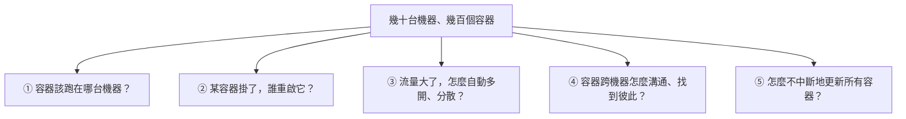

# [E-13-2] 為什麼 Docker 不夠用？容器編排的問題

> **目標**：理解單用 Docker（單機）的極限，以及為什麼「跑很多容器、跨很多台機器」時需要「容器編排」。

## Docker 很棒，但……

你學過 Docker（infra Part 5）——把應用打包成容器，「在哪都能跑」。在「一台機器跑幾個容器」時，`docker compose`（infra Part 5-4）就很夠。

但當規模變大，單機 Docker 就**力不從心**了。想像你要跑「**幾百個容器、分散在幾十台機器上**」（水平擴展的容器版，E-13-1），會遇到一堆 `docker compose` 解決不了的問題。

## 單機 Docker 解決不了的問題

具體說：

- **排程（放哪）**：幾百個容器、幾十台機器，每個容器該放哪台（哪台還有空間）？手動安排不可能。
- **自我修復**：某個容器/某台機器掛了，要自動在別處重啟一個——誰來盯、誰來做？
- **自動擴縮**：流量大了要自動多開容器、分散到各機器；小了要收掉。
- **服務發現與網路**：容器一直在生滅、換 IP，它們跨機器怎麼找到彼此、溝通？
- **滾動更新**：要更新幾百個容器，怎麼「一批批換、不中斷服務、出錯能回滾」？

這些都是「**管理一大群、跨多機的容器**」才會有的問題。`docker compose` 是單機工具，管不了這些。

## 解法：容器編排（Container Orchestration）

需要一個「**總指揮**」來管理整群容器——這就是**容器編排（orchestration）**：

> **容器編排平台幫你自動處理「一大群容器跨多台機器」的所有管理問題：排程、自我修復、擴縮、網路、滾動更新。**

用類比：

- **Docker** = 會做菜（把應用容器化、跑起來）。
- **容器編排** = **整個餐廳的營運總管**——調度幾十個廚師（容器）在幾個廚房（機器）工作、有人請假立刻補人、客人多了加開、出餐流程順暢。

最主流的容器編排平台就是 **Kubernetes（K8s）**（E-13-3 詳述）。

## 編排平台幫你做的事

| 問題 | 編排平台怎麼解 |
|------|--------------|
| 容器放哪台 | 自動排程（看哪台有資源）|
| 掛了重啟 | 自動偵測、自動重建（自我修復）|
| 自動擴縮 | 依負載自動增減容器/機器 |
| 跨機溝通 | 內建服務發現與網路 |
| 滾動更新 | 一批批換、可回滾、不中斷 |

這些正是你在 SRE（自我修復、擴縮）、aws Part 7（ECS/EKS）學到的能力——它們都是「容器編排」在做的事。

## 小結

- 單機 Docker（`docker compose`）在「一台跑幾個容器」很好用，但管不了「跨多機的一大群容器」。
- 大規模會遇到：排程、自我修復、自動擴縮、跨機網路、滾動更新等問題。
- **容器編排平台**（最主流是 **Kubernetes**）就是解決這些的「總管」。

> Kubernetes 入門 → [課外讀物 E-13-3：Kubernetes 概念入門](./E-13-3-kubernetes-intro.md)；雲端的容器編排 → 參見 **aws 課程** Part 7（ECS / EKS）；Docker 基礎 → **infra 課程** Part 5
