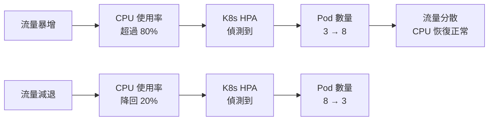

# [E-13-3] Kubernetes 概念入門：容器的指揮官

> **你會了解**：Kubernetes 是什麼、為什麼有了 Docker 還需要它，以及幾個最核心的概念。

---

## Docker 解決了一個問題，但帶來了另一個問題

如果你學過 Docker，你知道它的核心價值：**「在我電腦上可以跑」的終結者**。

把你的應用、執行環境、依賴全部打包成一個 Image，在任何機器上都能用一樣的方式跑起來。這個箱子（Container）在你的筆電上是什麼，部署到伺服器上就是什麼。

問題解決了，工程師們歡欣鼓舞。

然後公司長大了，系統複雜了，你有了 **50 個 Container**，跑在 **10 台不同的機器**上。

突然間冒出了一堆新問題：

- 這 50 個 Container 要分配到哪台機器上？誰來決定？
- 有一個 Container 突然掛掉了，誰來察覺並重啟它？
- 流量突然暴增，需要把某個服務從 2 個 Container 擴展到 10 個，怎麼自動做到？
- 新版本要更新，怎麼做到不停機、一個一個慢慢替換舊版本？

Docker 對這些問題的回答是：不在我的職責範圍。

**Kubernetes（K8s）就是來回答這些問題的。**

---

## Kubernetes 是什麼

**Kubernetes**（縮寫 K8s，因為 K 和 s 之間有 8 個字母）是一個**容器編排系統**。

「編排」這個詞很傳神——它就像一個樂團指揮，負責協調所有容器：幾個在哪台機器上跑、誰掛了就補上、流量來了就擴充人手。

用廚房比喻更直覺：

| Kubernetes 概念 | 廚房比喻 |
|---------------|---------|
| Pod | 一個廚師（執行工作的最小單位） |
| Deployment | 排班表（說明要幾個廚師、用哪種技能）  |
| Service | 收餐口（固定的窗口，外面的人不用管廚師換人） |
| Node | 廚房（實際的機器，廚師在裡面工作） |
| K8s 本身 | 廚房主管（決定怎麼排班、誰請假補誰、忙了多叫人） |

---

## 幾個你一定會碰到的核心概念

### Pod：最小的部署單位

Pod 是 Kubernetes 裡最基本的東西。通常一個 Pod 跑一個 Container（你的應用程式）。

```
Pod = 一個或幾個緊密配合的 Container + 共用的網路和儲存
```

為什麼不直接叫 Container？因為有時候你需要兩個 Container 緊密配合（比如應用程式 + sidecar logging agent），它們會被放在同一個 Pod 裡共用資源。

Pod 是短暫的——它可以在任何時間消失，由 Kubernetes 在別的地方重新建立一個新的。這就是為什麼你不應該把重要狀態存在 Pod 裡。

### Deployment：你的意圖聲明

與其告訴 Kubernetes「去啟動這個 Container」，Deployment 讓你說的是：

```yaml
# 我希望：
# - 永遠有 3 個 my-app 的 Pod 在跑
# - 用的 image 是 my-app:v2.1
# - 如果有 Pod 掛掉，立刻重啟
```

Kubernetes 會持續監控，確保現實跟你的聲明一致。少了一個 Pod？馬上補。機器炸了？在別的機器上開新的。

這種「聲明式」的設計（你說要什麼，系統自己想辦法達到）是 K8s 很核心的哲學。

### Service：固定的聯絡窗口

Pod 有個問題：每次重啟，IP 位址都會變。前端要怎麼連後端？每次 Pod 重啟都要更新 IP 嗎？

Service 解決了這個問題。它給一群 Pod 提供一個**固定的 IP 和 DNS 名稱**，外面的人連 Service，不用管後面有幾個 Pod、IP 是什麼。

```
外部請求 → Service（固定 IP）→ Pod 1
                               → Pod 2
                               → Pod 3
```

Service 同時也是一個簡單的 Load Balancer，自動把流量分散給旗下的 Pod。

### Node：實際的機器

Node 就是真實存在的機器（實體機或虛擬機）。一個 Kubernetes **Cluster（叢集）** 由多個 Node 組成，Pod 就跑在這些 Node 上。

Kubernetes 的 **Scheduler** 負責決定「這個 Pod 要放在哪個 Node 上跑」，考量因素包括資源使用量、硬體需求、用戶設定的限制等。

---

## 自動擴縮：流量來了自動加人

這是 K8s 最讓人驚豔的功能之一。

**HPA（Horizontal Pod Autoscaler，水平自動擴縮）** 可以根據 CPU 或記憶體使用量，自動調整 Pod 的數量：



這張圖說明：HPA 持續監控資源使用率，自動增減 Pod 數量，讓資源使用保持在合理範圍。

回到廚房比喻：週末用餐高峰，主管叫更多外包廚師來幫忙；平日下午客人少，讓外包廚師下班，節省成本。

---

## 另一個殺手功能：滾動更新

你要更新應用程式的新版本，但不想讓網站停擺。

Kubernetes 的 **Rolling Update（滾動更新）**：

```
原本：Pod 1 (v1) / Pod 2 (v1) / Pod 3 (v1)

更新步驟：
1. 啟動 Pod 4 (v2)，確認健康
2. 關掉 Pod 1 (v1)
3. 啟動 Pod 5 (v2)，確認健康
4. 關掉 Pod 2 (v1)
5. ...以此類推

最終：Pod 4 (v2) / Pod 5 (v2) / Pod 6 (v2)
```

全程用戶感受不到任何停機。如果新版本有問題，也可以一鍵 **Rollback（回滾）**到舊版本。

---

## 說了這麼多，初學者要學 K8s 嗎？

誠實的回答：**暫時不需要**。

K8s 的學習曲線非常陡峭。光是把一個最簡單的應用部署到 K8s 上，就需要理解 Deployment、Service、Namespace、ConfigMap、Secret、Ingress……

對初學者來說，這個複雜度遠遠超過解決的問題。

更好的選擇是用「把 K8s 的複雜度藏起來」的服務：

| 服務 | 特色 |
|------|------|
| **Railway** | 最簡單，push code 就部署 |
| **Render** | 免費方案夠用，設定直覺 |
| **Fly.io** | 彈性高，接近 K8s 的概念但簡化很多 |
| **Vercel** | 前端專用，Next.js 首選 |

這些服務的底層很可能就是 K8s，但他們幫你管好了所有複雜的部分。

**等到你真的遇到這些需求時，再來學 K8s**：
- 你需要精細控制多個服務的部署策略
- 你的公司有自己的機器需要管理
- 現有服務的彈性已經不夠用了

在那之前，把功能做好才是正事。

---

## 小結

Kubernetes 是容器的指揮官，解決了 Docker 解決不了的問題：誰來決定容器在哪裡跑、掛掉怎麼辦、流量大怎麼辦、新版本怎麼不停機更新。

四個最核心的概念：**Pod**（最小部署單位）、**Deployment**（聲明你要什麼）、**Service**（固定的聯絡窗口）、**Node**（實際的機器）。

初學者先用 Railway / Render，等真正有需要再深入 K8s。

---

## 延伸閱讀

> 想了解微服務為什麼需要 K8s → [課外讀物 E-13-4：Monolith vs Microservices：什麼時候該拆？](./E-13-4-monolith-vs-microservices.md)
