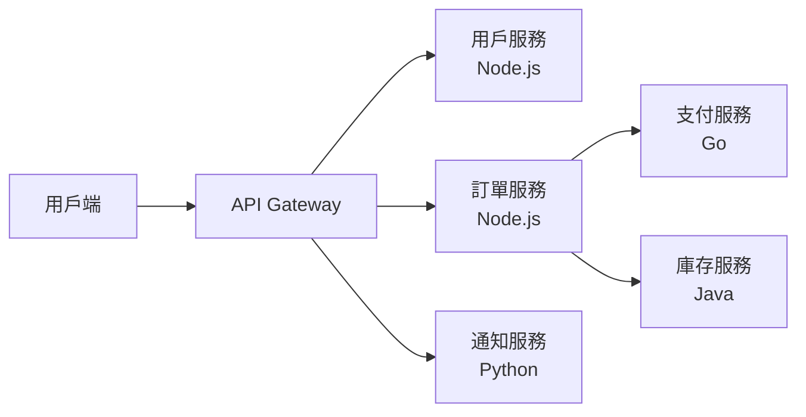

# [E-13-4] Monolith vs Microservices：什麼時候該拆？

> **你會了解**：兩種架構模式的真實取捨，以及初學者應該從哪個開始——劇透：答案可能出乎你意料。

---

## 微服務不是進化，是取捨

「微服務」這個詞在技術社群裡有一種神奇的魔力，好像只要說出口就代表你的系統很先進、你的公司很成熟。

面試的時候，候選人說「我們公司用微服務架構」，面試官會點點頭。

但 Netflix 的工程師曾經公開說：「微服務是我們遇過最複雜的分散式系統架構之一。」

Amazon 用了十年從 Monolith 轉向微服務。一家叫 Segment 的知名資料分析公司，在 2020 年把所有微服務合併回 Monolith——因為微服務的複雜度已經超過了它帶來的好處。

這不是說微服務不好。這是說：**任何架構都有它的適用情境**，盲目追隨潮流只會讓自己痛苦。

---

## 先說 Monolith：被低估的架構

**Monolith（單體架構）**就是把所有功能放在同一個程式裡——前端渲染、商業邏輯、資料庫操作、排程任務、通知系統，通通在一個 Codebase、一個 Process 裡跑。

很多人聽到「單體」就覺得老舊、不入流。但讓我們誠實地看它的優點：

**開發速度快**：
加一個功能，打開同一個 Codebase 就改，不用考慮要呼叫哪個服務、API 格式是什麼、網路會不會超時。

**部署簡單**：
一個程式，一個部署流程。不用協調多個服務的版本相依性。

**Debug 容易**：
一份日誌、一個執行堆疊（stack trace）。問題發生在哪一行，你馬上知道。

**事務（Transaction）天然一致**：
「扣錢」和「建立訂單」可以放在同一個資料庫事務裡，要麼全部成功，要麼全部回滾。這在微服務裡是一個很難解決的問題。

缺點也是真實的——規模大了以後，**同一份 Codebase 被幾十個工程師同時修改，互相踩腳**；某個功能的 Bug 可能拖垮整個程式；想針對「訂單查詢」這個服務多開幾台機器，做不到，只能整個程式一起擴縮。

---

## 再說 Microservices：強大但昂貴

**Microservices（微服務）**把一個大系統拆成多個小的、獨立的服務，每個服務只負責一件事，透過 API 或訊息佇列互相通訊：



這張圖說明：在微服務架構下，每個功能是獨立的服務，透過 API 呼叫彼此，甚至可以用不同的程式語言撰寫。

優點實實在在：

- **獨立部署**：更新訂單服務，不需要重新部署用戶服務
- **獨立擴縮**：促銷活動時只把訂單服務多開幾台
- **故障隔離**：通知服務掛掉，用戶還是可以下訂單
- **技術多樣性**：推薦系統用 Python（因為 ML 生態好），訂單系統用 Go（因為要高效能）

但代價非常高：

**服務間通訊複雜**：
A 服務呼叫 B 服務，如果 B 沒有回應，A 要等多久？要重試幾次？重試失敗了怎麼辦？這些在 Monolith 裡是函式呼叫，不會有網路問題；在微服務裡全都要考慮。

**分散式事務是噩夢**：
「扣錢」在支付服務，「建立訂單」在訂單服務，「扣庫存」在庫存服務。如果扣完錢但訂單建立失敗怎麼辦？不能用資料庫事務解決，因為它們是不同的資料庫。這個問題有解法（Saga Pattern 等），但複雜度急劇上升。

**本機開發複雜**：
要跑起整個系統，你需要在本機同時啟動 8 個服務。每個服務有自己的 port、環境變數、資料庫。光是「讓新人把開發環境跑起來」就可能花半天。

**需要大量基礎設施支援**：
要管理 20 個服務，你需要服務發現（怎麼找到其他服務的位址）、集中式日誌（8 個服務的日誌要整合在一起看）、分散式追蹤（一個請求跨越 5 個服務，要能追蹤完整路徑）、Kubernetes 來編排容器。這些每一個都是獨立的學習曲線。

---

## 真實案例：兩個方向的故事

### Amazon：從 Monolith 走向微服務

2000 年代初，Amazon 的整個電商系統是一個巨大的 Monolith。隨著公司快速成長，這個 Monolith 越來越難以維護：幾百個工程師同時在一份 Codebase 上工作，每次部署都是一場賭博。

他們花了好幾年，把系統拆成數百個獨立服務——這個過程本身就非常痛苦，但最終讓 Amazon 能夠以驚人的速度擴張，同時讓不同團隊獨立工作。

**重點**：他們是在 Monolith **真的痛了**之後才拆的，而且有充足的工程資源支撐整個遷移。

### Segment：從微服務走回 Monolith

Segment 是一家資料整合公司，2017 年前後決定把系統拆成微服務。聽起來很現代。

但到了 2020 年，他們的工程師寫文章說：**我們決定把所有微服務合併回一個 Monolith**。

原因？他們有幾十個微服務，維護複雜度讓工程師疲於奔命。每次要加一個功能，要修改 3 個服務、協調 3 次部署、寫 3 份文件。最後他們發現：他們的規模還不需要微服務，Monolith 反而讓他們跑得更快。

**重點**：架構選擇要根據**實際需求**，不是根據潮流。

---

## 中間選項：Modular Monolith

有一個常常被忽略的選項，叫做 **Modular Monolith（模組化單體）**。

概念是：Codebase 還是在一起（Monolith 的優點保留），但內部用嚴格的模組邊界把功能分開：

```
// 好的 Modular Monolith 結構
src/
├── modules/
│   ├── user/
│   │   ├── user.service.ts
│   │   ├── user.repository.ts
│   │   └── user.controller.ts
│   ├── order/
│   │   ├── order.service.ts
│   │   └── ...
│   └── notification/
│       └── ...
```

每個模組有清楚的邊界，不能隨便呼叫別的模組的 internal function，只能透過定義好的 interface 互動。

這樣的好處是：未來如果真的需要拆出微服務，這些模組的邊界已經定義好了，拆分成本低很多。

NestJS 就是這種設計哲學的典型代表。

---

## 那初學者應該用哪個？

這個問題的答案很明確：

**先寫 Monolith，而且要寫得好。**

原因不只是「簡單」，而是：

1. **你還不知道邊界在哪**：微服務的設計難點在於把系統切在正確的地方。如果你對業務不夠熟悉，切錯比不切更糟。先把業務做出來，自然會看出哪裡應該分開。

2. **讓系統先動起來**：最重要的事情是做出有價值的功能。在你有 10 個用戶的時候用微服務，是過早最佳化的教科書案例。

3. **真正的痛點才是最好的老師**：等你真的覺得 Monolith 痛了——部署互相影響、某個模組的問題拖垮整個服務——那時候你拆出去的動機和理解都是真實的。

**什麼時候考慮拆？**

- 不同功能需要完全不同的擴縮策略（比如影片轉碼非常吃 CPU，其他功能不需要）
- 不同團隊需要完全獨立的部署節奏
- 某個模組的技術需求跟主系統完全不同（比如 ML 推薦系統）

---

## 小結

Monolith 和 Microservices 各有適用場景，沒有絕對的好壞。

Monolith 的優勢在開發初期壓倒性地大：開發快、部署簡單、Debug 容易。Microservices 的優勢在系統規模很大、團隊很多、需要精細控制時才會顯現出來，但代價是高得多的複雜度。

初學者的正確順序：先把 Monolith 寫好，用模組化的方式組織程式碼（Modular Monolith），等真的遇到 Monolith 的瓶頸時，再考慮拆分。

---

## 延伸閱讀

> 想了解 K8s 如何管理微服務 → [課外讀物 E-13-3：Kubernetes 概念入門](./E-13-3-kubernetes-intro.md)
