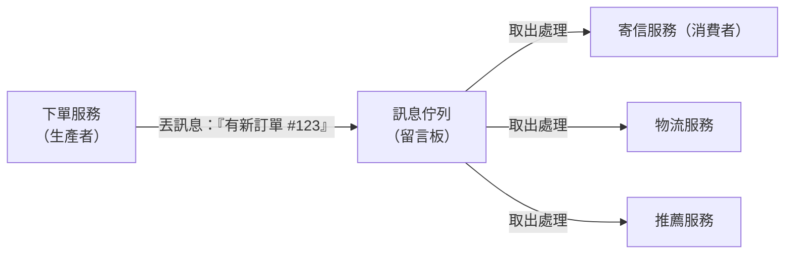

# [E-13-5] 訊息佇列：用非同步解耦服務

> **目標**：理解訊息佇列（Message Queue）——讓服務之間「非同步、解耦」地溝通，是分散式系統的關鍵元件。

## 一個問題：同步呼叫的痛

想像「使用者下單」要做很多事：建訂單、扣庫存、寄確認信、通知物流、更新推薦…。

如果**同步**做（一件接一件、等每件做完）：

```
下單 → 建訂單(等)→ 扣庫存(等)→ 寄信(等，慢！)→ 通知物流(等)→ 回應使用者
```

問題：

- **慢**：使用者要等所有事做完（尤其「寄信」這種慢又可能失敗的）。
- **耦合**：下單服務要認識所有下游服務，任一個掛了或變慢，整個下單就卡住（連鎖故障，SRE Part 8-1）。

## 解法：訊息佇列——「留言板」

**訊息佇列（Message Queue, MQ）** 讓服務之間透過「**一個中間的佇列（留言板）**」非同步溝通：

> 生產者（producer）把「**訊息（要做的事）**」丟進佇列就走（不等），消費者（consumer）之後**自己從佇列取出來慢慢處理**。



於是下單變成：

```
下單 → 建訂單 → 把「訂單建立」訊息丟進佇列 → 立刻回應使用者（快！）
（之後，寄信/物流/推薦服務各自從佇列取訊息、慢慢處理）
```

用類比：訊息佇列像**餐廳的點單夾**。服務生（生產者）把點單夾上去就去招呼別桌（不等廚房做完），廚師（消費者）依序取單來做。雙方不用「面對面等」，各做各的。

## 帶來的好處

**① 非同步、更快**：生產者丟了訊息就走，不用等消費者處理完——使用者體驗更快。

**② 解耦**：生產者**不用認識消費者**（只管丟進佇列）。要加一個「下單後也發優惠券」的服務？再加一個消費者訂閱佇列就好，下單服務一行不用改（呼應 E-12-5 Observer、開放封閉）。

**③ 削峰填谷（緩衝）**：流量暴增時，訊息先堆在佇列裡，消費者「按自己的步調」慢慢消化——不會被瞬間流量打垮（呼應 SRE 容量、負載卸除）。佇列當了緩衝墊。

**④ 可靠**：消費者掛了，訊息還在佇列裡（沒被處理掉），等它恢復再處理——不會遺失（搭配「至少一次」傳遞保證，E-13-15）。

## 常見的訊息佇列

你可能聽過這些 MQ 系統（知道名字即可）：

- **RabbitMQ**：經典的訊息佇列。
- **Apache Kafka**：高吞吐的「事件串流」平台（也常當 MQ 用），大數據場景愛用。
- **AWS SQS**：雲端託管的佇列（aws）。
- **Redis** 也能當輕量 MQ（cache-5-2）。

## 它和 Observer / Pub-Sub 的關係

訊息佇列是 E-12-5 Observer / Pub-Sub 模式的「**分散式、跨服務**」版本：

- Observer 是「程式內」的通知。
- 訊息佇列是「**跨服務、跨機器、且可靠（訊息會留存）**」的通知。

精神一樣（解耦、事件驅動），但 MQ 適用於分散式系統，且多了「可靠留存、緩衝」等能力。

## 要注意的事

MQ 很強，但帶來新問題（分散式的代價）：

- **最終一致**：因為是非同步，「下單後，信還沒寄」會有短暫的不一致（cache-6-1、E-13-11）——通常可接受。
- **訊息可能重複**：消費者要能處理「同一訊息收到兩次」——這需要**冪等性**（E-13-15）。
- **順序**：訊息的處理順序不一定有保證（看 MQ 設定）。

這些是「用非同步換來好處」的代價，要在設計時考慮。

## 小結

- 訊息佇列 = 服務之間透過「中間的佇列」非同步、解耦地溝通（像點單夾）。
- 好處：非同步更快、解耦、削峰填谷（緩衝）、可靠（訊息留存）。
- 是 Observer/Pub-Sub 的分散式版；常見：RabbitMQ、Kafka、SQS。
- 代價：最終一致、訊息可能重複（需冪等，E-13-15）。

> Observer 模式 → [課外讀物 E-12-5：Observer 模式](../E-12-design-patterns/E-12-5-observer.md)；冪等與訊息傳遞保證 → [課外讀物 E-13-15](./E-13-15-idempotency.md)
