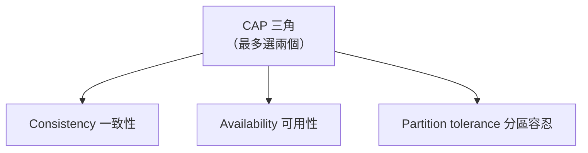
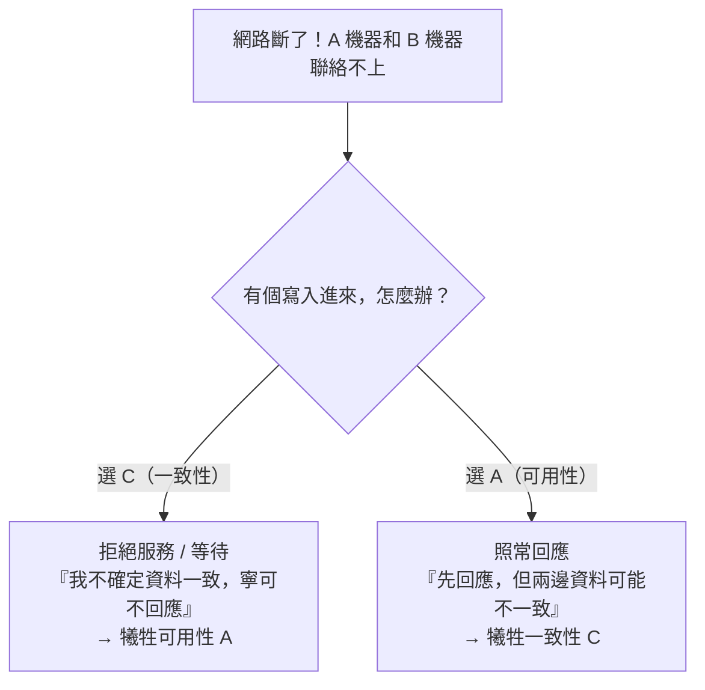

# [E-13-6] CAP 定理：分散式系統的不可能三角

> **目標**：理解 CAP 定理——分散式系統在「一致性、可用性、分區容忍」三者間，無法同時完美滿足，必須取捨。

## 三個你想要的特性

當資料分散在「多台機器」（分散式系統，E-13-10），你會想要三個特性：

| 特性 | 英文 | 意思 |
|------|------|------|
| **一致性** | **C**onsistency | 每次讀到的都是「最新、一致」的資料（不會 A 機器說 100、B 機器說 50）|
| **可用性** | **A**vailability | 每個請求都能得到回應（系統一直可用，不拒絕服務）|
| **分區容忍** | **P**artition tolerance | 即使機器之間「網路斷了（分區）」，系統仍能運作 |

CAP 定理說的是——**這三個，你最多只能同時滿足兩個。**

## 為什麼不能三個都要

關鍵在 **P（分區容忍）**——在分散式系統，「網路會斷」是**必然**的（機器分散各地，網路一定偶爾出問題）。所以 **P 幾乎是「必選」的**（你不能假設網路永遠不斷）。

那麼當「網路斷了（分區發生）」時，機器們聯絡不上彼此，你只能在 **C 和 A 之間二選一**：

舉例：A、B 兩台資料庫，網路斷了。有人要在 A 寫入：

- **選一致性（CP）**：A 不敢確定 B 也同步了 → **拒絕這次寫入/讀取**（或一直等），確保「不會給出不一致的資料」。代價：**這段時間不可用**（A）。
- **選可用性（AP）**：A 照常接受寫入、照常回應 → 系統一直可用。代價：A 和 B 的資料**暫時不一致**（C），等網路恢復再同步（最終一致，E-13-11）。

## CP vs AP：實際系統的選擇

依「業務上更不能忍受哪個」，系統分兩類：

| 類型 | 犧牲 | 適合 | 例子 |
|------|------|------|------|
| **CP（一致性優先）** | 可用性 | 「資料絕不能錯」比「一直能用」重要 | 銀行轉帳、庫存扣減、傳統關聯式資料庫的某些設定 |
| **AP（可用性優先）** | 一致性 | 「一直能用」比「即時一致」重要 | 社群動態、購物車、很多 NoSQL（如 Cassandra、DynamoDB）|

例如：

- **銀行餘額**：寧可「暫時不能查」（拒絕服務），也不能「給出錯誤的餘額」→ 偏 **CP**。
- **社群按讚數**：寧可「你看到的讚數暫時不準（最終會對）」，也要「網站一直能用」→ 偏 **AP**。

這呼應 cache-6-1 的「強一致 vs 最終一致」——CP 偏強一致、AP 偏最終一致。

## 重要澄清：CAP 是「分區時」的取捨

常見的誤解是「CAP 要你永遠在 C 和 A 之間選一個」。其實：

> **CAP 的取捨，只在「網路分區（P）發生時」才需要做。** 網路正常時，你可以同時有 C 和 A。只有「斷線的那一刻」，才被迫在 C 和 A 之間選。

這就引出了 CAP 的「升級版」**PACELC**（E-13-11 深入）——它補充說：「**即使沒分區（E, Else），你還是要在『延遲（L）』和『一致性（C）』之間取捨。**」也就是說，取捨無所不在，不只發生在斷線時。

## 小結

- CAP 定理：分散式系統在 **一致性(C)、可用性(A)、分區容忍(P)** 三者，最多同時滿足兩個。
- 因為「網路會斷（P 必選）」，所以「斷線時」要在 **C 和 A 之間二選一**。
- **CP**（犧牲可用性，如銀行）vs **AP**（犧牲一致性，如社群）。
- CAP 取捨「只在分區時」發生；升級版 PACELC 說「平時也要在延遲與一致性間取捨」。

> 一致性模型與 PACELC 的深入 → [課外讀物 E-13-11：一致性模型](./E-13-11-consistency-models.md)；強一致 vs 最終一致 → 快取課程 cache-6-1
