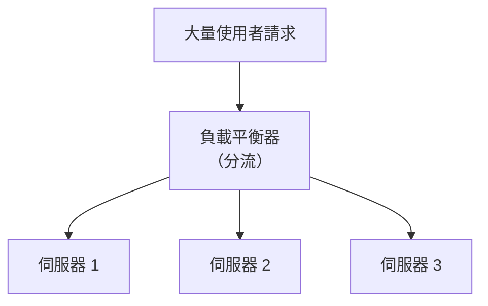

# [E-13-7] Load Balancer：流量如何分配到多台伺服器

> **目標**：理解負載平衡器（Load Balancer）——把流量分配到多台伺服器，是水平擴展（E-13-1）的關鍵元件。

## 水平擴展的關鍵問題

E-13-1 說水平擴展是「加更多台機器分攤」。但問題來了——使用者的請求進來，**該送到哪一台**？要有個「**分流的人**」，這就是 **負載平衡器（Load Balancer，LB）**。

> **負載平衡器站在「使用者」和「多台後端伺服器」之間，把進來的流量「平均分配」給後端，讓大家一起分攤。**

用類比：LB 像超市的**排隊引導員**——「這位往 3 號櫃台、那位往 5 號」，讓每個櫃台的負擔均衡。

（你在 infra Part 9-1、SRE Part 7、aws Part 6-4 ALB 都碰過它，這裡是課外讀物的概念總覽。）

## LB 怎麼分流：策略

LB 怎麼決定「這個請求給誰」？常見策略：

| 策略 | 怎麼分 | 適合 |
|------|--------|------|
| **輪詢（Round Robin）** | 一台一個輪流發 | 後端都差不多時（最簡單）|
| **最少連線（Least Connections）** | 發給目前最閒（連線最少）的 | 各請求耗時差很多時 |
| **IP 雜湊（IP Hash）** | 同一使用者固定到同一台 | 需要「黏住」同一台時（如某些 session）|
| **加權（Weighted）** | 強的機器分多一點 | 後端規格不一時 |

入門用輪詢就很夠。

## LB 的另一個關鍵：健康檢查

LB 不只分流，還做**健康檢查**（呼應 SRE Part 8-3、aws Part 6-4）：

> LB 持續確認每台後端「還活著、還健康」。如果某台掛了（健康檢查失敗），LB **自動把它從分流名單拿掉**，不再送流量給它——直到它恢復。

這帶來**高可用**：某台掛了，使用者幾乎無感（LB 自動避開它，把流量導到健康的機器）。這就是水平擴展「天然有冗餘」（E-13-1）的具體實現——但要靠 LB 來做到。

## LB 的種類

LB 可以運作在不同層次：

- **L4（傳輸層）負載平衡**：依 IP/port 分流，較底層、效能高、看不懂內容（如 AWS NLB）。
- **L7（應用層）負載平衡**：看得懂 HTTP，能依「網址路徑、標頭」做進階分流（如 Nginx、AWS ALB，aws Part 6-4）。

一般 web 應用用 L7（如 ALB）——它能依路徑把 `/api` 和 `/admin` 分到不同後端群組。

## LB 自己會不會是單點故障？

好問題——如果 LB 只有一台，它掛了不就全完了（單點故障，infra Part 9-2）？

所以正式環境的 LB **本身也要高可用**（多台 LB、或用雲端託管的 LB 如 ALB——它本身就跨多 AZ 高可用，aws Part 6-4、4-7）。這也是 aws Part 6-4 說「用受管 ALB 比自己架 Nginx LB 好」的原因之一——你不用煩惱「LB 自己的高可用」。

## 小結

- 負載平衡器（LB）= 把流量分配到多台後端伺服器（像排隊引導員），是水平擴展的關鍵。
- 分流策略：輪詢、最少連線、IP 雜湊、加權。
- 還做**健康檢查**：自動避開掛掉的機器 → 高可用。
- 分 L4（底層）/ L7（應用層，能依路徑分流）。
- LB 自己也要高可用（用受管的 ALB 最省事）。

> 負載平衡的自架與雲端實作 → 參見 **infra 課程** Part 9-1、**aws 課程** Part 6-4（ALB）；健康檢查與高可用 → **sre 課程** Part 8-3
