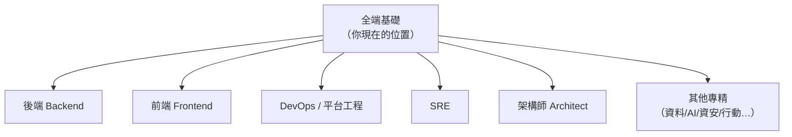

# [E-13-8] 從全端工程師到哪裡？職涯路線圖

> **目標**：認識軟體工程的幾條主要職涯路線——Backend / Frontend / DevOps / SRE / Architect 等，幫你思考「學完這些之後往哪走」。

## 你已經走了很遠

如果你跟著這套課程學下來——程式基礎、前後端、資料庫、infra、雲端、可靠性、快取——你已經具備了**全端 + 基礎建設**的廣泛能力。那接下來呢？這篇給你一張「職涯地圖」。

> 提醒：這些「路線」不是壁壘分明的——很多人橫跨多條、或先廣後專。重點是**找到你有興趣、又有價值的方向深耕**。

## 幾條主要路線

| 路線 | 專注 | 對應這套課程 |
|------|------|------------|
| **後端 Backend** | 伺服器端邏輯、API、資料庫、效能 | basic Part 4-5、csharp、快取 |
| **前端 Frontend** | UI/UX、瀏覽器、框架、效能 | basic Part 3、6 |
| **DevOps / 平台工程** | 自動化、CI/CD、基礎建設、開發者體驗 | infra、aws |
| **SRE** | 系統可靠性、SLO、監控、事故 | sre |
| **架構師 Architect** | 系統整體設計、技術選型、跨團隊 | 綜合全部 + E-13 |
| **專精領域** | 資料工程、機器學習、資安、行動… | 各自的專業 |

## 各路線簡述

**後端工程師**：深耕伺服器端——API 設計、資料庫優化、分散式系統、效能與擴展。你學的 csharp、快取、E-13 都是後端進階的養分。

**前端工程師**：深耕使用者端——框架（React 等）、瀏覽器原理、效能優化、互動體驗。

**DevOps / 平台工程師**：專注「讓開發與部署順暢」——CI/CD、IaC、容器、雲端、打造內部平台（呼應 SRE Part 6-3 的平台工程）。infra + aws 是核心。

**SRE**：專注「讓系統可靠」——SLO、監控告警、事故處理、消除 toil、為失敗而設計。sre 課程就是這條路。

**架構師**：往上走，負責「整個系統怎麼設計」——技術選型、跨服務架構、權衡取捨。需要廣度（懂前後端、infra、雲、分散式）+ 判斷力。E-13、各課的「取捨思維」是基礎。

## 怎麼選

幾個思考方向：

1. **你做什麼最有熱情？** 喜歡打磨使用者體驗 → 前端；喜歡讓系統穩如泰山 → SRE；喜歡自動化、消除重複 → DevOps。
2. **你的優勢在哪？** 細心嚴謹適合 SRE/後端；美感與互動敏感適合前端；綜觀全局適合架構。
3. **市場需求**：DevOps/SRE/雲端目前需求很大；資深後端、架構師長期搶手。

## 一個重要觀念：T 型人才

業界推崇 **「T 型人才」**——

> **橫的一畫**：對很多領域有「廣度」的理解（你這套全端 + infra 課程給的）。
> **豎的一畫**：在「一個領域」有「深度」的專精。

廣度讓你能跟各方溝通、做好取捨；深度讓你有不可取代的價值。所以「先廣（你現在）、再選一個深耕」是很好的路徑。

## 小結

- 主要路線：後端、前端、DevOps/平台、SRE、架構師、各專精領域。
- 它們不互斥——很多人橫跨或先廣後專。
- 選擇看「熱情 + 優勢 + 市場」。
- 目標是成為 **T 型人才**：廣度（全端基礎）+ 一個領域的深度。

> 各路線的核心能力，分別在這套課程的 basic / csharp / infra / aws / sre / 快取 等書中。挑你有興趣的深耕吧。
