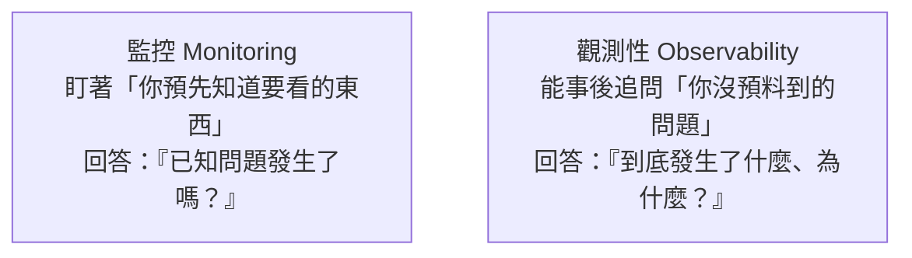

# [E-14-1]【概念版】觀測性是什麼？監控 vs 觀測性

> **目標**：理解「觀測性（Observability）」是什麼、它和「監控（Monitoring）」的差別，建立這個系列的基礎概念。

## 為什麼需要這個系列

你在公司可能聽過「監控」「觀測性」「ELK」「Grafana」「日誌」這些詞。它們都圍繞同一件事——**「線上系統出問題時，怎麼知道發生了什麼、怎麼查到原因」**。

這個系列建立觀測性的**概念**，並補上其他課程沒細講的工具（尤其 ELK）。

> 註：觀測性的**實作**（Prometheus / Grafana）在 infra Part 7、sre Part 3 已詳細教過；**方法論**（黃金訊號、告警設計）在 sre Part 3、Part 4。這個系列是「概念總覽 + ELK + 工具地圖」，會大量交叉引用它們。

## 監控 vs 觀測性

這兩個詞常混用，但有重要差別（呼應 sre Part 3-2）：

**監控（Monitoring）**：盯著「**你事先決定要看的指標**」。例如你設「CPU > 90% 告警」——你**事先就知道**要看 CPU。它回答「**已知的問題**發生了嗎？」。

**觀測性（Observability）**：讓你能「**事後追問你當初沒預料到的問題**」。系統出了個你從沒想過的怪狀況，你能不能透過手邊的資料，一路追查到根因？它回答「**到底發生了什麼、為什麼**？」——包括你沒預設的問題。

用類比（sre Part 3-2）：

- **監控**像汽車儀表板上**固定的幾個錶**（時速、油量）——只顯示設計時決定要顯示的。
- **觀測性**像有個**萬能診斷接口**——車子出任何怪問題，技師都能接上去深入追查。

## 為什麼現代系統需要觀測性

以前系統簡單（單機、單體），監控幾個指標就夠。但現代系統複雜（微服務、分散式，E-13-10），故障常常是「**你沒預料到的**」——一個請求穿過幾十個服務，問題可能出在任何意想不到的地方。

光「監控已知指標」不夠——你需要**觀測性**，能在事後「像偵探一樣」追查未知的問題。這就需要豐富的資料：指標、日誌、追蹤（E-14-2 的三支柱）。

## 觀測性要回答的問題

好的觀測性，讓你能回答：

- **發生了什麼？**（錯誤率升高了、變慢了）→ 靠**指標（Metrics）**
- **細節是什麼？**（具體的錯誤訊息）→ 靠**日誌（Logs）**
- **在哪一段？**（請求卡在哪個服務）→ 靠**追蹤（Traces）**

這三類資料就是「觀測性的三支柱」（E-14-2 深入）。有了它們，你才能從「發現異常」一路追到「找到根因」。

## 小結

- 觀測性 = 「線上系統出問題時，能知道發生什麼、追查到原因」的能力。
- **監控**：盯預先知道的指標，回答「已知問題發生了嗎」。
- **觀測性**：能事後追查「沒預料到的問題」，回答「到底發生什麼、為什麼」。
- 複雜系統（微服務、分散式）需要觀測性，因為故障常是「沒預料到的」。
- 靠「三支柱」（指標/日誌/追蹤）來達成（E-14-2）。

> 監控 vs 觀測性的方法論深入 → **sre 課程** Part 3-2；三支柱 → [課外讀物 E-14-2](./E-14-2-three-pillars.md)
