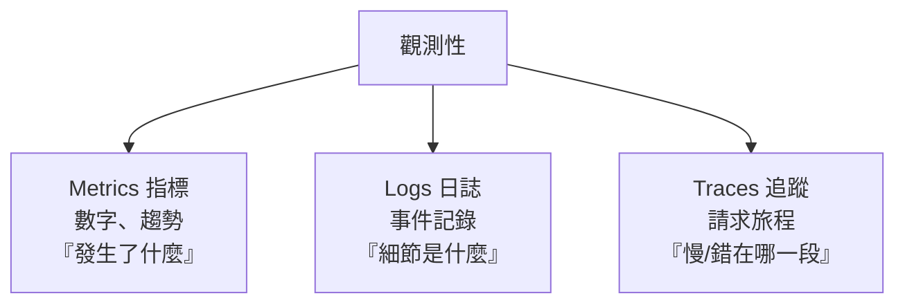

# [E-14-2]【概念版】觀測性三支柱：Metrics、Logs、Traces

> **目標**：理解觀測性的三根支柱——指標、日誌、追蹤，各解決什麼問題、怎麼配合除錯。

## 三根支柱

觀測性（E-14-1）建立在三類資料上，合稱「**三支柱**」（呼應 sre Part 3-2）：



## ① Metrics（指標）：數字與趨勢

隨時間變化的**數值**——CPU 使用率、每秒請求數、p95 延遲、錯誤率。

- **強項**：便宜、可長期保存、適合畫趨勢圖、設告警。
- **回答**：「**發生了什麼**」——延遲變高了、錯誤變多了。
- **侷限**：只給「數字」，不告訴你「為什麼」、「是誰」。它說「錯誤率 5%」，但不說「哪個請求、為什麼錯」。

工具：**Prometheus + Grafana**（infra Part 7、sre Part 3-3/3-4 詳細教過）。

## ② Logs（日誌）：事件細節

系統寫下的**一筆筆事件記錄**——「14:03 使用者 123 登入失敗，原因：密碼錯誤」。

- **強項**：細節豐富，告訴你「具體發生了什麼」。
- **回答**：「**細節是什麼**」——指標說錯誤變多，日誌說「錯誤訊息具體寫什麼」。
- **侷限**：量大、儲存貴；在分散式系統，一個請求的日誌**散落在很多台機器**，難拼湊。

工具：**ELK Stack**（E-14-3 詳述——這是這系列補的重點）、雲端的 CloudWatch Logs（aws Part 10-1）。

## ③ Traces（追蹤）：請求的旅程

追蹤**一個請求，從頭到尾穿過哪些服務、每段花多久**（在微服務特別重要）。

- **強項**：看見「一個請求的全貌」，精準定位「是哪一段慢/出錯」。
- **回答**：「**慢在哪、錯在哪一段**」——一個請求穿過 10 個服務，trace 告訴你卡在第 7 個。
- **侷限**：建置成本較高（要在程式埋點）。

工具：OpenTelemetry、Jaeger、aws X-Ray（sre Part 3-5、aws Part 10-2 教過）。

## 三者怎麼配合：除錯接力

三支柱不是三選一，而是**接力合作**（sre Part 3-2 的除錯流程）：

```
① Metrics 發現異常
   「儀表板顯示 p99 延遲飆到 2 秒」→ 知道「有問題」，但不知為什麼
        ↓
② Traces 定位環節
   「追一個慢請求，發現卡在『資料庫查詢』那段」→ 縮小到某環節
        ↓
③ Logs 找根因
   「看那段的日誌，發現某查詢沒用索引、掃了全表」→ 找到原因
```

**Metrics 告訴你「哪裡不對」，Traces 告訴你「在哪一段」，Logs 告訴你「為什麼」。** 三者由粗到細，接力縮小範圍、找到根因——這就是觀測性的威力。

## 一個記憶口訣

| 支柱 | 一句話 | 何時用 |
|------|--------|--------|
| **Metrics** | 數字趨勢，發現異常 | 設告警、看趨勢、第一線發現 |
| **Traces** | 請求旅程，定位環節 | 「是哪個服務/哪一段」 |
| **Logs** | 事件細節，找出根因 | 「具體發生什麼、為什麼」 |

## 小結

- 觀測性三支柱：**Metrics（指標）/ Logs（日誌）/ Traces（追蹤）**。
- Metrics 發現問題（數字）、Traces 定位環節（旅程）、Logs 找根因（細節）。
- 三者接力，由粗到細追到根因。
- 工具：Metrics→Prometheus/Grafana、Logs→ELK、Traces→OpenTelemetry/Jaeger（E-14-4 工具地圖）。

> 三支柱的方法論 → **sre 課程** Part 3-2；集中式日誌（ELK）→ [課外讀物 E-14-3](./E-14-3-elk-stack.md)
