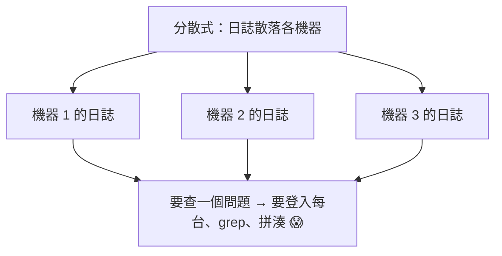
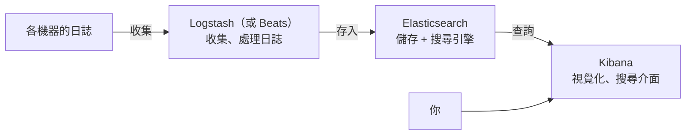

# [E-14-3]【深入版】集中式日誌與 ELK Stack

> **目標**：理解為什麼分散式系統需要「集中式日誌」，以及 ELK Stack（Elasticsearch / Logstash / Kibana）三個元件各做什麼。

## 問題：日誌散落各處

你在 infra Part 7-1 學過日誌——但那是「**一台機器**」的日誌（`/var/log`、`journalctl`）。在分散式系統（E-13-10），問題來了：

> 你有「**幾十台機器、幾百個容器**」，每個都各自寫日誌。當一個請求出問題，它的足跡**散落在好幾台機器的日誌裡**。你要 SSH 進每一台、`grep` 半天去拼湊——根本不可行。



解法是**集中式日誌（Centralized Logging）**：

> **把所有機器/服務的日誌，統一收集到「一個地方」，集中儲存、搜尋、分析。** 你不用再一台台找——在一個介面就能搜尋所有日誌。

## ELK Stack：最經典的集中式日誌方案

**ELK** 是三個工具的縮寫，組合成一套集中式日誌方案（這就是你聽過的 ELK）：



| 元件 | 全名 | 做什麼 | 類比 |
|------|------|--------|------|
| **E** | **Elasticsearch** | 儲存日誌 + 強大的「搜尋引擎」 | 倉庫 + 超強搜尋 |
| **L** | **Logstash** | 收集、處理、轉換日誌，送進 ES | 輸送帶 + 加工 |
| **K** | **Kibana** | 視覺化介面，搜尋、畫圖、看日誌 | 儀表板 + 搜尋頁 |

## 各元件詳解

**① Elasticsearch（核心，儲存 + 搜尋）**

整個 ELK 的心臟。它是一個**分散式的搜尋引擎**——專門「存大量文件、並能極快地全文搜尋」。日誌存進去後，你能用關鍵字、條件**瞬間搜尋幾億筆日誌**（比 `grep` 整堆檔案快太多）。它本身也是分散式的（用了 E-13 的複製、分片概念）。

**② Logstash（收集與處理）**

負責「**把各處的日誌收集進來、整理好、送進 Elasticsearch**」。它能：

- 從各種來源收集日誌（檔案、訊息佇列…）。
- **處理/轉換**：解析非結構化的日誌、抽出欄位、過濾。
- 送進 ES。

> 補充：Logstash 較重，現在常用更輕量的 **Beats**（如 Filebeat）來「收集」日誌，Logstash 或直接 ES 來處理。所以你也會聽到「**ELK** 演變成 **Elastic Stack**」（加上 Beats）。

**③ Kibana（介面）**

ELK 的「臉」——一個網頁介面，讓你：

- **搜尋**所有日誌（「找出所有含 'error' 的、來自服務 X 的、過去一小時的日誌」）。
- **視覺化**：把日誌畫成圖表、儀表板（例如「各服務的錯誤數趨勢」）。
- 探索、分析日誌找問題。

## ELK 怎麼幫你除錯

回到 E-14-2 的三支柱除錯流程，ELK 補強了「Logs」這支柱在分散式下的能力：

```
問題：使用者反映「下單失敗」
沒有集中式日誌：登入訂單服務、庫存服務、支付服務…各台 grep，拼半天
有 ELK：
  → 打開 Kibana
  → 搜尋「這個請求 ID / 這個使用者 / error，過去 10 分鐘」
  → 瞬間從「所有服務的所有機器」撈出相關日誌，集中顯示
  → 看到「支付服務 14:20 拋出 timeout」→ 找到根因
```

關鍵：**一個介面、搜尋全部日誌**——這是分散式系統除錯的必備能力。

> 小技巧：搭配「關聯 ID（correlation ID）」效果更好——給每個請求一個唯一 ID，貫穿所有服務的日誌（呼應追蹤 Traces）。在 Kibana 用這個 ID 搜尋，就能撈出「這個請求在所有服務」的完整足跡。E-14-5 會講。

## ELK 的替代方案

ELK 是經典，但不是唯一：

- **Grafana Loki**：較輕量的日誌方案，和 Grafana（你 infra Part 7 學的）整合好。
- **雲端託管**：AWS CloudWatch Logs（aws Part 10-1）、各雲的日誌服務——省去自己維運 ELK。
- **商業方案**：Datadog、Splunk 等。

選擇是取捨（呼應 aws-6-1）——自架 ELK 強大但要維運；雲端託管省事但要錢。

## 小結

- 分散式系統的日誌散落各機器，需要**集中式日誌**（統一收集、搜尋）。
- **ELK Stack** = **Elasticsearch**（儲存+搜尋引擎）+ **Logstash**（收集處理，或用 Beats）+ **Kibana**（視覺化搜尋介面）。
- 價值：一個介面搜尋所有服務的日誌，分散式除錯必備。
- 替代：Grafana Loki、雲端 CloudWatch、Datadog 等。

> 單機日誌基礎 → **infra 課程** Part 7-1；雲端日誌 → **aws 課程** Part 10-1；三支柱 → [E-14-2](./E-14-2-three-pillars.md)
