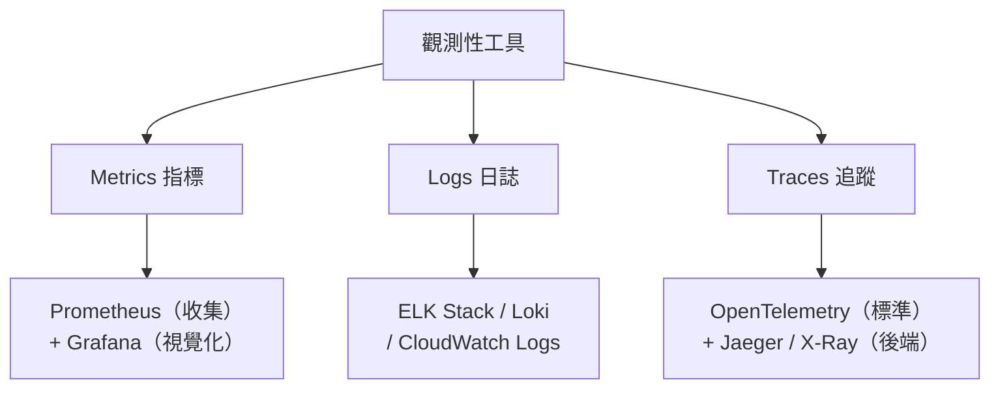

# [E-14-4]【概念版】觀測性工具地圖

> **目標**：建立一張「觀測性工具地圖」——三支柱各有哪些主流工具，它們在這套課程的哪裡學過、怎麼搭配。

## 為什麼需要一張地圖

觀測性的工具五花八門（Prometheus、Grafana、ELK、Jaeger、OpenTelemetry、CloudWatch…），新手容易混。這篇給你一張地圖，把它們對應到三支柱（E-14-2），並指出這套課程在哪教過它們的實作。

## 工具地圖（依三支柱分類）



| 支柱 | 主流工具 | 角色 | 課程在哪教 |
|------|---------|------|-----------|
| **Metrics** | **Prometheus** | 收集、儲存指標（pull）| infra Part 7-3、sre Part 3-3 |
| | **Grafana** | 視覺化儀表板、告警 | infra Part 7-4、sre Part 3-4 |
| **Logs** | **ELK Stack** | 集中式日誌（搜尋分析）| 課外讀物 E-14-3 |
| | **Grafana Loki** | 輕量日誌、與 Grafana 整合 | E-14-3 提及 |
| | **CloudWatch Logs** | 雲端託管日誌 | aws Part 10-1 |
| **Traces** | **OpenTelemetry** | 追蹤的「標準」（埋點規範）| sre Part 3-5 提及 |
| | **Jaeger** | 追蹤的後端（收集、視覺化）| sre Part 3-5 |
| | **AWS X-Ray** | 雲端託管追蹤 | aws Part 10-2 |

## 幾個關鍵工具的定位

**Prometheus + Grafana（Metrics）**：最經典的指標組合。Prometheus 負責「收集 + 儲存」（pull 模型，sre Part 3-3）、Grafana 負責「畫成儀表板 + 告警」（sre Part 3-4）。你 infra Part 7 親手架過。**注意：Grafana 只是「視覺化前端」**——它可以接 Prometheus（指標）、也能接 Loki（日誌）、也能畫 traces，是個通用的「看板」。

**ELK / Loki（Logs）**：集中式日誌（E-14-3）。ELK 功能強但較重；Loki 輕量、和 Grafana 整合好。

**OpenTelemetry（追蹤的標準）**：這個值得特別說。**OpenTelemetry（OTel）是「觀測性資料的統一標準」**——它定義「怎麼產生指標、日誌、追蹤」，讓你不被特定廠商綁定。你用 OTel 在程式埋點，產生的資料能送到「任何支援 OTel 的後端」（Jaeger、各雲、各商業方案）。它正在成為觀測性的通用標準。

## 兩種選擇：自架 vs 託管

跟其他基礎建設一樣（aws-6-1），觀測性工具也有自架 vs 託管的取捨：

| | 自架（Prometheus/Grafana/ELK…）| 雲端託管（CloudWatch、Datadog…）|
|---|------------------------------|--------------------------------|
| 維運 | 自己架、自己顧 | 別人顧（aws Part 10）|
| 彈性/可移植 | 高、不綁雲 | 綁平台 |
| 成本 | 機器成本 + 人力 | 服務費（可能不便宜）|

很多團隊**混用**——自架 Prometheus/Grafana 看自己的應用指標，用雲端的日誌/追蹤服務省維運。

## 一個整合的觀測性平台長怎樣

把工具串起來，一個典型的觀測性平台：

```
應用程式（用 OpenTelemetry 埋點）
   ├── 指標 → Prometheus → Grafana（儀表板 + 告警）
   ├── 日誌 → ELK / Loki → Kibana / Grafana（搜尋）
   └── 追蹤 → Jaeger / X-Ray（請求旅程）

出事時：Grafana 告警 → 看指標儀表板 → 用追蹤定位環節 → 搜日誌找根因
（這就是 E-14-2 的三支柱接力除錯）
```

理想是「**三支柱整合在一起、能互相跳轉**」——例如從 Grafana 的指標圖，一鍵跳到對應時間的日誌和追蹤。現代觀測性平台（如 Grafana 全家桶、Datadog）都在做這種整合。

## 小結

- 工具地圖：**Metrics**→Prometheus+Grafana；**Logs**→ELK/Loki/CloudWatch；**Traces**→OpenTelemetry+Jaeger/X-Ray。
- **Grafana** 是通用視覺化前端（可接指標/日誌/追蹤）。
- **OpenTelemetry** 是觀測性資料的統一標準（不綁廠商）。
- 自架 vs 託管是取捨，常混用。
- 理想是三支柱整合、能互相跳轉除錯。

> 各工具的實作 → **infra 課程** Part 7、**sre 課程** Part 3、**aws 課程** Part 10
